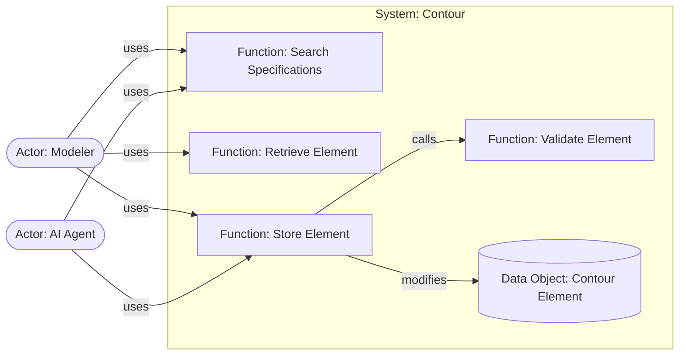
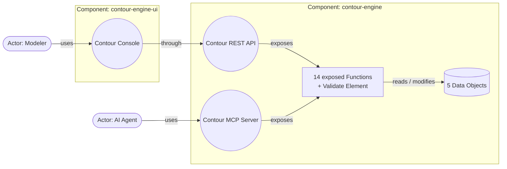

# Contour v0.5 — working notes: specification and implementation

Status: working draft. These notes test the v0.5 idea on a real model before
the paper (`contour.md`) is rewritten. The paper on this branch is still v0.4.

## The idea

A Contour model has two layers, written by different people for different
reasons:

| | Specification (top-down) | Implementation (bottom-up) |
|---|---|---|
| Answers | What the System must do, and for whom | How it is built and reached |
| Written by | Business owner, architect | Developers, or an LLM, from the specification |
| Elements | System, Actor, Function, Data Object, Event | Component, Interface |
| Record-tier | Requirements, Guardrails | Each element's `basis`: what it was derived from |
| Technical detail | None | Bindings, operations, requests, responses |
| File (contour-engine) | `contour-engine.spec.yaml` | `contour-engine.impl.yaml` |

The specification is complete on its own: a non-developer can review all of
it. The implementation never redefines anything the specification says — it
references Functions, Data Objects and Events by name and only decides where
they live and how they are reached.

## Specification layer

Unchanged from v0.4: System, Function (`steps`, `result`, `alternatives`,
`behavior`), Data Object, Event, Requirement, Guardrail.

New: an **Actor declares the Functions it needs**, and the Requirements that
say how it must be able to reach them, in business terms:

```yaml
Actor: Modeler
  needs: [Search Specifications, Retrieve Element, Store Element, …]
  requirements: [Works In A Browser, Listings Are Paginated]
  guardrails: [Diagrams Are Shown As Rendered]

Actor: AI Agent
  needs: [Search Specifications, Retrieve Element, Store Element, …]
  requirements: [Reaches The System As Tools]
```

`needs` is the record of the `uses` relation at specification level: Actor →
Function. The implementation refines each such edge into Actor → Interface →
Function, the same rollup as principle 5.



## Implementation layer

```yaml
Implementation:
  system: Contour
  components:
    - name: contour-engine
      basis: [One Core For Every Actor, "principle 4: data has a home"]
      performs: [every Function]
      owns: [every Data Object]
      produces: [every Event]
      implements: [Contour MCP Server, Contour REST API]
    - name: contour-engine-ui
      basis: [Console Released Independently, Works In A Browser]
      performs: []
      implements: [Contour Console]
  interfaces:
    - name: Contour Console
      basis: [Modeler needs, Works In A Browser]
      serves: Modeler
      implementedBy: contour-engine-ui
      through: Contour REST API
      binding: { style: Web UI }
      exposes: [the Functions the Modeler needs]
    - name: Contour MCP Server
      basis: [AI Agent needs, Reaches The System As Tools]
      serves: AI Agent
      implementedBy: contour-engine
      binding: { style: MCP, … }
      exposes: { per Function: operation, request, responses }
    - name: Contour REST API
      basis: ["allocation: Contour Console is implemented by contour-engine-ui, its Functions by contour-engine"]
      serves: Components
      implementedBy: contour-engine
      binding: { style: OpenAPI, … }
      exposes: { per Function: operation, request, responses }
```

New fields:

- **`basis`** (Component, Interface) — what it was derived from: an Actor's
  needs (`Modeler needs`), a Requirement, a Guardrail, a principle, or an
  allocation. Every implementation element must trace back to the
  specification.
- **`implements`** (Component → Interface) and **`implementedBy`**
  (Interface → Component) — which Component runs an Interface. Interfaces are
  no longer owned by a Component by definition; they are allocated to one.
- **`through`** (Interface → Interface) — when an Interface is implemented by
  a Component that doesn't perform the Functions it exposes, the internal
  Interface it reaches them through.
- **`performs` / `owns` / `produces`** keep their meaning, now read as
  allocation of the specification's Functions, Data Objects and Events.



## Derivation rules

How the implementation follows from the specification. An implementer or an
LLM applies these; the checker verifies the result.

1. **One Interface per Actor and channel.** An Actor's channel Requirement
   (*Works In A Browser*, *Reaches The System As Tools*) picks the binding
   style; the Interface `serves` that Actor and `exposes` exactly the
   Functions it `needs`.
2. **Components come from Requirements and Guardrails, not from Functions.**
   A Requirement that something changes, scales, fails or is released on its
   own (*Console Released Independently*) separates a Component; a Guardrail
   that something stays together (*One Core For Every Actor*) and principle 4
   (one home per Data Object) keep things in one.
3. **Everything is allocated exactly once.** Each Function to one performing
   Component, each Data Object to one owner, each Event to the Component
   that performs the Function producing it.
4. **A split allocation derives an internal Interface.** When an Interface is
   implemented by a Component that doesn't perform the Functions it exposes,
   an Interface serving `Components` is derived on the performing Component,
   exposing those Functions. That is where the Contour REST API comes from.
5. **Everything derived names its basis.** A Component or Interface that
   traces back to nothing in the specification is a design decision nobody
   asked for.

## Checks (`contour-check.py`)

Specification:

- **S1** every Function an Actor needs exists
- **S2** steps reference existing elements; `consumes` only first; `becomes` maps real outcomes onto the caller's alternatives
- **S3** no Actor needs an Event-triggered Function
- **S4** every referenced Requirement and Guardrail is defined

Implementation against specification:

- **I0** the implementation is of the specified System
- **I1** every Function, Data Object and Event is allocated to exactly one Component, and nothing unspecified is allocated
- **I2** `reads`/`modifies` stay with the owning Component; Events are produced where their Function runs; a `calls` edge isn't split across Components
- **I3** every Interface is implemented by exactly one Component, consistently on both sides
- **I4** each Actor's needs are covered *exactly* by the Interfaces serving it
- **I5** Interfaces serve an Actor or `Components`; exposed Functions exist and aren't Event-triggered; responses cover exactly each Function's outcomes
- **I6** an Interface presenting Functions performed elsewhere goes `through` an internal Interface that exposes them from their performer
- **I7** every Component and Interface has a basis that resolves to the specification
- **I8** Requirements and Guardrails referenced in the implementation are defined

Result on contour-engine: **all checks pass.** Nine deliberate violations —
an undefined need, an unexposed need, an unallocated Function, a Data Object
owned twice, a Console without the REST API, an Interface without basis, a
basis naming nothing, a `calls` split across Components, an incomplete
response map — are each caught by the intended rule.

## What modeling contour-engine this way showed

- **The 14 Console Functions disappeared.** List Components, View Element,
  Find Requirements and the rest were presentation of the System's real
  capabilities. At specification level the Modeler needs the same Functions
  the AI Agent does; the Console's description says how views combine them.
  The specification has 15 Functions where the v0.4 model had 29.
- **The REST API is derived, not declared.** No Actor needs it. It exists
  because one Requirement put the Console in its own Component (rule 4).
- **Guardrails moved to the level they describe.** "UI Owns No Contour Data"
  and "UI Goes Through The Engine" only made sense once a UI Component
  existed; in the specification their intent is *One Core For Every Actor*
  and *Writes Are Validated By The System*, and the implementation's
  allocation satisfies them.
- **Every implementation decision has a reason on record.** v0.3 stated
  "contour-engine-ui is a separate Component"; v0.5 states *why*.

## Open decisions

1. **A `calls` edge split by allocation.** The specification says
   `Store Element calls Validate Element`. If an implementation ever put them
   in different Components, the edge would cross a boundary and need an
   internal Interface — today I2 simply forbids it. Either keep forbidding it
   (allocation must respect `calls`), or let the implementation refine
   `calls` into `uses: Interface / Function`, as rule 4 does for Actors.
2. **Calls into another System at specification level.** The specification
   has no Interfaces, so a Function depending on another System would name
   `uses: Inventory / Check Stock` (System / Function), and the
   implementation would resolve it to `Inventory gRPC / Check Stock`. Not
   exercised by contour-engine, which depends on no other System.
3. **`needs` or `uses`.** `needs` reads better for business authors; `uses`
   reuses the relation's name. These notes use `needs`.
4. **Channel requirements as a convention.** Rule 1 relies on each Actor
   having one Requirement that names its channel. It works here, but it's a
   convention, not a check: nothing yet verifies that an Interface's binding
   style matches the Requirement it cites.
5. **Diagrams.** Two views follow naturally — the specification view (Actors
   using Functions inside the System) and the implementation view
   (Components, Interfaces, allocation). How the v0.4 one-page diagram maps
   onto them is still to be decided.
6. **Schema.** `contour.schema.json` on this branch is still v0.4; a v0.5
   schema needs separate shapes for the two files.

## Next steps

1. Settle the open decisions.
2. Model the paper's Order Service example in both layers, including a call
   into another System (open decision 2).
3. Write the v0.5 schema for both layers.
4. Rewrite the paper around the two layers.
