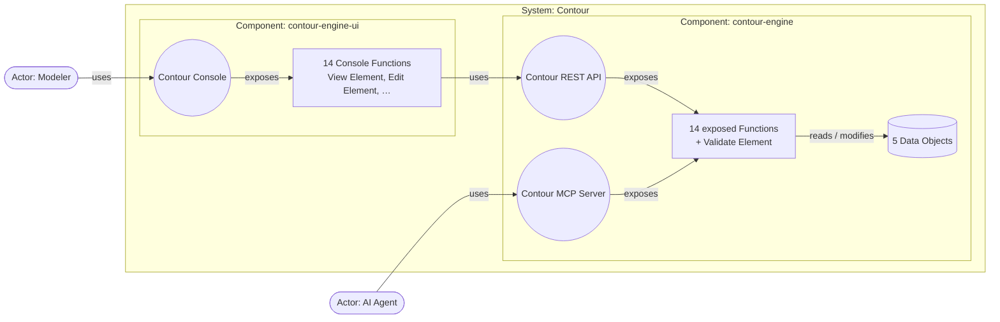

# Contour v0.5 — working notes: one model, two directions

Status: working draft. These notes test the v0.5 idea on a real model before
the paper (`contour.md`) is rewritten. The paper on this branch is still v0.4.

## The idea

A Contour model is **one model at one level**. Its elements — System, Actor,
Function, Data Object, Event, Component, Interface — are peers; none is a
layer above or below another. What varies is **where you start filling it
in**:

| | Top-down | Bottom-up |
|---|---|---|
| Starts from | Business needs | Source code |
| Filled in first | Actors and the Functions they need, Data Objects, Events, Requirements, Guardrails | Components (deployables), Interfaces (entry points), Functions (handlers), Data Objects (stores) |
| Recovered later | Components and Interfaces — how the System is split and reached | Actors' needs, and the Requirements and Guardrails that explain the code's shape |
| Typical use | Building a new System from a specification | Documenting or changing an existing one; legacy extraction |

Both directions arrive at the same model. A model in progress is simply
incomplete from one side, and the checker says what is missing and what the
next step is from either direction.

This fits the paper's claims. Building from a specification is the top-down
direction run to completion; propagating a change into an existing codebase
starts bottom-up (recover the model) and continues top-down (change the
needs, then the code).

## What v0.5 adds to v0.4

- **An Actor declares the Functions it `needs`.** This is the record of the
  Actor → Function `uses` edge. Where an Interface exists, the edge is
  refined as Actor → Interface → Function — the same rollup as principle 5.
  ```yaml
  Actor: Modeler
    needs: [Find Specifications, View Element, Edit Element, …]
    requirements: [Works In A Browser, Listings Are Paginated]
  ```
- **Interfaces belong to the System and are allocated to a Component**, not
  owned by one by definition: an Interface names the Component that
  `implementedBy`, and the Component lists it in `implements`. As in v0.4,
  **an Interface exposes only Functions its implementing Component
  performs.** A Component that needs another Component's Function performs
  its own Function, which `uses` the other's Interface — the crossing is a
  visible step with `Unreachable` mapped, never hidden in an Interface.
- **Components and Interfaces carry a `rationale`**: the Actor needs,
  Requirements, Guardrails, principles or allocation that explain why they
  exist. Top-down, it records why something was derived; bottom-up, it
  records the reason recovered for what the code already has.
- **Components are optional.** A model with none says what the System does,
  not yet how it is split. `performs`, `owns` and `produces` are read as
  allocation of the System's Functions, Data Objects and Events.

## contour-engine as one model

`contour-engine.yaml` on this branch is the v0.5 model:

- **System** Contour: 29 Functions (15 core, 14 Console), 5 Data Objects,
  6 Events.
- **Actors:** Modeler (needs the 14 Console Functions; *Works In A Browser*)
  and AI Agent (needs 14 core Functions; *Reaches The System As Tools*).
- **Components:**
  - **contour-engine** performs every Function and owns all data —
    rationale: *One Core For Every Actor*, principle 4.
  - **contour-engine-ui** performs the 14 Console Functions (View Element,
    Find Specifications, Edit Element, Remove Element, …), owns no data, and
    implements the Console — rationale: *Console Released Independently*,
    *Works In A Browser*.
- **Interfaces:**
  - **Contour Console** serves the Modeler (Web UI), implemented by
    contour-engine-ui; exposes the Console Functions.
  - **Contour MCP Server** serves the AI Agent (MCP), implemented by
    contour-engine.
  - **Contour REST API** serves Components (OpenAPI), implemented by
    contour-engine; exposes exactly the 14 core Functions the Console
    Functions `use` — rationale: *Console Released Independently*.



The Console Functions have their own behavior — how a record is laid out,
that a diagram is shown exactly as rendered, that a removal is confirmed —
which is why they are Functions and not just a list of what the Console
presents. Each one `uses: Contour REST API / <core Function>` and maps
`Unreachable` to its own *Engine Unavailable*, so the dependency of the
Console on the engine is visible in every step that crosses it.

Function names are unique within a System, so four Console Functions that
had the same names as core Functions were renamed for what the person does:
*Find Specifications*, *Remove Element*, *Remove Requirement*,
*Remove Guardrail*.

## Completing a model in each direction

Rules for moving from what a model has to what it lacks. An implementer or an
LLM applies them; the checker reports what's left.

**Top-down** — from needs to structure:

1. **One Interface per Actor and channel.** The Actor's channel Requirement
   (*Works In A Browser*, *Reaches The System As Tools*) picks the binding;
   the Interface `serves` the Actor and `exposes` exactly its `needs`.
2. **Components come from Requirements and Guardrails.** A Requirement that
   something changes, scales, fails or is released on its own separates a
   Component; a Guardrail that things stay together, and principle 4 (one
   home per Data Object), keep them in one.
3. **Allocate everything exactly once** — each Function to one performer,
   each Data Object to one owner, each Event to the Component performing the
   Function that produces it.
4. **A split `calls` derives an internal Interface.** Before allocation, the
   Console Functions simply `call` the core Functions. When an allocation
   puts caller and callee in different Components, the callee is exposed on
   an Interface of its Component serving `Components`, and the step becomes
   `uses: <Interface> / <Function>` with `Unreachable` mapped to one of the
   caller's alternatives. This is where the Contour REST API comes from: its
   exposes are exactly the Functions the Console's steps cross to.

**Bottom-up** — from code to needs:

1. **Deployables become Components; entry points become Interfaces;**
   handlers become Functions; stores become Data Objects.
2. **An Interface's caller becomes an Actor**, unless the caller is another
   Component — then the Interface serves `Components`.
3. **An Actor's `needs` are what the Interfaces serving it expose**, reviewed
   for anything exposed by accident.
4. **Rationale is recovered, not invented.** Each Component and Interface
   gets the Requirement or Guardrail that explains why the code has it. One
   that can't be explained is a finding in itself: either a missing
   Requirement or a design worth questioning.

## Checks (`contour-check.py`)

The checker reads one model and reports two kinds of finding.

**Contradictions** — wrong however the model was started; exit status 1:

- **R1–R6** every reference resolves: Actor needs, steps, `becomes`,
  Interfaces,
  Component allocations, Requirements, Guardrails, rationale
- **R3** response maps cover exactly each exposed Function's outcomes
- **R1, R3** no Actor needs, and no Interface exposes, an Event-triggered Function
- **A1** nothing allocated to two Components
- **R2** a `uses` step names an Interface that exposes the target, maps
  `Unreachable`, and maps only the target's outcomes to the caller's
  alternatives
- **A3** `reads`/`modifies` stay with the owner (principle 4); an Event is
  produced where its Function runs
- **A5** an Interface exposes only Functions its implementing Component
  performs
- **A6** a Function using another Component's Interface uses one that serves
  `Components`

**Gaps** — not filled in yet; each comes with a top-down and a bottom-up next
step:

- **A0** no Components at all
- **A2** a Function, Data Object or Event not yet allocated
- **A4** an Interface not yet allocated to a Component
- **A7** a `calls` step whose caller and callee are allocated to different
  Components (top-down rule 4)
- **N1** an Actor with Interfaces but no stated needs
- **N2** an Actor with needs but no Interface
- **N3** a need no Interface exposes
- **N4** an exposed Function the Actor isn't recorded as needing
- **W1** a Component or Interface without rationale

A gap reads like this:

```
GAP [N3] Actor AI Agent needs Render Diagram, but no Interface serving it exposes it
      top-down:  expose Render Diagram on an Interface serving AI Agent
      bottom-up: check whether AI Agent really needs it; if not, drop it from `needs`
```

Results on contour-engine:

| Model state | Contradictions | Gaps |
|---|---|---|
| Complete (`contour-engine.yaml`) | 0 | 0 |
| Started top-down: no Components or Interfaces; Console Functions `call` core ones | 0 | 3 — A0, and N2 for each Actor |
| Top-down, Components allocated, no Interfaces yet | 0 | 17 — A7 for each crossing `calls`, N2 for each Actor |
| Started bottom-up: no needs, no rationale yet | 0 | 7 — N1 for each Actor, W1 for each Component and Interface |
| A Data Object given a second owner | 8 | 0 |
| The Console exposes a core Function (Retrieve Element) | 1 — A5 | 1 — N4 |
| A `uses` step without `Unreachable` | 1 — R2 | 0 |
| The REST API stops exposing a Function the Console uses | 1 — R2 | 0 |
| A Console Function uses the MCP Server (serves AI Agent) | 1 — A6 | 0 |

## Open decisions

1. **Who rewrites `calls` into `uses`.** Rule 4 says a split `calls`
   becomes `uses` once an Interface exists, and the checker reports it as a
   gap (A7). Whether a tool performs that rewrite, or the model keeps
   `calls` and a view derives the Interface, is open.
2. **A call into another System,** when the model starts top-down and has no
   Interfaces yet: does a step name `System / Function`, refined to
   `Interface / Function` once the other System's Interface is known? Not
   exercised by contour-engine, which depends on no other System.
3. **`needs` or `uses`.** `needs` reads better for business authors; `uses`
   reuses the relation's name.
4. **Channel requirements are a convention.** Top-down rule 1 relies on an
   Actor having a Requirement that names its channel; nothing yet checks
   that an Interface's binding matches it.
5. **Is the `needs` ↔ `exposes` redundancy worth keeping in a complete
   model?** It's what lets the two directions meet and be checked against
   each other (N3, N4); the cost is that a complete model states the same
   set twice.
6. **Diagrams.** The figure above draws the System with Components inside it.
   How the v0.4 one-page diagram, the half-open neighbours and the
   drill-downs carry over is still to be decided.
7. **Schema.** `contour.schema.json` on this branch is still v0.4; it needs
   System-level Interfaces, `implements`, `rationale` and Actor `needs`.

## Next steps

1. Settle the open decisions.
2. Model the paper's Order Service example as a v0.5 model, including a call
   into another System (open decision 2), and run it both from a top-down
   start and a bottom-up start.
3. Update the schema.
4. Rewrite the paper around one model and two directions.
