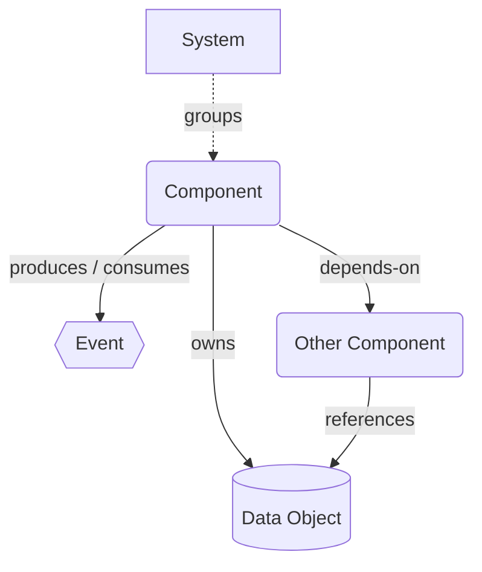
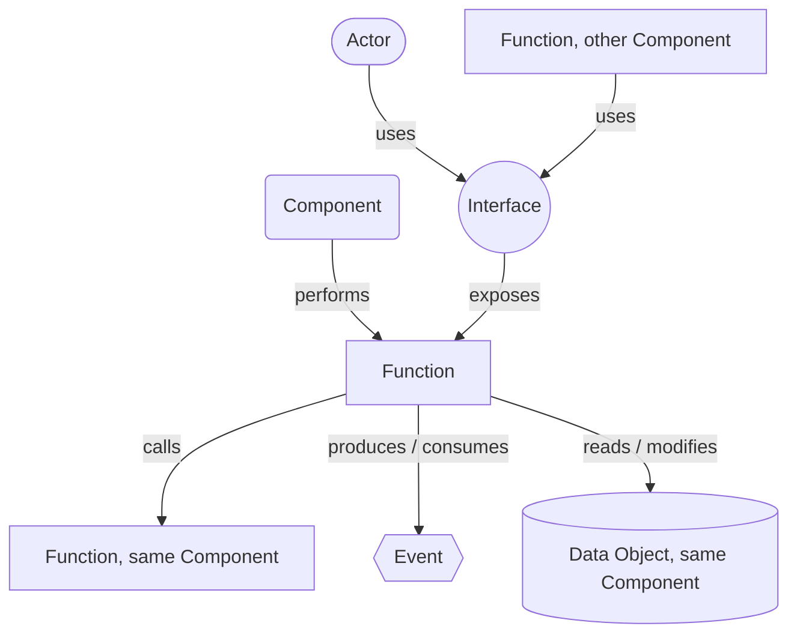
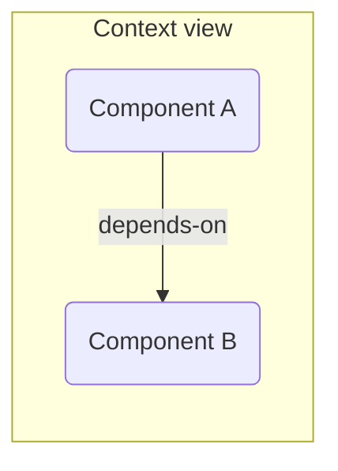
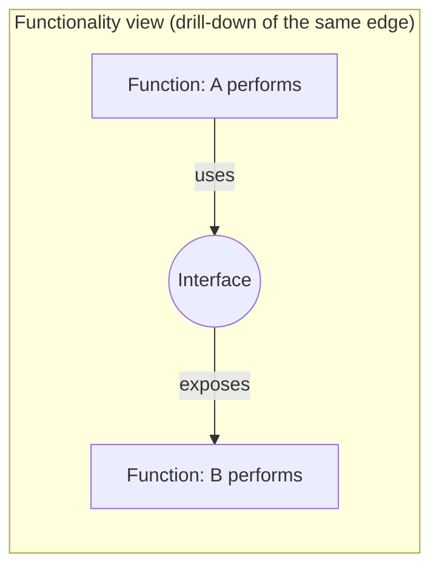
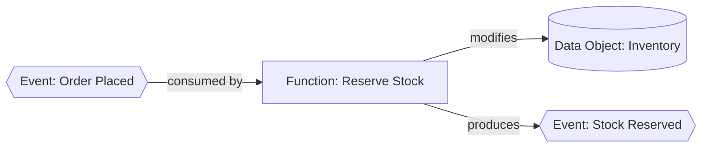
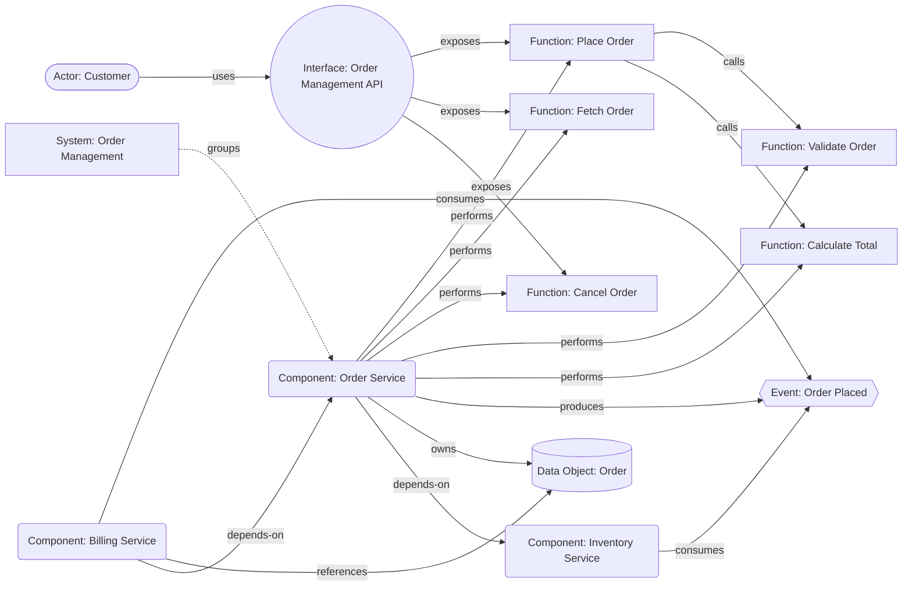
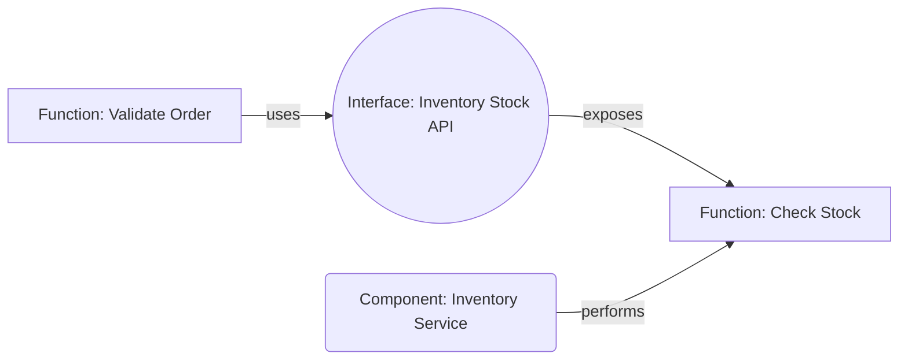

# Contour

## A Lightweight Framework for Modeling Software System Architecture

### Defining logical boundaries — functionality, data, and interfaces — as a business-readable structure for propagating change into code

**Version 0.23** — working draft

**Author:** Mykhailo Kulish ([LinkedIn](https://www.linkedin.com/in/mkulish/))

---

## Abstract

Enterprise and software architects routinely need to describe how a software
system behaves, what it offers to its environment, how it talks to other
systems, and what data flows through it. Comprehensive enterprise
architecture standards provide this — but at the cost of a large,
multi-layered metamodel that is often more than a single system
description needs.

This paper proposes **Contour** — a small, opinionated modeling
framework for the **logical boundary of a software system**: what it
does, the data it shares, and the interfaces it exposes and depends on.
It is structured precisely enough to act as **guardrails for
propagating a described change into actual code**, rather than as
after-the-fact documentation, and it serves three audiences at once: a
**non-developer**, who describes a needed change in business language
without reading code; a **developer**, who turns that into a safe
change; and an **LLM**, which can do the same, using the model as its
specification and its boundary.

What gets modeled is a **System** — the business-level application a
stakeholder would name — delivered by one or more **Components**, each
with a single lifecycle. Contour describes a System by describing its
Components: the Component is what gets drawn, the System is what they
add up to.

The paper claims two things: that a readable Contour record is enough to
propagate a described change into an existing codebase correctly, and
enough to build a new Component from as a spec. A first experiment
(Section 8) supports both on one small codebase. A third, harder
possibility — reconstructing an existing system's real prior behavior
from its record alone — is left explicitly **optional** and untested;
nothing else here depends on it.

The framework works in two tiers. A compact **diagram** shows a system's
shape at a glance; a **structured record** underneath each element
carries the detail a diagram can't hold — behavior, schemas, contracts,
ordered steps. Seven element types and nine relationship verbs, one
vocabulary partitioned across two zoom levels (Section 3), and no
separate vocabulary per level. The name says the same thing: a contour
traces an outline at low resolution and leaves the interior to something
else.

This is a personal working paper, not a finished standard. The goal is
to pressure-test whether a model this small still says enough to guide a
change into code correctly.

---

## Contents

1. [Motivation](#1-motivation)
2. [Design Principles](#2-design-principles)
3. [Core Metamodel](#3-core-metamodel)
   1. [Metamodel diagram](#31-metamodel-diagram)
   2. [Two Levels of Detail: Context View and Functionality View](#32-two-levels-of-detail-context-view-and-functionality-view)
   3. [The Structured Record](#33-the-structured-record)
   4. [Event-Driven Causal Chains](#34-event-driven-causal-chains)
   5. [Naming Conventions](#35-naming-conventions)
   6. [Requirements and Guardrails](#36-requirements-and-guardrails)
4. [Notation](#4-notation)
5. [Worked Example](#5-worked-example)
6. [Limitations and Open Questions](#6-limitations-and-open-questions)
7. [Next Steps](#7-next-steps)
8. [Preliminary Experiment Results](#8-preliminary-experiment-results)
   1. [What proves the approach](#81-what-proves-the-approach)
   2. [What challenges the approach](#82-what-challenges-the-approach)
   3. [Net read](#83-net-read)
9. [Conclusion](#9-conclusion)
10. [Appendix: Comparison to ArchiMate and C4](#appendix-comparison-to-archimate-and-c4)
11. [Changelog](#changelog)

---

## 1. Motivation

Most architecture documentation questions an architect is actually asked
boil down to a short, recurring list:

- What does this system *do*?
- What does it offer to the outside world, and to whom?
- How do other systems reach it (protocol, format, contract)?
- What events does it raise, and what does it react to?
- What data does it own or exchange?
- What does it depend on, and what depends on it?

Full enterprise frameworks answer these questions but bury them across
several layers (business, application, technology) and dozens of element
types, most of which are irrelevant when the scope is "describe this one
system and its neighbors." The result is that many architects fall back
to free-form boxes-and-arrows diagrams — expressive, but not comparable
across systems and not machine-readable.

A second, more demanding problem motivates this paper: a large amount of
software, particularly legacy software, exists with little or no
documentation of any kind. LLMs are increasingly capable of reading such
a codebase and producing *some* description of it — but a description
is only as useful as what it lets you do next. A description that lets a
human skim and nod along is not the same as a description precise
enough that a specific, described change — in business-friendly
language, not code — can be turned into the correct actual code change
without drifting outside the system's declared boundary. That is a
genuinely useful outcome on its own, for legacy modernization, incident
response, or simply making a change safely. Ordinary prose
documentation, and most diagram notations, fall short of that bar: they
describe *shape*, not enough to guide *change* correctly.

Contour aims at the middle ground on both problems at once: a notation
small enough to use consistently without a tool-enforced palette, but
structured enough — down to the level of individual Function behavior,
Data Object schemas, and Interface contracts — to be captured as data
(e.g., YAML/JSON) and acted on to propagate a change correctly.

A note on words: capitalized terms (System, Component, Function, …) are
Contour elements. Lowercase "system" is the ordinary word.

---

## 2. Design Principles

1. **Two boundaries: business and lifecycle.** A *System* is the
   business-level application a stakeholder would name — one capability,
   however it happens to be built. A *Component* is a lifecycle boundary
   inside it: one thing built, versioned, released, and retired as a
   whole. A System of one Component is normal; a System of several is
   common. Neither boundary is a size limit — a Component can be a small
   service or a large monolith, so long as it shares one lifecycle. Each
   diagram centres on one Component: everything else is either something
   it contains or something in its environment. The one-page constraint
   governs the diagram, not the real size of what it depicts or the
   record beneath it.

2. **A small, fixed vocabulary.** Seven element types, on the diagram,
   and no more — a fixed vocabulary is easier to apply consistently than
   an extensible one. The record tier may still name things that are never
   drawn. Where a concept can be *derived* rather than declared, it is:
   a Function has no separate "service" counterpart; it is externally
   accessible exactly when an Interface exposes it, and private otherwise.

3. **Logical relations, not communication mechanisms.** Contour records
   *that* one thing invokes, reaches, or reacts to another — never how
   the invocation physically travels. Two Functions in one Component share
   the same `calls` relation whether that is a method call, an in-process
   bus, or an internal queue; a Function reaching another Component shares
   the same `uses` relation whether it is REST, gRPC, or a file drop. An
   Event marks a genuine crossing *between* Components — a logical fact, not
   a transport choice. Mechanism detail belongs in an Interface's schema
   or a Function's `behavior`.

4. **Data has a home.** Every Data Object is owned by exactly one Component.
   Only Functions of that Component may read or modify it directly; others
   reach it through an Interface or an Event, never by a direct data
   link. Ownership is asserted once and never implied, which is what
   keeps data lineage legible.

5. **Two levels of detail, not two layers.** Contour has no
   business/application/technology strata to switch between — business
   capability mapping and infrastructure topology stay out of scope. It
   has instead two *zoom levels of the same thing*: a Context view
   (Component-to-Component) and a Functionality view (Function-to-Interface),
   the way a map has a country view and a street view of one territory.
   The coarser level always summarizes the finer one — a `depends-on`
   edge stands for a `uses`→`exposes` chain underneath it — so detail is
   drilled into when needed, never duplicated. A System is a *grouping*
   drawn around Components in the Context view, not a third zoom level:
   it changes what the boundary encloses, not how deep the diagram goes.

6. **The diagram summarizes; the record holds the truth.** Each element
   has a shape on the diagram and a structured record underneath it. The
   diagram is what gets read first and stays deliberately small; the
   record is where completeness lives — descriptions, schemas, a
   Function's behavior and its ordered steps. When the two disagree, the
   record is authoritative.

7. **Written for three audiences at once.** A non-developer must be able
   to read the diagram unaided and describe a needed change in business
   language; a developer must be able to turn that into a safe change; an
   LLM must find the record unambiguous enough to do the same. This is
   why names are plain language and Functions are named for the work they
   do rather than their implementation — and why one model serves all
   three rather than three artifacts drifting apart.

8. **A guardrail, not a retrospective.** A record is not only written
   after the fact to describe what exists. It bounds what may be built or
   changed: the behavior, schemas and contracts are the boundary a Component
   is expected to stay inside of, whether it is being built for the first
   time or receiving a described change. What an element must achieve is
   named as a *Requirement*; where its implementation must stop, as a
   *Guardrail* (Section 3.6).

---

## 3. Core Metamodel

Contour defines **seven element types**:

| # | Element | Meaning |
|---|---------|---------|
| 1 | **System** | The business-level application a stakeholder would name — "Order Management", "Payments". A System groups the Components that together deliver one business capability. It performs no work of its own: everything a System does, one of its Components does. A System may contain a single Component, and often contains several |
| 2 | **Component** | One lifecycle: whatever is built, versioned, released, and retired as a whole, usually by one owning team. The consequence is that it deploys as one artifact — a single service, or a monolith, however large. Anything with more than one lifecycle is modeled as more than one Component, tied together by `depends-on`. This is the unit most modeling happens at |
| 3 | **Function** | A capability the Component performs — internal or external. It becomes externally accessible the moment an Interface exposes it. A Function can consume and react to an Event, produce an Event, call another Function in the same Component, or use another Component's Interface. It is the minimal unit of Component behavior — but not smaller than an actual piece of business-related work: `Calculate Total` is a Function; `Parse Input` is an implementation step inside one, and belongs in that Function's `steps`/`behavior` record (Section 3.3), not on the diagram |
| 4 | **Interface** | The technical channel through which one or more Functions are exposed (protocol, format, endpoint style) |
| 5 | **Event** | A notification to the environment that a Component's state has changed — "Payment Completed", "Order Placed". An Event reports something that has already happened, which is why Event names are written in the past tense (Section 3.5) |
| 6 | **Data Object** | A named piece of information the Component owns |
| 7 | **Actor** | A person, external system, or organization that participates from outside |

and **nine relationship types** (three of which pair an inverse verb — `produces`/`consumes`, `reads`/`modifies`, `owns`/`references`):

| Relationship | Between | Meaning |
|---|---|---|
| **groups** | System → Component | This Component is one of the deployables delivering the System's capability. A Component belongs to exactly one System |
| **performs** | Component → Function | The component carries out this function |
| **exposes** | Interface → Function | This interface makes the function externally reachable; a Function with no `exposes` edge is private. One Interface may expose several Functions — e.g. one API covering several operations — but only Functions of its own Component |
| **uses** | Actor / Function → Interface | A caller — an external Actor or a Function of *another* Component — reaches a Function through this interface. A Function never `uses` an Interface of its own Component; inside a Component the relation is `calls` |
| **calls** | Function → Function | One Function invokes another *within the same Component*, without going through an Interface. Order is not part of this edge — see the note below |
| **produces / consumes** | Component → Event, or Function → Event | At Component level, a Context-view summary: the component raises or reacts to this event. At Function level, the precise cause: which specific Function produces it, or reacts to it — see Section 3.4 |
| **reads / modifies** | Function → Data Object | A Function's actual read or write access to a Data Object owned by its *own* Component — principle 4 at Function-level precision. A Function in another Component can only reach that data through an Event it consumes or an Interface it uses |
| **owns / references** | Component → Data Object | `owns`: this Component is the Data Object's single home. `references`: a Context-view summary that this Component obtains the Data Object *from its owner* — through an Interface the owner exposes or an Event it produces. It is never direct access; the Functionality-view chain underneath it is a `uses`→`exposes` chain to a Function that `reads` it, or a `consumes` edge on an Event that carries it. A `references` edge that rests on an Interface implies a `depends-on` edge to the owner |
| **depends-on** | Component → Component | A directed dependency, drawn at Context-view resolution, summarizing a `uses`→`exposes` chain — see Section 3.2. Consuming another Component's Event does *not* create a `depends-on` edge: the Event is the coupling, and it is drawn as such |

That's the entire metamodel. Everything on a Contour diagram is one of
these seven boxes connected by one of these nine relations.

**Why `calls` is separate from `uses`:** `uses` always crosses through an
Interface — a contract, with a protocol and a shape. `calls` is a
same-Component invocation with no contract in between. Keeping them
distinct means a reader can tell, from the relation alone, whether they're
looking at a governed boundary crossing or a plain internal invocation.
Like every relation, `calls` is logical (principle 3): it covers a direct
method call, an in-process bus, an internal queue, or a scheduled
hand-off, and the mechanism, if it matters, goes in the calling Function's
`behavior`.

**Ordering is not part of the `calls` edge itself.** If `Place Order`
calls `Validate Order` before `Calculate Total`, the `calls` edges on
the diagram don't show that sequence; the relationship stays a plain,
unordered edge, the same way `modifies` stays a plain edge rather than a
state transition (Section 3.4). Sequence lives in the calling Function's
`steps` list (Section 3.3); the diagram's edges are a derived summary of
that list, not the authoritative source of order.

### 3.1 Metamodel diagram

Context-view relations (Component-level):



Functionality-view relations (Function-level), which the Context-view
relations above summarize (principle 5):



`produces`/`consumes` is the one relation that appears at both levels;
the other eight belong to one view each.

### 3.2 Two Levels of Detail: Context View and Functionality View

Contour can be drawn at two resolutions of the same model, chosen per
diagram rather than fixed for the whole framework:

- **Context view** — boxes are Components; the primitive relation is
  `depends-on` (Component → Component). This is the fast, whiteboard-friendly
  view: "what does this landscape look like." It is complete and valid
  on its own — you don't have to model Functions to draw it.
- **Functionality view** — boxes are Functions and Interfaces; the
  primitive relation is `uses` (Function → Interface). This is the
  precise, drill-down view: "*why*, specifically, does Component A depend
  on Component B?" Answer: because one of A's Functions `uses` an Interface
  that `exposes` one of B's Functions.





The two views describe the same territory at different resolutions. Once
the Functionality view exists, every Context-level `depends-on` edge
should be *explainable* by a `uses` chain underneath it — "soft
consistency," expected but not enforced (Section 6).

**The default one-page diagram combines the two.** In practice, and in
every diagram in this paper, a Component diagram draws the focal
Component *opened* — its Functions, the Interfaces that expose them, the
Data Objects it owns, the Events it produces — and every neighbouring
Component *closed*, as a Context-view box with only its `depends-on`,
`consumes` and `references` edges. That is the Context view of the
landscape and the Functionality view of one Component on one page; the
Functionality view of a neighbour is a separate drill-down.

### 3.3 The Structured Record

The diagram answers "what exists and how does it connect." It
deliberately does not answer "what would I need to know to build this,
or to change it correctly." That second question is answered by a
structured record attached to each element — built from a small, shared
set of possible fields, rather than each of the seven inventing its own
shape:

- **`description`** — required. A plain-language sentence or two, same
  register as the name (Section 3.5) — what this element is, for a
  reader who isn't going to open the schema.
- **`schema`** — the structured shape, where the element has one: a
  Data Object's fields, an Interface's request/response contract. Can
  be given inline, or as a link to an existing schema artifact (an
  OpenAPI or AsyncAPI file, a JSON Schema, an Avro definition) rather
  than a re-authored duplicate — for legacy systems in particular
  (Section 1), the schema usually already exists somewhere; Contour can
  point at it instead of restating it. System, Component, Actor, and
  Function have no `schema`.

A Function deliberately has no `schema` of its own: its data shape is
already determined by its relations — the Interface that `exposes` it,
the Data Objects it `reads`/`modifies`, and any Interface it `uses`
elsewhere. A separate Function schema would restate those and drift
from them.

Any element may also carry `requirements` and `guardrails` (Section
3.6); because they apply everywhere, the table lists them once rather
than per element. Beyond that, a Function carries `behavior` and
`steps` — the one place `description` alone leaves room to guess:

| Element | Property | Description |
|---|---|---|
| **any element** | `requirements` | Optional list of Requirement names this element must satisfy (Section 3.6) |
| | `guardrails` | Optional list of Guardrail names this element must stay inside (Section 3.6) |
| **Function** | `description` | Plain-language summary of what the Function does |
| | `behavior` | Prose account of business rules and side effects, precise enough that its logic isn't left for an LLM to invent |
| | `steps` | Ordered list of the Function's own `calls`/`uses`/`reads`/`modifies`/`produces` edges — the authoritative sequence the diagram's edges summarize |
| **Interface** | `description` | Plain-language summary of what this Interface provides |
| | `schema` | Request/response contract, error handling, authentication — inline, or a link to an existing spec (OpenAPI/AsyncAPI) rather than a re-authored duplicate |
| **Data Object** | `description` | Plain-language summary of what this data represents |
| | `schema` | Fields, types, constraints |
| **Event** | `description` | Plain-language summary of what happened |
| | `schema` | Payload shape |
| **System** | `description` | Plain-language statement of the business capability this System delivers |
| **Component** | `description` | Plain-language purpose of the Component |
| **Actor** | `description` | Plain-language role or relationship to the Component |

A sketch of what this looks like as data (illustrative, not the final
syntax — the serialization used in the experiments is described in
Section 8):

```yaml
Function: Place Order
  description: Accepts a new order request, validates it, and creates it.
  behavior: >
    Validates the order via Validate Order, which checks each item
    against current stock. Rejects the order if validation fails. On
    success, persists an Order and emits Order Placed.
  steps:
    - calls: Validate Order
    - calls: Calculate Total
    - modifies: Order
    - produces: Order Placed

Function: Validate Order
  description: Checks that every item on the order is in stock.
  steps:
    - uses: Inventory Stock API

Interface: Order Management API
  description: REST/JSON API for placing, fetching, and cancelling orders.
  schema: https://internal/specs/order-api-openapi.yaml

DataObject: Order
  description: A customer's order, from placement through fulfillment.
  schema:
    id: uuid
    customerId: string
    items: LineItem[]
    total: decimal
    status: enum(pending, confirmed, cancelled)
```

`steps` is an ordered list, and each entry is one of the relationship
verbs Section 3 already defines — `calls`, `uses`, `reads`, `modifies`,
`produces` — so it adds no new relationship type. `consumes` doesn't
appear: it's what triggers a Function to run in the first place (Section
3.4), not one of the steps it takes once running. What `steps` changes
is which side is authoritative: the diagram's edges for those verbs are a
**derived, unordered summary** of the Function's `steps` list — the same
rollup as principle 5 (Context summarizes Functionality), applied one
level further down (record summarizes into diagram).

`steps` is deliberately a straight line, not a control-flow language: it
can't express "these two run in parallel" or "only call Calculate Total
if validation passed." That is out of scope for now, and worth
revisiting only if the experiments show plain sequence isn't enough
(Section 6).

### 3.4 Event-Driven Causal Chains

Section 3.2 showed `depends-on` as a Context-view summary of a
Function-level `uses`→`exposes` chain. The same rollup applies to
Events (principle 5): a Component-level `produces`/`consumes` edge is a
summary; the precise cause is a specific Function consuming an Event,
doing work that touches a Data Object, and possibly producing another
Event in turn. Because an Event marks a crossing *between* Components
(principle 3), the consuming Function is always in a different Component
from the producing one. The worked example (Section 5) has `Reserve
Stock`, on Inventory Service, consuming an Event produced by Order
Service:

```
Event --consumed by--> Function --modifies--> Data Object
                            |
                            +--produces--> Event
```

The shape of this chain follows from what an Event is (Section 3): the
`modifies` edge is the state change, and the `produces` edge is the
notification that it happened. A Function that produces an Event
without having changed anything is usually a sign the Event is really
reporting an activity rather than an outcome — worth re-checking
against the past-tense test in Section 3.5.

For readability, a causal chain reads left to right, event first — the
passive form of the relation (`consumed by` instead of `consumes`; same
edge, same direction, just the natural order for narrating "this
happens, which triggers that"):



`modifies` is deliberately a plain edge, not a state machine: it says
*that* `Reserve Stock` changes `Inventory`, not which field or which
state transition. A Data Object's structured record (Section 3.3) may
optionally describe states and transitions — the worked `Order` schema
already sketches a `status` enum — but the core metamodel stays at the
"this Function touches this Data Object" level, consistent with a small
diagram vocabulary (principle 2) and precision in the record (principle
6) rather than in the relationship itself.

### 3.5 Naming Conventions

Because the diagram tier is meant to be legible to a wide audience — not
only engineers — Contour treats naming as part of the metamodel, not a
stylistic afterthought:

- **Plain language, for a wide audience.** Names describe things the way
  any project stakeholder would recognize them, not the way a codebase
  would. "Reserve Stock" reads as work being done; `InventoryUpdateHandler`
  or `calcTotalV2` reads as code. Class names, method names, and other
  implementation detail belong in the element's `description` or
  `behavior` (Section 3.3), never in the name shown on the diagram.
- **Functions are named for the work, not the mechanism.** A Function
  name states what actually gets done — an action plus the thing it
  acts on ("Reserve Stock", "Validate Order", "Calculate Total") — not
  the technical means used to do it, the class it happens to map to, or
  the protocol it runs over. Protocol and transport belong on the
  Interface, never in the Function's name — principle 7 applied to
  naming.
- **Events are named in the past tense.** An Event reports a state
  change that has already happened, so its name says so: "Order
  Placed", "Payment Completed", "Stock Reserved" — not "Place Order"
  (that's the Function doing the work) or "Order Placement" (which
  names a process, not an outcome). The tense is the tell: if a name
  reads as an instruction or an activity in progress, it is describing
  a Function, not an Event.

### 3.6 Requirements and Guardrails

Two kinds of statement don't belong inside any single element's
`description` or `behavior`: what an element must *achieve*, and where
its implementation must *stop*. Contour names both, as record-tier
concepts rather than diagram elements:

- A **Requirement** states something an element must address — a
  business rule, a technical or operational target, a regulatory
  obligation. It is a positive obligation: the element is not correct
  unless it satisfies this.
- A **Guardrail** states a boundary the implementation must stay
  inside — where responsibility ends, what must not be reimplemented,
  reached for, or bypassed. It doesn't say what to achieve; it directs
  *how* the achieving may be done.

The distinction is worth holding onto, because the two fail differently.
A missed Requirement means the element doesn't do its job. A crossed
Guardrail means the element does its job the wrong way — often by
absorbing responsibility that belongs somewhere else, which is exactly
the drift a model is supposed to prevent.

Both are named, defined once, and *referenced* by the elements they
apply to — the same way a `schema` field can point at an external spec
instead of restating it inline. Neither is ever drawn, so principle 2's
count of seven elements and nine relations is untouched. Either may be
referenced from **any** element: an Interface can carry a boundary about
what it must never expose, a Data Object one about where it may be
copied to, just as readily as a Function can carry one about
responsibility it must not absorb.

```yaml
Requirement: Minimum Order Value
  description: >
    An order must total at least $1.00 before it can be placed; smaller
    amounts are rejected to avoid processing-fee losses.

Guardrail: Payment Logic Stays in Billing
  description: >
    Order Service must not compute, authorize, or settle payments. It
    calls Billing Service through its Interface and treats the result
    as opaque.

Function: Place Order
  description: Accepts a new order request, validates it, and creates it.
  requirements: [Minimum Order Value]
  guardrails: [Payment Logic Stays in Billing]
```

`Place Order`, not `Calculate Total`, is where the Minimum Order Value
requirement belongs: `Calculate Total` should only produce a fact — the
order's total — not decide anything about it. Rejecting an order
because that fact falls below a threshold is a business decision, and
that decision belongs to whichever Function owns it. `Place Order`
calls `Calculate Total` (per its `steps` list in Section 3.3) to get
the total, then is the one responsible for satisfying the Requirement
against it.

Neither field replaces `behavior`: that says what the Function does, a
Requirement what must be true of it, a Guardrail what it must not
become.

**Both are enforced, not declarative.** Unlike the soft consistency
between the two views (Section 3.2), these references are meant to be
checked rather than asserted: after propagating a change into a
Component, or building one from its record, verify for every element
that each Requirement it references is satisfied and each Guardrail it
references is respected — by a test asserting the rule directly, or by
grading the result against the description. A Requirement or Guardrail
that fails that check isn't a documentation gap; it's a failed test, the
same as a structural or contractual mismatch would be.

---

## 4. Notation

Contour uses seven simple shapes so a diagram can be drawn by hand and still
be recognizable. The element and relationship set is normative; the
shapes are the recommended rendering, and a tool may substitute its own
so long as the seven stay distinguishable:

- **System** — dashed boundary drawn around the Components it groups,
  labeled at the edge. A grouping, not a box that performs work — which
  is why its border is dashed and the Components inside keep their own
  solid ones
- **Component** — rounded rectangle, bold border
- **Function** — plain rectangle, nested inside the Component box. A
  Function on the Component's edge with a lollipop attached is externally
  accessible; one fully inside with no lollipop is private
- **Interface** — small labeled circle or "lollipop," attached directly
  to the Function(s) it exposes (borrowed from UML's provided-interface
  notation). One lollipop may connect to several Function boxes when one
  Interface covers several operations
- **Event** — hexagon
- **Data Object** — cylinder (borrowed shorthand for "a store of data,"
  used purely as a pictogram — not implying a database)
- **Actor** — stick figure when drawn by hand; a stadium (capsule)
  shape in tools that have no stick figure, placed outside the
  Component boundary. Not a circle: that shape belongs to Interface

Relationships are drawn as directed arrows, labeled with the relationship
verb (`performs`, `exposes`, `uses`, `produces`, `owns`, `depends-on`,
etc.) so the diagram is readable without a legend.

Every diagram in this paper follows these shapes, so Sections 3.1 and 5
double as a notation reference.

---

## 5. Worked Example

A small **Order Service** in an e-commerce context, drawn as the default
one-page diagram of Section 3.2 — Order Service opened, its neighbours
closed:



One Interface, the `Order Management API`, `exposes` three operations.
Those three are externally accessible; `Validate Order` and `Calculate
Total` carry no Interface, so they stay private — `Place Order` reaches
them with `calls`, inside the Component, no contract in between. Order
Service owns the `Order` Data Object and announces placement via
`Order Placed`, which both Billing and Inventory consume. Billing
`references` the Order data through the Order Management API rather
than reading it directly (principle 4) — which is why Billing also
`depends-on` Order Service. Inventory consumes the Event but draws no
`depends-on` edge: the Event is the coupling.

Deployment nodes, infrastructure, and organizational elements are absent
by design (principle 5).

**Drilling into the dependency:** the `depends-on` edge to Inventory is
a Context-view summary. If we needed to know *why*, the Functionality
view underneath it might look like this:



`Validate Order` — one specific Function inside Order Service — is what
actually drives the dependency, not the Component as a whole. That
precision is optional: the diagram above stands on its own without it.

**Drilling into the event:** the same optional precision applies to
`Order Placed`. At Context level, Order Service `produces` it and
Inventory `consumes` it — that's the whole story on the diagram above.
The Functionality-view chain underneath, on Inventory's side, is the one
Section 3.4 showed: `Reserve Stock` is the specific Function reacting to
`Order Placed`, and `Stock Reserved` is a second Event the one-page
diagram never had to show.

---

## 6. Limitations and Open Questions

- **No layering** means Contour cannot, by itself, connect a system model
  to business capability *mapping* or strategy — the portfolio-level
  discipline of tracing systems to an enterprise capability model. It
  would need to compose with a separate business-layer model for that.
  (This is distinct from the Function-level sense of "a capability the
  Component performs" in Section 3, which Contour does express.)
- **No deployment/infrastructure view** — physical or cloud topology is
  intentionally out of scope. Contour models the lifecycle boundary a
  Component draws, not the infrastructure the resulting artifact runs on.
- **Neither vocabulary has settled, and the relationship list less so.**
  Both lists have grown as the precision bar rose; whether nine
  relationship types are sufficient for complex, multi-directional
  data-flow scenarios is untested.
- **`steps` covers the straight line only.** Branching and parallelism
  ("these two run at once," "only call Calculate Total if validation
  passed") are outside the metamodel, as are Data Object state
  transitions (Section 3.4). Worth revisiting once the experiments show
  whether real systems need conditional or parallel steps often enough
  to justify the added complexity.
- **Same function, differently-shaped interfaces.** Because a Function
  is the single unit of both behavior and contract, a capability
  exposed through two interfaces with genuinely different shapes (e.g.
  REST v1 vs. v2 with different fields) can't share one Function box —
  each becomes its own Function, even if they share an implementation
  internally. This is arguably correct at context level (the model
  should reflect distinguishable external behavior, not shared code),
  but it is a deliberate trade-off of collapsing contract and behavior
  into one element, not a free simplification.
- **Soft consistency between the two views is unenforced.** Nothing in
  the model requires a Context-view `depends-on` edge to actually be
  explainable by a `uses` chain in the Functionality view, or vice
  versa — the two can drift apart silently unless a modeler or tooling
  checks them against each other. Whether that check should become
  mandatory is worth revisiting now that a serialization exists to
  enforce it (Section 8).
- **Requirement and Guardrail compliance grading is only partly tested.**
  Section 3.6 prescribes checking both, but *how* — a hard test
  assertion versus an LLM grading the resulting code against a
  `description` — gives very different reliability guarantees, and only
  the first has been tried (Section 8: both Guardrails involved were
  checked by direct assertion). Guardrails may be the harder of the two:
  a Requirement can often be asserted directly ("rejects orders under
  $1.00"), while a boundary ("doesn't reimplement payment logic") is a
  statement about what the code *doesn't* do, which is much harder to
  test for than to describe.
- **Full reconstruction of an existing system is optional, and
  unproven.** Taking a system that already exists and regenerating code
  that matches its real prior behavior, using the record alone with no
  reference to the original source, is a further possibility the model
  happens to support, not something this paper claims works: no such
  round-trip has been attempted. Until it is, "enough detail to match
  prior behavior" is a guess: a Function's `behavior` field, in
  particular, could easily be under-specified for anything beyond
  toy-sized logic, or could balloon into effectively re-writing the
  source in prose. Answering that isn't a precondition for the
  change-propagation or build-from-spec claims the rest of the paper
  depends on.
- **The two primary claims rest on one preliminary experiment.** Section
  8 reports a single-codebase result: two propagated changes and two
  independent builds from one record, all correct at the level of core
  behavior. What that leaves open is precision, not the core claim —
  see Section 8.3.

---

## 7. Next Steps

1. **Repeat the change-propagation test beyond one codebase.** Section 8
   shows it working on a small, self-describing system. The next runs
   should use a codebase that is not itself a Contour implementation,
   with a non-developer writing the change description, and check that
   every referenced Requirement and Guardrail (Section 3.6) was honored.
2. **Repeat the build-from-spec test at larger scope.** Section 8's two
   independent implementations from one record cover a small metamodel
   engine. The open question is where the record's precision runs out
   as the Component grows — and whether the divergences Section 8.2
   found (physical schema, payload shape, transport) can be closed by
   record fields alone.
3. **Round-trip test full reconstruction of an existing system —
   optional, secondary.** Have an LLM produce a Contour record from a
   real system's source; then regenerate the code from *only* that
   record and compare the regenerated behavior against the original.
   Worth trying because the model happens to support it, but not a
   precondition for anything else here.
4. **Prototype the composed System landscape.** A System has a notation
   (Section 4) but no *composed* view: several Component diagrams
   assembled into one landscape of the System they belong to, without
   violating the one-page constraint at the individual level. That view
   is what would show whether a System needs properties beyond a name
   and a description — ownership, a lifecycle of its own, cross-Component
   requirements — or whether grouping is all it ever needs to be.
5. **Render the diagram tier from the serialization.** A YAML
   serialization of the seven elements and the record fields now exists
   (Section 8); rendering the diagrams from it automatically, rather than
   drawing them by hand, is the missing half.
6. **Apply Contour to a real legacy system** with little or no existing
   documentation, to see where the element vocabulary or the record-level
   detail strains against undocumented complexity — including cases
   where a "legacy system" turns out, once modeled, to be several
   Components already.

---

## 8. Preliminary Experiment Results

Two experiments have been run against the paper's two primary claims.
Both used `contour-engine`, a Java/Spring Boot implementation of the
Contour metamodel itself, built from a YAML record (`contour.yaml`) in
the shape sketched in Section 3.3 and served through a REST API and an
MCP server. The record carries one Requirement and three Guardrails that
the results below refer to:

- Requirement **Uses full-text search** — search over the record must be
  backed by a real full-text index, not a scan.
- Guardrail **Read-only function** — the search Function must not modify
  any Data Object.
- Guardrail **Proper field indexes** — the fields the search Requirement
  names must be indexed.
- Guardrail **Interfaces Share One Core** — the REST and MCP Interfaces
  expose the same Functions through one service layer; neither may
  implement behavior of its own.

The experiments:

- **Experiment 1 — build from spec: two independent implementations from
  one record.** This tests the second claim (a new Component can be
  built from the record as a spec). `contour-engine` (Java) and
  `contour-engine-py` (Python/FastAPI), built by different sessions from
  nothing but the same byte-identical `contour.yaml`, were run
  simultaneously against one shared database and cross-called against
  each other's data.
- **Experiment 2 — change propagation into existing code.** This tests
  the first claim. A plain-language change ("also search Requirements
  and Guardrails, not just Elements") was routed record-first: the agent
  read the existing Requirement and Guardrails via the MCP server before
  touching any code, amended the Requirement (v1 → v2), then conformed
  the Java implementation to it, rebuilt, and confirmed the change
  behaviorally against the live database. A second, self-correcting pass
  (v2 → v3) used the first pass's own findings to redesign the record —
  splitting one search Function into three scoped ones — and
  re-propagated that into code.

Both experiments are documented in full in `EXPERIMENT-REPORT.md` and
`EXPERIMENT-REPORT-CHANGE-PROPAGATION.md`; this section summarizes what they
show for the paper's claims.

### 8.1 What proves the approach

- **A record propagates a described change correctly into existing code.**
  The first claim held on both passes of Experiment 2: each record
  amendment was implemented, rebuilt against an already-populated
  database with a clean migration, and passed a live behavioral
  acceptance test — without the developer ever pointing at a file.
- **A record builds independent implementations that agree on core
  semantics.** The second claim held in Experiment 1: given nothing but
  the same record, the Java and Python engines derived the same table
  shape, ownership rules, relationship semantics, versioning, and
  delete-cascade behavior. An element created by one was fully readable,
  linkable, and deletable by the other; cross-ownership and
  required-field validation rejected the same inputs on both, with the
  same HTTP status.
- **Requirements and Guardrails behaved as enforceable obligations, not
  prose.** The Read-only function and Proper field indexes Guardrails
  held through both iterations of Experiment 2, checked by direct
  assertion, and the Uses full-text search Requirement's version history
  (v1 → v2 → v3) stands as a legible, auditable record of what the
  capability was asked to do and why.
- **Record-first is the workflow an agent reaches for naturally, not one
  that has to be imposed.** In Experiment 2 the agent read the record before
  the code and amended the record before touching the code, unprompted —
  consistent with principles 6 and 8.
- **Interfaces Share One Core held in practice.** Adding two new search
  Functions required no change to the pre-existing REST endpoint at all —
  one service-layer change updated both the REST and MCP surfaces
  together, as the Guardrail intends.

### 8.2 What challenges the approach

- **The record specifies logical content, not physical shape — and the gap
  produced a real, reproducible failure.** The one outright crash observed
  across both experiments came from this: the record requires full-text
  search to exist and be indexed, but not how, so the two implementations
  in Experiment 1 built schema-incompatible physical indexes (a functional
  index over the whole record body vs. a generated column over named
  fields) — one engine's search then failed with a 500 against the
  other's schema.
- **A naming convention stated in prose doesn't have one algorithmic
  reading.** "Event names are past tense" (Section 3.5) is a convention, not
  a defined test; the two implementations in Experiment 1 chose different
  irregular-verb lists and accepted or rejected the identical input (`"Data
  Given"`) differently. Enforced as a hard validation rule, a rule stated
  only in natural language will diverge across implementations.
- **A derived obligation between a Requirement and a Guardrail isn't visible
  as a dependency.** In Experiment 2, Proper field indexes was only
  correct once Uses full-text search defined which fields were in scope;
  widening the Requirement silently reopened the Guardrail, and nothing in
  the record structure flagged that coupling — the agent had to infer it to
  avoid leaving the Guardrail quietly violated.
- **The record leaves response shape undecided when a change spans more than
  one kind of thing.** Extending search to cover Requirements and Guardrails
  as well as Elements (Experiment 2, first pass) forced an undocumented
  design choice — a discriminated result union vs. separate per-kind
  results — that a second agent could reasonably resolve differently and
  still be fully record-compliant, while producing wire-incompatible output.
  It took a deliberate second record change (splitting into three scoped
  search Functions) to remove the ambiguity; the original record didn't rule
  it out.
- **Section 4's shapes were read differently by each engine.** The two
  engines in Experiment 1 rendered the same diagram content (same nodes,
  same edges) with different shapes and layout conventions. Section 4 now
  states that shapes are recommended rather than normative.
- **Validation payload shape and interface transport are unconstrained by
  the record.** Both engines in Experiment 1 returned the same HTTP status on
  invalid input but different violation-payload shapes, and chose
  incompatible MCP transports (SSE vs. stdio) — less a record ambiguity than
  a silent gap in what Interfaces Share One Core is meant to guarantee:
  drop-in interchangeability, or only consistent logical behavior.
- **Tooling: wholesale edge-list replacement makes small record changes
  risky.** In `contour-engine`, a relationship is only editable by
  replacing its owning element's full outgoing edge list, so adding two
  edges in Experiment 2 meant re-submitting 24- and 11-edge lists in
  full. A tooling gap rather than a metamodel gap, but it bears on how
  safely a record can be evolved.

### 8.3 Net read

Both primary claims held, on one small codebase: a readable Contour
record was sufficient to drive a described change into existing code,
and to build two independent implementations that agree on core behavior
— ownership, relationships, versioning, validation outcomes, and cascade
semantics — with no core-metamodel violation in either experiment. Every
divergence found sits in the tier the record leaves underspecified by
design: physical schema, a prose naming heuristic, payload and transport
shape, and diagram cosmetics. The practical implication is about
precision rather than the metamodel: where the record states an
obligation but not its physical or algorithmic realization, two
compliant implementations can and will diverge — and neither the
two-view structure (Section 3.2) nor the Requirement/Guardrail layer
(Section 3.6) yet distinguishes "must behave the same" from "must be
built the same way underneath."

---

## 9. Conclusion

Contour is an attempt to answer a narrow but demanding question: can a
software system's *logical boundary* — its functionality, the data it
shares, and the interfaces it exposes and depends on — be described
precisely enough, and readably enough for a non-developer, that a
specific described change can be propagated into existing code
correctly, or a new Component built correctly from the record as a spec?
The framework keeps its diagram small on purpose (seven elements, two
zoom levels, one page per diagram) and pushes the completeness that
guiding a change correctly demands into a structured record underneath
each element. A first experiment (Section 8) says the split holds at the
level of core behavior, and that what the record still leaves open is
physical and algorithmic realization rather than logical content.
Whether "enough detail to guide a change" and "small enough to stay
usable" continue to coexist as the Component grows is what the next
experiments (Section 7) are meant to find out; the harder, optional
question of regenerating an existing system from its record alone comes
after.

---

## Appendix: Comparison to ArchiMate and C4

Contour is a deliberate subset-and-simplification, not a derivative of
either:

| Aspect | ArchiMate | C4 | Contour |
|---|---|---|---|
| Element count | 50+ across 3 layers | ~8 (across diagram types) | 7, single layer |
| Notation | Standardized shapes & colors (Open Group spec) | Boxes + arrows, informal | Generic geometric shapes, no reserved iconography |
| Scope | Whole enterprise (business, application, technology, motivation) | One software system's structure | One Component and its immediate environment |
| Zoom levels | Layers (business/application/technology) | Separate diagram types (Context, Container, Component, Code, Dynamic) | Two views of one model (Context, Functionality) — Section 3.2 |
| Relationships | 10+ formal types with precise semantics | Informal, unlabeled by convention | 9 relationship types, one vocabulary partitioned across both views |
| Service concept | A dedicated element (Business/Application Service, separate from Process/Function) | Not modeled explicitly | No separate type — a Function with an Interface attached |
| Sequence/ordering | Not a core concern | Dynamic diagram (separate, numbered arrows) | `steps` list on a Function's record (Section 3.3) |
| Tooling | Formal metamodel, exchange format, certified tools | Informal; Structurizr DSL as one implementation | Tool-agnostic (plain diagrams or simple YAML) |

A few points worth stating plainly rather than leaving to the table:

- The **Context / Functionality** split (Section 3.2) echoes C4's own
  resolution of the same problem — a Context diagram and a Component
  diagram of the same system, with no requirement to draw both — but
  Contour keeps one fixed element vocabulary across both resolutions
  rather than C4's separate diagram types, each with its own
  conventions.
- The `steps` list on a Function (Section 3.3) has a direct precedent in
  C4's supplementary Dynamic diagram, which numbers ordered interactions
  between components for a use case. C4 explicitly treats Code as its
  lowest, optional level and recommends *not* hand-maintaining it, since
  low-level structure churns too fast to document by hand. `steps`
  pushes into that territory on purpose — not because Contour disagrees
  that this detail churns fast, but because guiding a change correctly
  (Section 1) needs exactly this precision to exist as data. That's a
  real, knowingly-accepted maintenance cost, not an oversight.
- No ArchiMate or C4 shapes, colors, or relationship names are reused;
  the similarity is only at the level of the general idea (component +
  contract + relation modeling, viewed at more than one zoom level),
  which is common ground shared by many architecture notations and not
  something any single framework owns. One term does overlap: ArchiMate
  has a Motivation-layer element called Requirement. Contour's
  Requirement is a different thing in a different place — a record-tier
  annotation on an element, never a modeled element with a shape of its
  own, and with no motivation layer for it to live in. The word is a
  common noun in this field rather than a coined one, but the overlap is
  worth naming rather than glossing over.
- **"Component" means something finer-grained in C4.** C4's deployable
  unit is a *Container*; its Component sits one level below that, inside
  a Container. Contour's Component is the lifecycle unit — in practice
  the deployable — so it maps to C4's Container, not C4's Component. The
  naming instead follows the lay reading — a System is made of
  Components — which Backstage's software catalog arrived at
  independently: there too, `Component` is one deployable service and
  `System` is a group of Components forming a product. Prior art is
  genuinely split on this word; Contour sides with the reading a
  non-technical stakeholder would expect (principle 7). The mapping,
  stated plainly: Contour Component ≈ C4 Container ≈ Backstage Component.

A third, non-diagram comparison worth naming given Contour's
record tier (Section 3.3): interface-description formats
like **OpenAPI** and **AsyncAPI** already solve "precise enough to
regenerate a client or server" — but only for the Interface/Event
contract layer, in isolation, without the surrounding
Component/Function/Data Object context or the Context-view landscape.
Contour's structured record is closer in spirit to that kind of precision,
applied across all seven elements rather than interfaces alone, and
paired with the lighter-weight diagram those formats don't attempt to
provide.

---

## Changelog

- **v0.23** — Consistency pass. Sections 7 and 9 updated to reflect the
  Section 8 results; build-from-spec claim given its own test item and
  mapped to Experiment 1. Defined the default one-page diagram (focal
  Component opened, neighbours closed) in Section 3.2 and labeled the
  worked example accordingly. `references` redefined as a Context-view
  summary of obtaining data via the owner's Interface or Event, with its
  drill-down and its implied `depends-on`; stated that consuming an Event
  creates no `depends-on`. `uses` added to the `steps` vocabulary;
  `Validate Order` (not `Calculate Total`) now uses the Inventory Stock
  API throughout. Component defined by lifecycle everywhere, with
  deployability as the consequence. Section 8's Requirement and
  Guardrails introduced before use. Fixed cross-references (principle 1 →
  2 in 3.4; principle 7 → Section 3 in Section 6; System "drawn view" →
  composed landscape in Section 7). Removed restatements of: the optional
  reconstruction disclaimer, the three-audience formula, `calls`
  mechanism-agnosticism, ordering/branching scope, derived public/private
  visibility, multi-Function Interfaces, Context-view completeness, soft
  consistency, defined-once-referenced R&G, and the Section 8 net read.
  Removed edit-history phrasing ("now exists", "same as before", …).
  Event example "Order Created" → "Order Placed"; Interface operation
  "Create Order" → "Place Order". Section 4 states shapes are recommended,
  the element set normative. Added this Changelog (listed in Contents but
  missing in v0.22).
