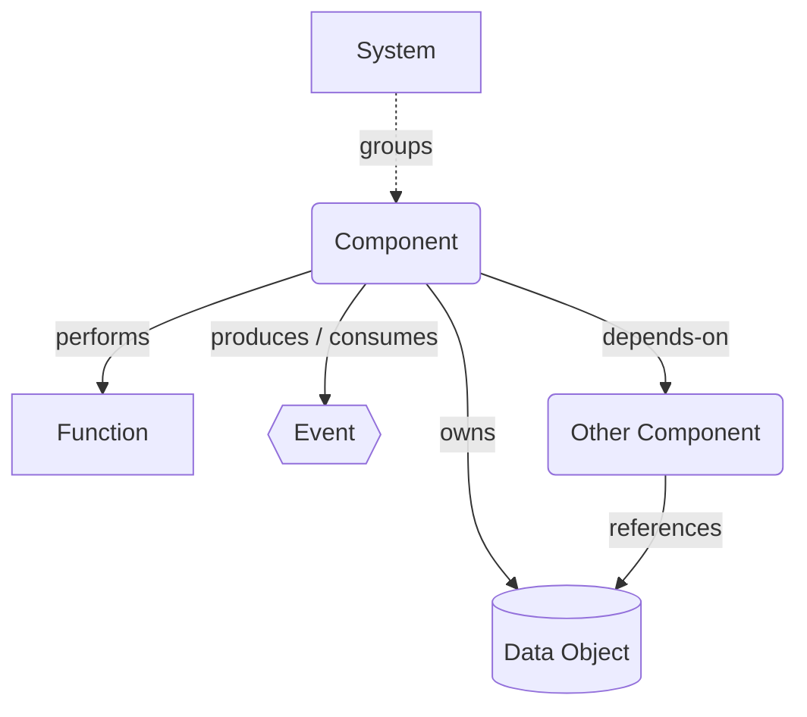
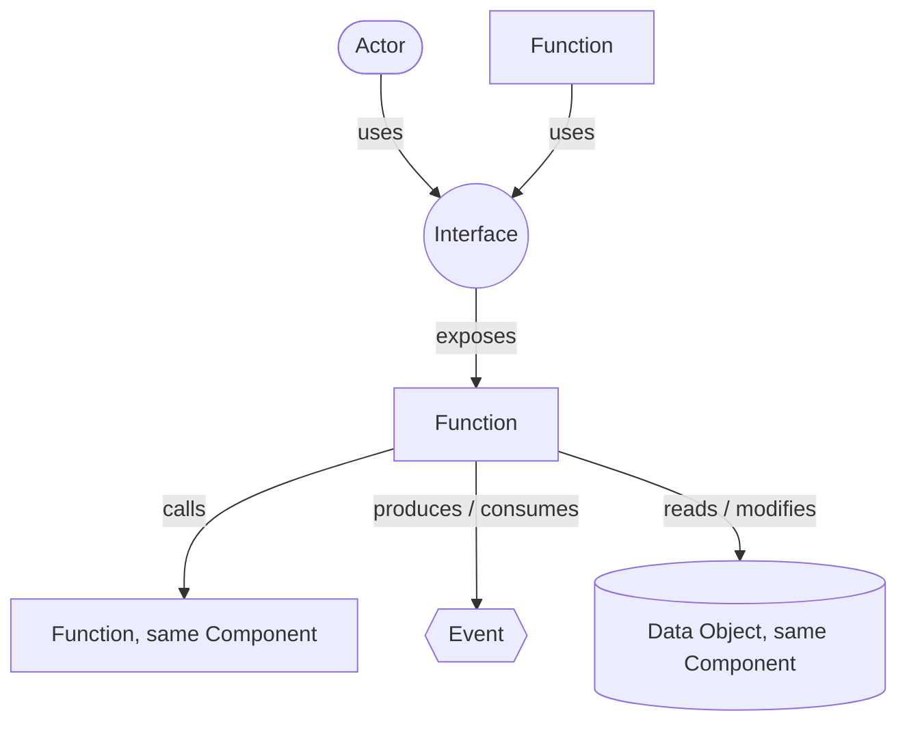
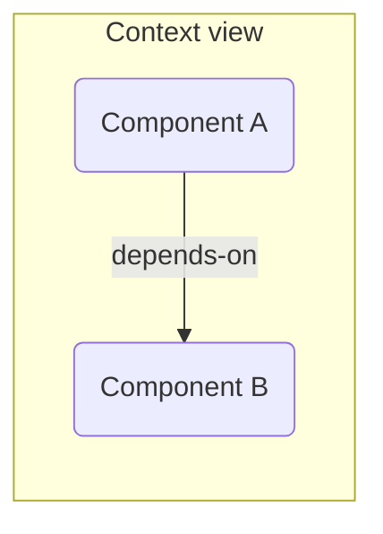
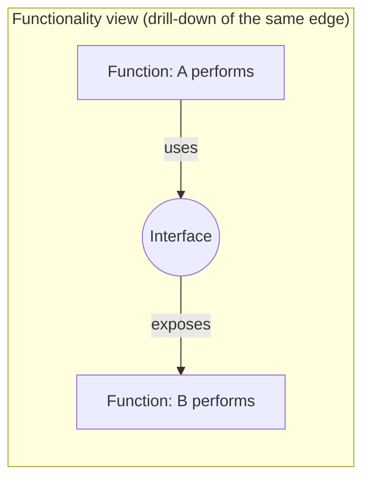
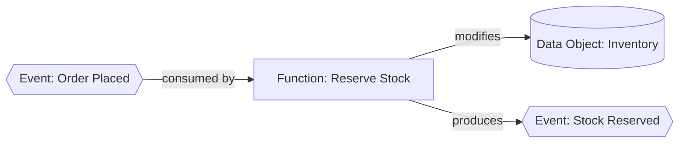
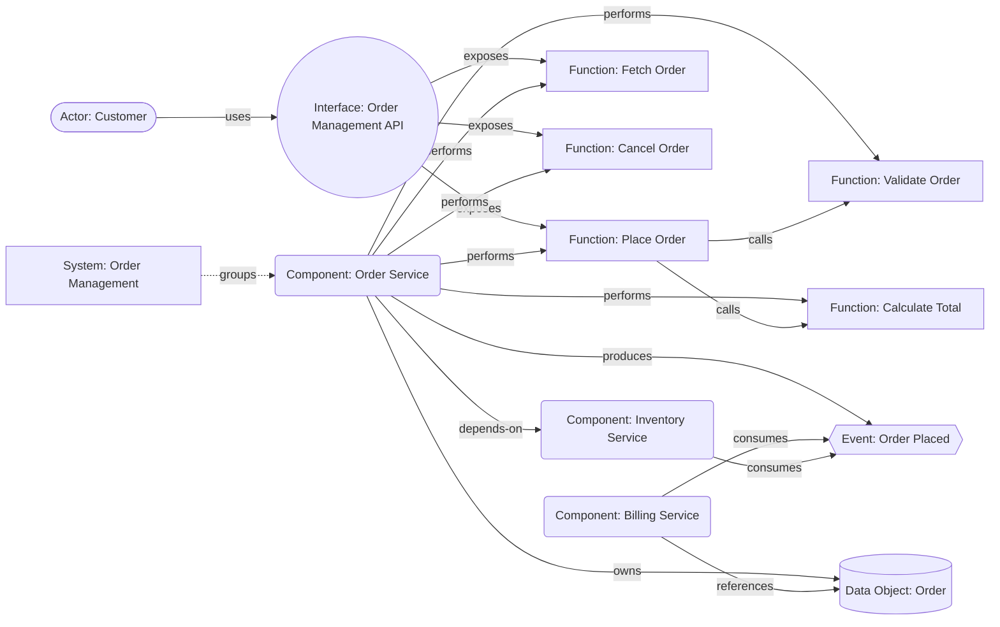

# Contour

## A Lightweight Framework for Modeling Software System Architecture

### Defining logical boundaries — functionality, data, and interfaces — as a business-readable structure for propagating change into code

**Version 0.2** — working draft

**Author:** Mykhailo Kulish ([LinkedIn](https://www.linkedin.com/in/mkulish/))

---

## Abstract

Enterprise and software architects routinely need to describe how a software
system behaves, what it offers to its environment, how it talks to other
systems, and what data flows through it. Comprehensive enterprise
architecture standards provide this — but at the cost of a large,
multi-layered metamodel that is often more than a single system
description needs.

This paper proposes **Contour** — a small, opinionated modeling
framework for the **logical boundary of a software system**: what it
does, the data it shares, and the interfaces it exposes and depends on.
It is written to be read by non-technical and technical audiences
alike, and structured precisely enough to act as **guardrails for
propagating a described change into actual code**, rather than as
after-the-fact documentation.

What gets modeled is a **System** — the business-level application a
stakeholder would name — usually delivered by several independently
deployable **Components**. Contour describes a System by describing its
Components: the Component is what gets drawn, the System is what they
add up to. Either way the model must serve three audiences at once: a
**non-developer**, who describes a needed change in business language
without reading code; a **developer**, who turns that into a safe
change; and an **LLM**, which can do the same, using the model as its
specification and its boundary.

The paper claims two things: that a readable Contour record is enough to
propagate a described change into an existing codebase correctly, and
enough to build a new Component from as a spec. A third, harder
possibility is left explicitly **optional** — reconstructing an
existing system's real prior behavior from its record alone. Section 6
treats that as untested and Section 7 proposes how to test it; nothing
else here depends on it.

The framework works in two tiers. A compact **diagram** shows a system's
shape at a glance; a **structured record** underneath each element
carries the detail a diagram can't hold — behavior, schemas, contracts,
ordered steps. Seven element types, a small set of relationship verbs
reused across two zoom levels (Section 3), and no separate vocabulary
per level. The name says the same thing: a contour traces an outline at
low resolution and leaves the interior to something else.

This is a personal working paper, not a finished standard. The goal is
to pressure-test whether a model this small still says enough to guide a
change into code correctly.

---

## Contents

1. [Motivation](#1-motivation)
2. [Design Principles](#2-design-principles)
3. [Core Metamodel](#3-core-metamodel)
   1. [Metamodel diagram](#31-metamodel-diagram)
   2. [Two Levels of Detail: Context View and Functionality View](#32-two-levels-of-detail-context-view-and-functionality-view)
   3. [The Structured Record](#33-the-structured-record)
   4. [Event-Driven Causal Chains](#34-event-driven-causal-chains)
   5. [Naming Conventions](#35-naming-conventions)
   6. [Requirements and Guardrails](#36-requirements-and-guardrails)
4. [Notation](#4-notation)
5. [Worked Example](#5-worked-example)
6. [Limitations and Open Questions](#6-limitations-and-open-questions)
7. [Next Steps](#7-next-steps)
8. [Conclusion](#8-conclusion)
9. [Appendix: Comparison to ArchiMate and C4](#appendix-comparison-to-archimate-and-c4)
10. [Changelog](#changelog)

---

## 1. Motivation

Most architecture documentation questions an architect is actually asked
boil down to a short, recurring list:

- What does this system *do*?
- What does it offer to the outside world, and to whom?
- How do other systems reach it (protocol, format, contract)?
- What events does it raise, and what does it react to?
- What data does it own or exchange?
- What does it depend on, and what depends on it?

Full enterprise frameworks answer these questions but bury them across
several layers (business, application, technology) and dozens of element
types, most of which are irrelevant when the scope is "describe this one
system and its neighbors." The result is that many architects fall back
to free-form boxes-and-arrows diagrams — expressive, but not comparable
across systems and not machine-readable.

A second, more demanding problem motivates this paper: a large amount of
software, particularly legacy software, exists with little or no
documentation of any kind. LLMs are increasingly capable of reading such
a codebase and producing *some* description of it — but a description
is only as useful as what it lets you do next. A description that lets a
human skim and nod along is not the same as a description precise
enough that a specific, described change — in business-friendly
language, not code — can be turned into the correct actual code change,
by a developer or an LLM, without drifting outside the system's
declared boundary. That is a genuinely useful outcome on its own, for
legacy modernization, incident response, or simply making a change
safely. Ordinary prose documentation, and most diagram notations, fall
short of that bar: they describe *shape*, not enough to guide *change*
correctly.

Reconstructing a legacy system's real prior behavior from its record
alone — no reference to the original source — is harder than either
claim this paper makes, and it is not claimed here. Sections 6 and 7
treat it as open and untested.

Contour aims at the middle ground on both problems at once: a notation
small enough to use consistently without a tool-enforced palette, but
structured enough — down to the level of individual Function behavior,
Data Object schemas, and Interface contracts — to be captured as data
(e.g., YAML/JSON), read by a non-developer in business language, and
acted on by a developer or an LLM to propagate a change correctly.

---

## 2. Design Principles

1. **Two boundaries: business and lifecycle.** A *System* is the
   business-level application a stakeholder would name — one capability,
   however it happens to be built. A *Component* is a lifecycle boundary
   inside it: one thing built, versioned, released, and retired as a
   whole. A System of one Component is normal; a System of several is
   common. Neither boundary is a size limit — a Component can be a small
   service or a large monolith, so long as it shares one lifecycle. Each
   diagram centres on one of these: everything else is either something
   it contains or something in its environment, and the one-page
   constraint governs the diagram, not the real size of what it depicts
   or the record beneath it.

2. **A small, fixed vocabulary.** Seven element types, on the diagram,
   and no more — a fixed vocabulary is easier to apply consistently than
   an extensible one. The record tier may still name things that are never
   drawn. Where a concept can be *derived* rather than declared, it is:
   a Function has no separate "service" counterpart, it simply becomes
   externally accessible the moment an Interface is attached to it, and
   private again when none is.

3. **Logical relations, not communication mechanisms.** Contour records
   *that* one thing invokes, reaches, or reacts to another — never how
   the invocation physically travels. Two Functions in one Component share
   the same `calls` relation whether that is a method call, an in-process
   bus, or an internal queue; a Function reaching another Component shares
   the same `uses` relation whether it is REST, gRPC, or a file drop. An
   Event marks a genuine crossing *between* Components — a logical fact, not
   a transport choice. Mechanism detail belongs in an Interface's schema
   or a Function's `behavior`.

4. **Data has a home.** Every Data Object is owned by exactly one Component.
   Only Functions of that Component may read or modify it directly; others
   reach it through an Interface or an Event, never by a direct data
   link. Ownership is asserted once and never implied, which is what
   keeps data lineage legible.

5. **Two levels of detail, not two layers.** Contour has no
   business/application/technology strata to switch between — business
   capability mapping and infrastructure topology stay out of scope. It
   has instead two *zoom levels of the same thing*: a Context view
   (Component-to-Component) and a Functionality view (Function-to-Interface),
   the way a map has a country view and a street view of one territory.
   The coarser level always summarizes the finer one — a `depends-on`
   edge stands for a `uses`→`exposes` chain underneath it — so detail is
   drilled into when needed, never duplicated. A System is a *grouping*
   drawn around Components in the Context view, not a third zoom level:
   it changes what the boundary encloses, not how deep the diagram goes.

6. **The diagram summarizes; the record holds the truth.** Each element
   has a shape on the diagram and a structured record underneath it. The
   diagram is what gets read first and stays deliberately small; the
   record is where completeness lives — descriptions, schemas, a
   Function's behavior and its ordered steps. When the two disagree, the
   record is authoritative.

7. **Written for three audiences at once.** A non-developer must be able
   to read the diagram unaided and describe a needed change in business
   language; a developer must be able to turn that into a safe change; an
   LLM must find the record unambiguous enough to do the same. This is
   why names are plain language and Functions are named for the work they
   do rather than their implementation — and why one model serves all
   three rather than three artifacts drifting apart.

8. **A guardrail, not a retrospective.** A record is not only written
   after the fact to describe what exists. It bounds what may be built or
   changed: the behavior, schemas and contracts are the boundary a Component
   is expected to stay inside of, whether it is being built for the first
   time or receiving a described change. What an element must achieve is
   named as a *Requirement*; where its implementation must stop, as a
   *Guardrail*. Both are defined once and referenced, rather than
   restated in each place they apply.

---

## 3. Core Metamodel

Contour defines **seven element types**:

| # | Element | Meaning |
|---|---------|---------|
| 1 | **System** | The business-level application a stakeholder would name — "Order Management", "Payments". A System groups the Components that together deliver one business capability. It performs no work of its own: everything a System does, one of its Components does. A System may contain a single Component, and often contains several |
| 2 | **Component** | One independently deployable unit — the unit most modeling happens at. A Component is whatever is built, versioned, released, and retired as a whole: one lifecycle, usually one owning team. In practice that means it deploys as one artifact — a single service, or a monolith, however large. Anything with more than one lifecycle is modeled as more than one Component, tied together by `depends-on` |
| 3 | **Function** | A capability the Component performs — internal or external. It becomes externally accessible the moment an Interface is attached to it. A Function can consume and react to an Event, produce an Event, or call another Function. It is the minimal unit of Component behavior — but not smaller than an actual piece of business-related work (e.g. `Calculate Total`, not `Parse Input`) |
| 4 | **Interface** | The technical channel through which one or more Functions are exposed (protocol, format, endpoint style) |
| 5 | **Event** | A notification to the environment that a Component's state has changed — "Payment Completed", "Order Created". An Event reports something that has already happened, which is why Event names are written in the past tense (Section 3.5) |
| 6 | **Data Object** | A named piece of information the Component owns |
| 7 | **Actor** | A person, external system, or organization that participates from outside |

and **nine relationship types** (three of which pair an inverse verb — `produces`/`consumes`, `reads`/`modifies`, `owns`/`references`):

| Relationship | Between | Meaning |
|---|---|---|
| **groups** | System → Component | This Component is one of the deployables delivering the System's capability. A Component belongs to exactly one System |
| **performs** | Component → Function | The component carries out this function |
| **exposes** | Interface → Function (one Interface may expose several Functions) | This interface makes the function externally reachable; a Function with no `exposes` edge is private. An Interface may expose more than one Function — e.g. one API covering several operations — but only Functions belonging to its own Component |
| **uses** | Actor / Function → Interface | A caller — external Actor or another Component's Function — reaches a Function through this interface |
| **calls** | Function → Function | One Function invokes another *within the same Component*, without going through an Interface. Order/sequence is deliberately not part of this relation — see the note below |
| **produces / consumes** | Component → Event, or Function → Event | At Component level, a Context-view summary: the component raises or reacts to this event. At Function level, the precise cause: which specific Function produces it, or reacts to it — see Section 3.4 |
| **reads / modifies** | Function → Data Object | A Function's actual read or write access to a Data Object owned by its *own* Component — see the ownership boundary note below |
| **owns / references** | Component → Data Object | Ownership vs. read/write access from elsewhere, at Context-view resolution |
| **depends-on** | Component → Component | A directed dependency, drawn at Context-view resolution — see Section 3.2 |

That's the entire metamodel. Everything on a Contour diagram is one of
these seven boxes connected by one of these nine relations.

**Why `calls` is separate from `uses`:** `uses` always crosses through an
Interface — a contract, with a protocol and a shape. `calls` is a
same-Component invocation with no contract in between; two Functions owned
by the same Component, one invoking the other. Keeping them distinct means
a reader can tell, from the relation alone, whether they're looking at a
governed boundary crossing or a plain internal invocation — collapsing
them into one verb would hide that difference.

**`calls` is a logical relation, not a synchronous one.** Despite the
verb, `calls` covers *any* invocation between two Functions in the same
Component — a direct method call, an in-process event bus, an internal
queue, a scheduled hand-off. Contour deliberately doesn't model which:
the mechanism is an implementation choice that belongs in the calling
Function's `behavior`, the same way protocol and transport belong on an
Interface rather than in a Function's name (Section 3.5). What the
model records is that one Function causes another to run inside the
same Component — a logical fact that doesn't change with the transport.
An Event, by contrast, marks a crossing *between* Components, which is a
boundary fact rather than a mechanism (principle 3).

**Ordering is not part of the `calls` edge itself.** If `Place Order`
calls `Validate Order` before `Calculate Total`, the `calls` edges on
the diagram don't show that sequence — same treatment as the
state-transition question for `modifies` (Section 3.4): the
relationship stays a plain, unordered edge. Sequence lives instead in
the calling Function's `steps` list, in its structured record (Section
3.3); the diagram's `calls` edges are a derived summary of that list,
not the authoritative source of order.

**The ownership boundary applies to `reads`/`modifies` too:** a Function
may only `reads` or `modifies` a Data Object owned (`owns`) by its own
Component — this is principle 4's "Data has a home" carried down to
Function-level precision, not a new rule. A Function in another Component
can never draw a direct `reads`/`modifies` edge to it; it can only reach
that data through an Event it consumes or an Interface it uses, same as
before.

**Public vs. private, by example:** a Function with an Interface
attached (`Place Order`, reached through the Order Management API) is
externally accessible. A Function with no Interface (`Validate Order`,
called only internally) stays private and is simply not reachable from
outside the Component boundary. One element, two visibility states, no
separate vocabulary for each.

**Granularity, by example:** `Calculate Total` is a Function —
recognizable, business-related work with its own meaning. `Parse Input`
is not — it's an implementation step inside some Function, not a piece
of behavior a stakeholder would think of as a distinct capability. The
`calls` relationship exists for genuine business-level orchestration
between Functions (`Place Order` calling `Validate Order`), not as an
invitation to decompose a Function down to its technical substeps —
that level of detail, if it matters, belongs in the calling Function's
`steps`/`behavior` record (Section 3.3), not as Functions of their own.

### 3.1 Metamodel diagram

Context-view relations (Component-level):



Functionality-view relations (Function-level), which the Context-view
relations above summarize (principle 5):



### 3.2 Two Levels of Detail: Context View and Functionality View

Contour can be drawn at two resolutions of the same model, chosen per
diagram rather than fixed for the whole framework:

- **Context view** — boxes are Components; the primitive relation is
  `depends-on` (Component → Component). This is the fast, whiteboard-friendly
  view: "what does this landscape look like." It is complete and valid
  on its own — you don't have to model Functions to draw it.
- **Functionality view** — boxes are Functions and Interfaces; the
  primitive relation is `uses` (Function → Interface). This is the
  precise, drill-down view: "*why*, specifically, does Component A depend
  on Component B?" Answer: because one of A's Functions `uses` an Interface
  that `exposes` one of B's Functions.

The two views describe the same territory at different resolutions. Once
the Functionality view exists, every Context-level `depends-on` edge
should be *explainable* by a `uses` chain underneath it — but a
Context-only diagram, drawn before anyone went that deep, is still a
complete model. Precise where the work has been done, honest where it
hasn't.





### 3.3 The Structured Record

The diagram answers "what exists and how does it connect." It
deliberately does not answer "what would I need to know to build this,
or to change it correctly." That second question is answered by a
structured record attached to each element — built from a small, shared
set of possible fields, rather than each of the seven inventing its own
shape:

- **`description`** — required. A plain-language sentence or two, same
  register as the name (Section 3.5) — what this element is, for a
  reader who isn't going to open the schema.
- **`schema`** — the structured shape, where the element has one: a
  Data Object's fields, an Interface's request/response contract. Can
  be given inline, or as a link to an existing schema artifact (an
  OpenAPI or AsyncAPI file, a JSON Schema, an Avro definition) rather
  than a re-authored duplicate — for legacy systems in particular
  (Section 1), the schema usually already exists somewhere; Contour can
  point at it instead of restating it. Not every element has one:
  System, Component, Actor, and Function all omit it (see below).

A Function deliberately has no `schema` of its own: its data shape is
already determined by its relations — the Interface that `exposes` it,
the Data Objects it `reads`/`modifies`, and any Interface it `uses`
elsewhere. A separate Function schema would restate those and drift
from them.

Any element may also carry `requirements` and `guardrails` (Section
3.6); because they apply everywhere, the table lists them once rather
than per element. Beyond that, a Function carries `behavior` and
`steps` — the one place `description` alone leaves room to guess:

| Element | Property | Description |
|---|---|---|
| **any element** | `requirements` | Optional list of Requirement names this element must satisfy (Section 3.6) |
| | `guardrails` | Optional list of Guardrail names this element must stay inside (Section 3.6) |
| **Function** | `description` | Plain-language summary of what the Function does |
| | `behavior` | Prose account of business rules and side effects, precise enough that its logic isn't left for an LLM to invent |
| | `steps` | Ordered list of the Function's own `calls`/`modifies`/`produces` (etc.) edges — the authoritative sequence the diagram's edges summarize |
| **Interface** | `description` | Plain-language summary of what this Interface provides |
| | `schema` | Request/response contract, error handling, authentication — inline, or a link to an existing spec (OpenAPI/AsyncAPI) rather than a re-authored duplicate |
| **Data Object** | `description` | Plain-language summary of what this data represents |
| | `schema` | Fields, types, constraints |
| **Event** | `description` | Plain-language summary of what happened |
| | `schema` | Payload shape |
| **System** | `description` | Plain-language statement of the business capability this System delivers |
| **Component** | `description` | Plain-language purpose of the Component |
| **Actor** | `description` | Plain-language role or relationship to the Component |

A sketch of what this looks like as data (not a proposed final syntax —
just illustrating the idea; see Section 7 for the actual serialization
work):

```yaml
Function: Place Order
  description: Accepts a new order request, validates it, and creates it.
  exposed_via: Interface(Order Management API, /orders)
  behavior: >
    Validates each item against current stock via Check Stock. Rejects
    the order if any item is out of stock. On success, persists an
    Order and emits Order Placed.
  steps:
    - calls: Validate Order
    - calls: Calculate Total
    - modifies: Order
    - produces: Order Placed

Interface: Order Management API
  description: REST/JSON API for creating, fetching, and cancelling orders.
  schema: https://internal/specs/order-api-openapi.yaml

DataObject: Order
  description: A customer's order, from placement through fulfillment.
  schema:
    id: uuid
    customerId: string
    items: LineItem[]
    total: decimal
    status: enum(pending, confirmed, cancelled)
```

`steps` is an ordered list, and each entry is just one of the
relationship verbs Section 3 already defines (`calls`, `modifies`,
`produces`, `reads`) — no new relationship type, and the
relationship count from Section 3 is unchanged. `consumes` doesn't
appear here: it's what triggers a Function to run in the first place
(Section 3.4), not one of the steps it takes once running. What changes
is which side is authoritative: the diagram's `calls`/`modifies`/`produces`
edges become a **derived, unordered summary** of a Function's `steps`
list, the same rollup pattern as principle 5 (Context summarizes
Functionality), applied one level further down — record summarizes into
diagram, not the other way around.

`steps` is deliberately a straight line, not a control-flow language: it
can't express "these two run in parallel" or "only call Calculate Total
if validation passed." That's left out of scope for now, the same way
Data Object state transitions were (Section 3.4) — worth revisiting only
if Section 7's tests show plain sequence isn't enough.

Diagram and record are meant to stay in sync the same way the two views
in Section 3.2 do — "soft consistency," not enforced, but expected: the
diagram is what you read first, the record is what you'd hand to an LLM
(or a developer) actually making the change.

### 3.4 Event-Driven Causal Chains

Section 3.2 showed `depends-on` as a Context-view summary of a
Function-level `uses`→`exposes` chain. The same rollup applies to
Events (principle 5): a Component-level `produces`/`consumes` edge is a
summary; the precise cause is a specific Function consuming an Event,
doing work that touches a Data Object, and possibly producing another
Event in turn. Because a Component is one lifecycle (Section 3), the
consuming Function is always in a *different* Component from the producing
one — an Event models a boundary crossing, and internal causality is
`calls` regardless of what mechanism carries it (principle 3). The
worked example below has `Reserve Stock`, on Inventory Service,
consuming an Event produced by Order Service:

```
Event --consumed by--> Function --modifies--> Data Object
                            |
                            +--produces--> Event
```

The shape of this chain follows from what an Event is (Section 3): the
`modifies` edge is the state change, and the `produces` edge is the
notification that it happened. A Function that produces an Event
without having changed anything is usually a sign the Event is really
reporting an activity rather than an outcome — worth re-checking
against the past-tense test in Section 3.5.

For readability, a causal chain reads left to right, event first — the
passive form of the relation rather than the active one used in the
Section 3 table (`consumed by` instead of `consumes`; same edge, same
direction, just the natural order for narrating "this happens, which
triggers that"):

```
Event: Order Placed <--consumed-- Function: Reserve Stock
Function: Reserve Stock --modifies--> Data Object: Inventory
Event: Stock Reserved <--produced-- Function: Reserve Stock
```

As a diagram:



This is deliberately a plain edge, not a state machine: `modifies` says
*that* `Reserve Stock` changes `Inventory`, not which field or which
state transition. A Data Object's structured record (Section 3.3) may
optionally describe states and transitions — the worked `Order` schema
already sketches a `status` enum — but the core metamodel stays at the
"this Function touches this Data Object" level, consistent with keeping
the diagram tier small (principle 1) and pushing precision into the
record (principle 6) rather than into the relationship itself.

### 3.5 Naming Conventions

Because the diagram tier is meant to be legible to a wide audience — not
only engineers — Contour treats naming as part of the metamodel, not a
stylistic afterthought:

- **Plain language, for a wide audience.** Names describe things the way
  any project stakeholder would recognize them, not the way a codebase
  would. "Reserve Stock" reads as work being done; `InventoryUpdateHandler`
  or `calcTotalV2` reads as code. Class names, method names, and other
  implementation detail belong in the element's `description` or
  `behavior` (Section 3.3), never in the name shown on the diagram.
- **Functions are named for the work, not the mechanism.** A Function
  name states what actually gets done — an action plus the thing it
  acts on ("Reserve Stock", "Validate Order", "Calculate Total") — not
  the technical means used to do it, the class it happens to map to, or
  the protocol it runs over. Protocol and transport details belong on
  the Interface (Section 3, `exposes`), never folded into the Function's
  name — this is principle 7 applied to naming.
- **Events are named in the past tense.** An Event reports a state
  change that has already happened, so its name says so: "Order
  Placed", "Payment Completed", "Stock Reserved" — not "Place Order"
  (that's the Function doing the work) or "Order Placement" (which
  names a process, not an outcome). The tense is the tell: if a name
  reads as an instruction or an activity in progress, it is describing
  a Function, not an Event.

### 3.6 Requirements and Guardrails

Two kinds of statement don't belong inside any single element's
`description` or `behavior`: what an element must *achieve*, and where
its implementation must *stop*. Contour names both, as record-tier
concepts rather than diagram elements:

- A **Requirement** states something an element must address — a
  business rule, a technical or operational target, a regulatory
  obligation. It is a positive obligation: the element is not correct
  unless it satisfies this.
- A **Guardrail** states a boundary the implementation must stay
  inside — where responsibility ends, what must not be reimplemented,
  reached for, or bypassed. It doesn't say what to achieve; it directs
  *how* the achieving may be done.

The distinction is worth holding onto, because the two fail differently.
A missed Requirement means the element doesn't do its job. A crossed
Guardrail means the element does its job the wrong way — often by
absorbing responsibility that belongs somewhere else, which is exactly
the drift a model is supposed to prevent.

Both are named, defined once, and *referenced* by the elements they
apply to — the same way a `schema` field can point at an external spec
instead of restating it inline. Neither is ever drawn, and either may be
referenced from **any** element: an Interface can carry a boundary about
what it must never expose, a Data Object one about where it may be
copied to, just as readily as a Function can carry one about
responsibility it must not absorb.

```yaml
Requirement: Minimum Order Value
  description: >
    An order must total at least $1.00 before it can be placed; smaller
    amounts are rejected to avoid processing-fee losses.

Guardrail: Payment Logic Stays in Billing
  description: >
    Order Service must not compute, authorize, or settle payments. It
    calls Billing Service through its Interface and treats the result
    as opaque.

Function: Place Order
  description: Accepts a new order request, validates it, and creates it.
  requirements: [Minimum Order Value]
  guardrails: [Payment Logic Stays in Billing]
```

`Place Order`, not `Calculate Total`, is where the Minimum Order Value
requirement belongs: `Calculate Total` should only produce a fact — the
order's total — not decide anything about it. Rejecting an order
because that fact falls below a threshold is a business decision, and
that decision belongs to whichever Function owns it. `Place Order`
calls `Calculate Total` (per its `steps` list in Section 3.3) to get
the total, then is the one responsible for satisfying the Requirement
against it.

Neither field replaces `behavior`: that says what the Function does, a
Requirement what must be true of it, a Guardrail what it must not
become.

Principle 2 governs the *diagram* vocabulary — what gets a box and a
shape. `requirements` and `guardrails` are lists of names, not boxes, so
neither the element count nor the relationship count changes because of
them. A `schema` link to an external spec already worked this way.

**Both are enforced, not declarative.** Unlike the "soft consistency,
not enforced" caveat that applies to the Context/Functionality views
(Section 3.2), these references are meant to be checked rather than
asserted: Section 7's tests include a compliance check — after
propagating a change into a Component (or, for the optional reconstruction
test, after regenerating it from its record alone), verify for every
element that each Requirement it references is satisfied and each
Guardrail it references is respected, whether by a test asserting the
rule directly or by grading the result against the description. A
Requirement or Guardrail that fails that check isn't a documentation
gap; it's a failed test, the same as a structural or contractual
mismatch would be.

---

## 4. Notation

Contour uses seven simple shapes so a diagram can be drawn by hand and still
be recognizable:

- **System** — dashed boundary drawn around the Components it groups,
  labeled at the edge. A grouping, not a box that performs work — which
  is why its border is dashed and the Components inside keep their own
  solid ones
- **Component** — rounded rectangle, bold border
- **Function** — plain rectangle, nested inside the Component box. A
  Function sitting on the Component's edge with a lollipop attached is, by
  construction, externally accessible; one sitting fully inside with no
  lollipop is private — the same box, distinguished purely by whether an
  Interface touches it
- **Interface** — small labeled circle or "lollipop," attached directly
  to the Function(s) it exposes (borrowed from UML's provided-interface
  notation). One lollipop may connect to more than one Function box when
  a single Interface covers several operations — e.g. one API exposing
  `Create Order`, `Fetch Order`, and `Cancel Order` — rather than
  drawing a separate Interface per operation
- **Event** — hexagon
- **Data Object** — cylinder (borrowed shorthand for "a store of data,"
  used purely as a pictogram — not implying a database)
- **Actor** — stick figure when drawn by hand; a stadium (capsule)
  shape in tools that have no stick figure, placed outside the
  Component boundary. Not a circle: that shape belongs to Interface

Relationships are drawn as directed arrows, labeled with the relationship
verb (`performs`, `exposes`, `uses`, `produces`, `owns`, `depends-on`,
etc.) so the diagram is readable without a legend.

Every diagram in this paper follows these shapes, so Sections 3.1 and 5
double as a notation reference.

---

## 5. Worked Example

A small **Order Service** in an e-commerce context:



One Interface, the `Order Management API`, `exposes` three
operations rather than being drawn three times for one Function each.
Those three are externally accessible; `Validate Order` and `Calculate
Total` carry no Interface, so they stay private — `Place Order` reaches
them with `calls`, inside the Component, no contract in between. Order
Service owns the `Order` Data Object and announces completion via
`Order Placed`, which both Billing and Inventory consume. Billing
`references` that data rather than reaching it directly, per
principle 4.

Note what is deliberately *absent*: no deployment nodes, no
infrastructure, no organizational/business-layer elements. Those are
out of scope by design (Section 2, principle 5).

**Drilling into the dependency:** the `depends-on` edge to Inventory is
a Context-view summary. If we needed to know *why*, the Functionality
view underneath it might look like this:


`Calculate Total` — one specific Function inside Order Service — is what
actually drives the dependency, not the Component as a whole. That
precision is optional: the Context-view diagram above is a complete,
valid model on its own without ever drawing this second diagram.

**Drilling into the event:** the same optional precision applies to the
`Order Placed` event. At Context level, Order Service `produces` it and
Billing `consumes` it — that's the whole story on the diagram above. The
Functionality-view chain underneath (Section 3.4), on Inventory's side
rather than Billing's, might look like this:


`Reserve Stock` is the specific Function reacting to `Order Placed`, and
`Stock Reserved` is a second Event the Context-view diagram never had to
show.

---

## 6. Limitations and Open Questions

- **No layering** means Contour cannot, by itself, connect a system model
  to business capability *mapping* or strategy — the portfolio-level
  discipline of tracing systems to an enterprise capability model. It
  would need to compose with a separate business-layer model for that.
  (This is distinct from the Function-level sense of "what capability
  this Component performs" in principle 7, which Contour does express.)
- **No deployment/infrastructure view** — physical or cloud topology is
  intentionally out of scope. Note that although a Component is *defined*
  as one deployable unit (Section 3), Contour models the boundary that
  definition draws, not the infrastructure the deployable runs on.
- Whether nine relationship types are *actually* sufficient for more
  complex, multi-directional data-flow scenarios is untested.
- **Neither vocabulary has settled.** Elements have been the more
  stable of the two, but not fixed — System was added once it became
  clear the business-level grouping needed a name of its own.
  Relationships have grown further and faster as the precision bar
  rose: `uses`, `reads`/`modifies`, `calls`, and `groups` were each
  added to express something the earlier set couldn't. Neither list is
  finished, and the relationship list less so.
- **Call ordering has a structured home now, but only for the straight
  line.** The `steps` list (Section 3.3) resolves plain sequence — a
  Function's `calls`/`modifies`/`produces` edges can now be read in
  order, not just asserted as an unordered set. What it still can't
  express is branching or parallelism: "these two run at once," or
  "only call Calculate Total if validation passed." That's left out of
  the metamodel deliberately for now, same call as the Data Object
  state-transition question (Section 3.4); worth revisiting once the
  tests in Section 7 show whether a straight-line `steps` list
  is actually sufficient in practice, or whether real systems
  need conditional/parallel steps often enough to justify the added
  complexity.
- **Same function, differently-shaped interfaces.** Because a Function
  is the single unit of both behavior and contract, a capability
  exposed through two interfaces with genuinely different shapes (e.g.
  REST v1 vs. v2 with different fields) can't share one Function box —
  each becomes its own Function, even if they share an implementation
  internally. This is arguably correct at context level (the model
  should reflect distinguishable external behavior, not shared code),
  but it is a deliberate trade-off of collapsing contract and behavior
  into one element, not a free simplification.
- **Soft consistency between the two views is unenforced.** Nothing in
  the model requires a Context-view `depends-on` edge to actually be
  explainable by a `uses` chain in the Functionality view, or vice
  versa — the two can drift apart silently unless a modeler (or, later,
  tooling) checks them against each other. Whether that check should
  ever become mandatory, rather than left as a documentation habit, is
  worth revisiting once the YAML serialization exists to enforce it.
- **Requirement and Guardrail compliance grading is itself untested.**
  Section 3.6 prescribes checking both as part of Section 7's tests,
  but *how* that check is done — a hard test assertion versus an LLM
  grading the resulting code against a `description` — hasn't been
  tried in practice, and the two give very different reliability
  guarantees. Guardrails may be the harder of the two: a Requirement
  can often be asserted directly ("rejects orders under $1.00"), while
  a boundary ("doesn't reimplement payment logic") is a statement about
  what the code *doesn't* do, which is much harder to test for than to
  describe.
- **Full reconstruction of an existing system is optional, and
  unproven.** The paper's primary claims are narrower — that a Contour
  record is detailed enough to guide a *specific, described change*
  into an existing codebase correctly, and detailed enough to build a
  *new* Component correctly from the record as a spec (Abstract, Section
  1). Taking a system that already exists and regenerating code that
  matches its real prior behavior, using the record alone with no
  reference to the original source, is a further possibility the model
  happens to support, not something this paper claims works: no
  round-trip (real code → Contour record → regenerated code, checked
  against the original) has been attempted. Until that's tried, "enough
  detail to match prior behavior" is a guess: a Function's `behavior`
  field, in particular, could easily be under-specified for anything
  beyond toy-sized logic, or could balloon into effectively re-writing
  the source in prose. Where that line sits is an open question worth
  testing (Section 7), but answering it isn't a precondition for the
  change-propagation or new-build claims the rest of the paper depends
  on.
- **The change-propagation claim is untested — and it is the paper's
  biggest open question.** No experiment has confirmed that a
  non-developer's business-language change description, run through a
  Contour record, reliably produces the correct code change. Everything
  else in the paper is built on the assumption that it does. It is a
  smaller and more plausible claim than full reconstruction, but being
  the more modest of the two is not evidence that it works: Section 7's
  first test exists specifically to find out, and until it has been
  run, this is the assumption most worth being sceptical of.

---

## 7. Next Steps

1. **Test change propagation first — this is the paper's actual
   premise.** Take one small, real piece of software with a Contour
   record; have a non-developer (or a description written in
   business-friendly language) specify one concrete change; have a
   developer or an LLM turn that description into the actual code
   change; check that it's correct and that every referenced Requirement
   and Guardrail (Section 3.6) was honored. This is the claim the rest of the paper
   depends on, and it hasn't been tried yet.
2. **Round-trip test full reconstruction of an existing system —
   optional, secondary.** Take a real system that already exists; have
   an LLM produce a Contour structured record (Section 3.3) from its
   source; then have an LLM regenerate the code from *only* that
   record, with no reference back to the original. Compare the
   regenerated behavior against the *real* original behavior. Worth
   trying because the model happens to support it, but it is not a
   precondition for anything else in this paper and should not block on
   being solved first.
3. **Prototype the System-level view.** A System now exists as an
   element (Section 3), but only as a grouping with a `description`.
   What it still lacks is a drawn view of its own: several Component
   diagrams composed into one landscape of the System they belong to,
   without violating the one-page-per-diagram principle at the
   individual level. That view is what would show whether a System needs
   properties beyond a name and a description — ownership, a lifecycle
   of its own, cross-Component requirements — or whether grouping is all
   it ever needs to be.
4. Prototype a plain-text (YAML) serialization of the seven elements,
   including the structured-record fields from Section 3.3, and render
   the diagram tier from it automatically.
5. Apply Contour to a real legacy system with little or no existing
   documentation, specifically, to see where the element vocabulary
   or the record-level detail strains against real undocumented
   complexity — including cases where a "legacy system" turns out, once
   modeled, to actually be several deployables already.

---

## 8. Conclusion

Contour is an attempt to answer a narrow but demanding question: can a
software system's *logical boundary* — its functionality, the data it
shares, and the interfaces it exposes and depends on — be described
precisely enough, and readably enough for a non-developer, that a
specific described change can be propagated into existing code
correctly, or a new Component built correctly from the record as a spec,
by a developer or an LLM? Whether an *existing, real* system could also
be reconstructed to match its actual prior behavior — regenerated from
the record alone, without reference to the original source, then
checked against it — is a harder, optional question the same structure
happens to support, and not one this paper claims yet. The framework
keeps its diagram small on purpose (seven elements, two zoom levels, one
page per diagram) and pushes the completeness that guiding a change
correctly demands into a structured record underneath each element. Whether that split holds up — whether "enough detail to
guide a change" and "small enough to stay usable" can really coexist —
is untested, and is exactly what Section 7's change-propagation
experiment is meant to find out; the harder, optional regeneration
question comes after.

---

## Appendix: Comparison to ArchiMate and C4

Contour is a deliberate subset-and-simplification, not a derivative of
either:

| Aspect | ArchiMate | C4 | Contour |
|---|---|---|---|
| Element count | 50+ across 3 layers | ~8 (across diagram types) | 7, single layer |
| Notation | Standardized shapes & colors (Open Group spec) | Boxes + arrows, informal | Generic geometric shapes, no reserved iconography |
| Scope | Whole enterprise (business, application, technology, motivation) | One software system's structure | One system and its immediate environment |
| Zoom levels | Layers (business/application/technology) | Separate diagram types (Context, Container, Component, Code, Dynamic) | Two views of one model (Context, Functionality) — Section 3.2 |
| Relationships | 10+ formal types with precise semantics | Informal, unlabeled by convention | 9 relationship types, reused across both views |
| Service concept | A dedicated element (Business/Application Service, separate from Process/Function) | Not modeled explicitly | No separate type — externality is a derived property of a Function with an Interface attached |
| Sequence/ordering | Not a core concern | Dynamic diagram (separate, numbered arrows) | `steps` list on a Function's record (Section 3.3) |
| Tooling | Formal metamodel, exchange format, certified tools | Informal; Structurizr DSL as one implementation | Tool-agnostic (plain diagrams or simple YAML) |

A few points worth stating plainly rather than leaving to the table:

- The **Context / Functionality** split (Section 3.2) echoes C4's own
  resolution of the same problem — a Context diagram and a Component
  diagram of the same system, with no requirement to draw both — but
  Contour keeps one fixed element vocabulary across both resolutions
  rather than C4's separate diagram types, each with its own
  conventions.
- The `steps` list on a Function (Section 3.3) has a direct precedent in
  C4's supplementary Dynamic diagram, which numbers ordered interactions
  between components for a use case. C4 explicitly treats Code as its
  lowest, optional level and recommends *not* hand-maintaining it, since
  low-level structure churns too fast to document by hand. `steps`
  pushes into that territory on purpose — not because Contour disagrees
  that this detail churns fast, but because guiding a change correctly
  (Section 1) needs exactly this precision to exist as data. That's a
  real, knowingly-accepted maintenance cost, not an oversight.
- No ArchiMate or C4 shapes, colors, or relationship names are reused;
  the similarity is only at the level of the general idea (component +
  contract + relation modeling, viewed at more than one zoom level),
  which is common ground shared by many architecture notations and not
  something any single framework owns. One term does overlap: ArchiMate
  has a Motivation-layer element called Requirement. Contour's
  Requirement is a different thing in a different place — a record-tier
  annotation on an element, never a modeled element with a shape of its
  own, and with no motivation layer for it to live in. The word is a
  common noun in this field rather than a coined one, but the overlap is
  worth naming rather than glossing over.
- **"Component" means something finer-grained in C4.** C4's deployable
  unit is a *Container*; its Component sits one level below that, inside
  a Container. Contour's Component is the deployable, so it maps to C4's
  Container, not C4's Component. The naming instead follows the lay
  reading — a System is made of Components — which Backstage's software
  catalog arrived at independently: there too, `Component` is one
  deployable service and `System` is a group of Components forming a
  product. Prior art is genuinely split on this word; Contour sides with
  the reading a non-technical stakeholder would expect (principle 7).
  The mapping, stated plainly: Contour Component ≈ C4 Container ≈
  Backstage Component.

A third, non-diagram comparison worth naming given Contour's
record tier (Section 3.3): interface-description formats
like **OpenAPI** and **AsyncAPI** already solve "precise enough to
regenerate a client or server" — but only for the Interface/Event
contract layer, in isolation, without the surrounding
Component/Function/Data Object context or the Context-view landscape.
Contour's structured record is closer in spirit to that kind of precision,
applied across all seven elements rather than interfaces alone, and
paired with the lighter-weight diagram those formats don't attempt to
provide.

---
