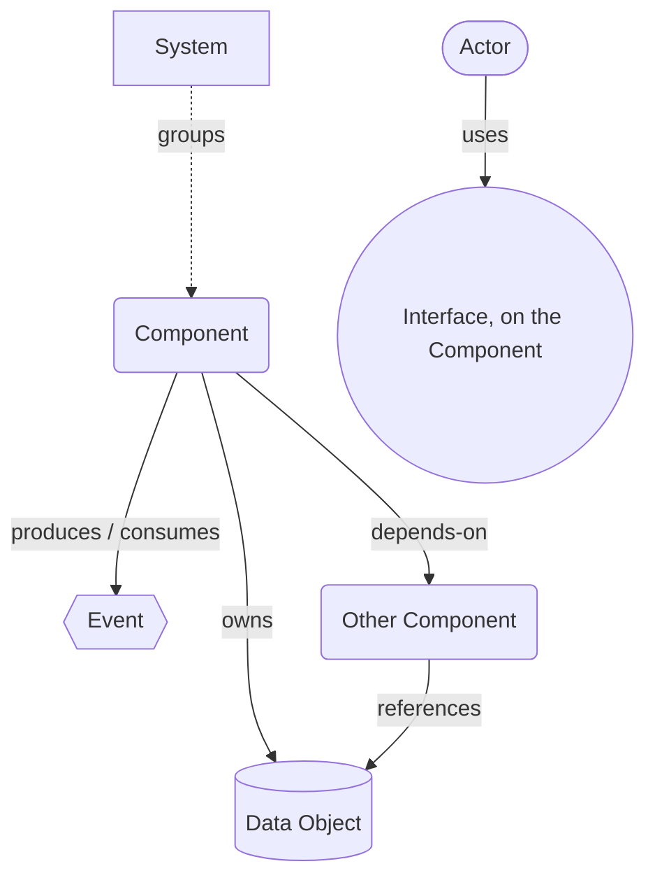
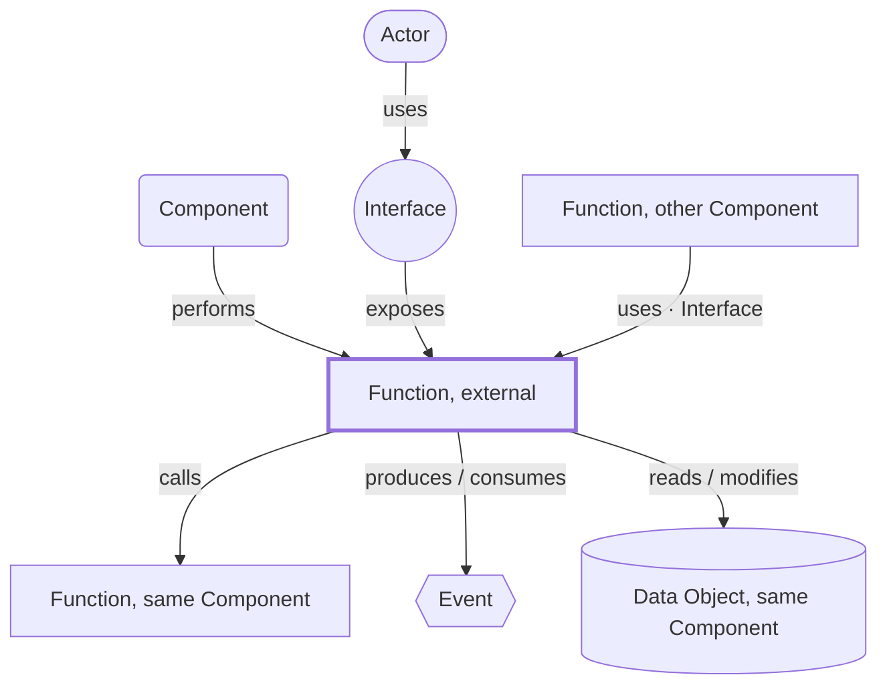
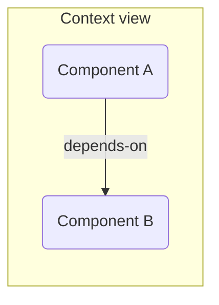
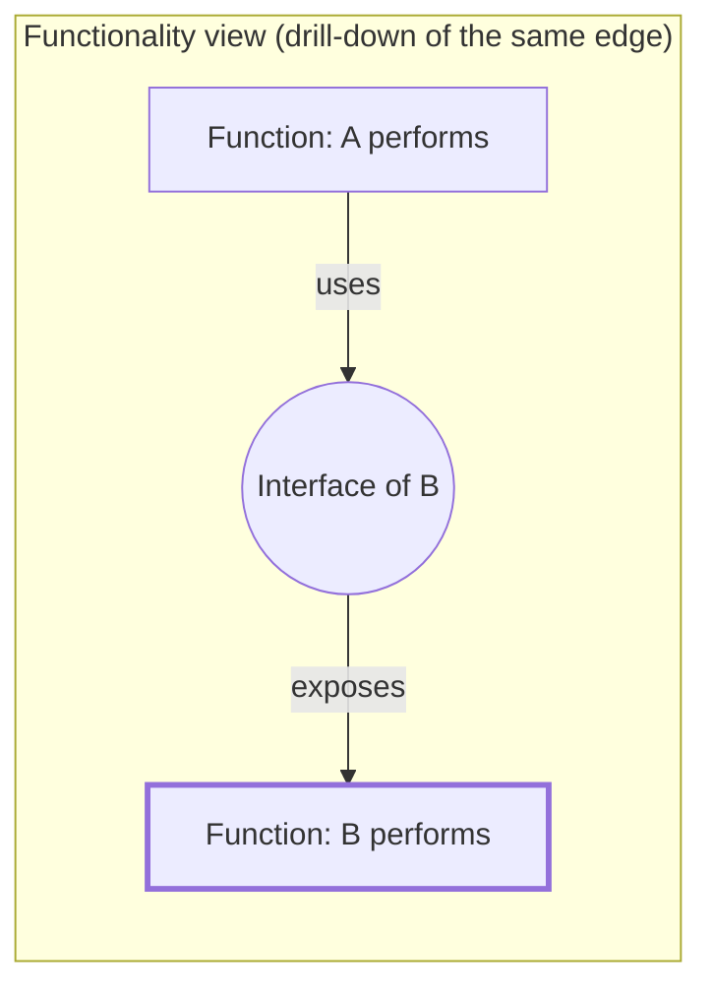
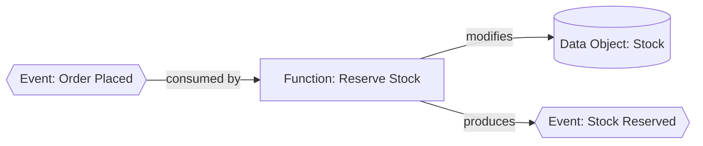
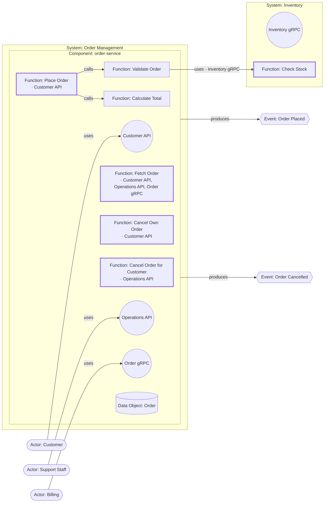
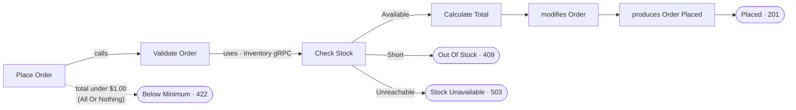

# Contour

## A Lightweight Framework for Modeling Software System Architecture

### Defining logical boundaries — functionality, data, and interfaces — as a business-readable structure for propagating change into code

**Version 0.5** — working draft

**Author:** Mykhailo Kulish ([LinkedIn](https://www.linkedin.com/in/mkulish/))

---

## Abstract

Enterprise and software architects routinely need to describe how a software
system behaves, what it offers to its environment, how it talks to other
systems, and what data flows through it. Comprehensive enterprise
architecture standards provide this — but at the cost of a large,
multi-layered metamodel that is often more than a single system
description needs.

This paper proposes **Contour** — a small, opinionated modeling
framework for the **logical boundary of a software system**: what it
does, the data it shares, and the interfaces it offers and depends on.
It is structured precisely enough to act as **guardrails for
propagating a described change into actual code**, rather than as
after-the-fact documentation, and it serves three audiences at once: a
**non-developer**, who describes a needed change in business language
without reading code; a **developer**, who turns that into a safe
change; and an **LLM**, which can do the same, using the model as its
specification and its boundary.

What gets modeled is a **System** — the business-level application a
stakeholder would name — which exists to serve its **Actors**: people,
organizations, other systems. What it offers them is a set of
**Functions**, and each Actor's record names the ones it **uses**. How
it is built is a separate decision: **Components** implement the
System, grouping its Functions and the data they keep by lifecycle,
maintainability and availability, and **Interfaces** are the channels
through which its callers reach the Functions. A model is complete
with all of this filled in, but it does not start that way, and it can
be started from either end: **top-down**, from the Actors and the
Functions they need, or **bottom-up**, from the Components and
Interfaces found in source code. One checker reads the model either
way and reports what is *wrong* separately from what is *not filled in
yet* (Section 3.7).

The paper claims two things: that a readable Contour record is enough to
propagate a described change into an existing codebase correctly, and
enough to build a new Component from as a spec. The evidence lives in a
companion document, [`contour-experiments.md`](contour-experiments.md),
which also carries the roadmap. In short: preliminary experiments
support both claims on one small codebase. On a real undocumented
legacy subsystem they support the second only for structure: the
record was a sufficient spec for the new Component's shape, not for its
detailed behavior. A third, harder
possibility — reconstructing an existing system's real prior behavior
from its record alone — is left explicitly **optional** and untested;
nothing else here depends on it.

The framework works in two tiers. A compact **diagram** shows a system's
shape at a glance; a **structured record** underneath each element
carries the detail a diagram can't hold — behavior, schemas, contracts,
ordered steps. Seven element types and nine relationship verbs, one
vocabulary partitioned across two zoom levels (Section 3), and no
separate vocabulary per level. The name says the same thing: a contour
traces an outline at low resolution and leaves the interior to something
else.

This is a personal working paper, not a finished standard. The goal is
to pressure-test whether a model this small still says enough to guide a
change into code correctly.

---

## Contents

1. [Motivation](#1-motivation)
2. [Design Principles](#2-design-principles)
3. [Core Metamodel](#3-core-metamodel)
   1. [Metamodel diagram](#31-metamodel-diagram)
   2. [Two Levels of Detail: Context View and Functionality View](#32-two-levels-of-detail-context-view-and-functionality-view)
   3. [The Structured Record](#33-the-structured-record)
   4. [Event-Driven Causal Chains](#34-event-driven-causal-chains)
   5. [Naming Conventions](#35-naming-conventions)
   6. [Requirements and Guardrails](#36-requirements-and-guardrails)
   7. [One Model, Two Directions](#37-one-model-two-directions)
4. [Notation](#4-notation)
5. [Worked Example](#5-worked-example)
6. [Limitations and Open Questions](#6-limitations-and-open-questions)
7. [Conclusion](#7-conclusion)
8. [Appendix: Comparison to ArchiMate and C4](#appendix-comparison-to-archimate-and-c4)
9. [Changelog](#changelog)

Experiment results and the roadmap live in the companion document
[`contour-experiments.md`](contour-experiments.md); the worked examples,
their model files and the checker's output on them, in
[`contour-example.md`](contour-example.md).

---

## 1. Motivation

Most architecture documentation questions an architect is actually asked
boil down to a short, recurring list:

- What does this system *do*?
- What does it offer to the outside world, and to whom?
- How do other systems reach it (protocol, format, contract)?
- What events does it raise, and what does it react to?
- What data does it own or exchange?
- What does it depend on, and what depends on it?

Full enterprise frameworks answer these questions but bury them across
several layers (business, application, technology) and dozens of element
types, most of which are irrelevant when the scope is "describe this one
system and its neighbors." The result is that many architects fall back
to free-form boxes-and-arrows diagrams — expressive, but not comparable
across systems and not machine-readable.

A second, more demanding problem motivates this paper: a large amount of
software, particularly legacy software, exists with little or no
documentation of any kind. LLMs are increasingly capable of reading such
a codebase and producing *some* description of it — but a description
is only as useful as what it lets you do next. A description that lets a
human skim and nod along is not the same as a description precise
enough that a specific, described change — in business-friendly
language, not code — can be turned into the correct actual code change
without drifting outside the system's declared boundary. That is a
genuinely useful outcome on its own, for legacy modernization, incident
response, or simply making a change safely. Ordinary prose
documentation, and most diagram notations, fall short of that bar: they
describe *shape*, not enough to guide *change* correctly.

Contour aims at the middle ground on both problems at once: a notation
small enough to use consistently without a tool-enforced palette, but
structured enough — down to the level of individual Function behavior,
Data Object schemas, and the Interfaces external Functions are offered
through — to be captured as data
(e.g., YAML/JSON) and acted on to propagate a change correctly.

A note on words: capitalized terms (System, Component, Function, …) are
Contour elements. Lowercase "system" is the ordinary word.

---

## 2. Design Principles

1. **Two boundaries: business and lifecycle.** A *System* is the
   business-level application a stakeholder would name — one capability,
   however it happens to be built — and it exists to serve its Actors.
   A *Component* is how part of it is implemented: a lifecycle boundary
   inside the System, one thing built, versioned, released, and retired
   as a whole, grouping Functions and Data Objects that belong together
   for lifecycle, maintainability and availability reasons. What the
   System offers comes first; how it is split into Components is a design
   decision that can change without changing what is offered — and one
   that a model need not have made yet: a model with no Components says
   what the System does, not how it is split. A System
   of one Component is normal; a System of several is common. Neither
   boundary is a size limit — a Component can be a small
   service or a large monolith, so long as it shares one lifecycle. Each
   one-page diagram centres on one System: everything else is either
   something it contains or something in its environment. The one-page constraint
   governs the diagram, not the real size of what it depicts or the
   record beneath it.

2. **A small, fixed vocabulary.** Seven element types, on the diagram,
   and no more — a fixed vocabulary is easier to apply consistently than
   an extensible one. The record tier may still name things that are never
   drawn. Where a concept can be *derived* rather than declared, it is:
   a Function has no separate "service" or "interface" counterpart; it is
   externally accessible exactly when an Interface
   exposes it, and private otherwise. Likewise an Interface declares no
   owner: it sits on whichever Component performs the Functions it
   exposes.

3. **Logical relations, not communication mechanisms.** Contour records
   *that* one thing invokes, reaches, or reacts to another — never how
   the invocation physically travels. Two Functions in one Component share
   the same `calls` relation whether that is a method call, an in-process
   bus, or an internal queue; a Function reaching another Component shares
   the same `uses` relation whether it is REST, gRPC, or a file drop. An
   Event marks a genuine crossing *between* Components — a logical fact, not
   a transport choice. Mechanism detail belongs in an Interface's `binding`
   (Section 3.3) or a Function's `behavior`.

4. **Data has a home.** Every Data Object is owned by exactly one Component.
   Only Functions of that Component may read or modify it directly; others
   reach it through an external Function or an Event, never by a direct data
   link. Ownership is asserted once and never implied, which is what
   keeps data lineage legible. A Data Object is state the Component
   keeps; data that only crosses a boundary — what a caller sends, what
   it gets back — is described in the Interface where it crosses
   (Section 3.3), not as a Data Object.

5. **Two levels of detail, not two layers.** Contour has no
   business/application/technology strata to switch between — business
   capability mapping and infrastructure topology stay out of scope. It
   has instead two *zoom levels of the same thing*: a Context view
   (Component-to-Component) and a Functionality view (Function-to-Function),
   the way a map has a country view and a street view of one territory.
   The coarser level always summarizes the finer one — a `depends-on`
   edge stands for a `uses` edge to an external Function underneath it — so detail is
   drilled into when needed, never duplicated. A System is a *grouping*
   drawn around Components in the Context view, not a third zoom level:
   it changes what the boundary encloses, not how deep the diagram goes.

6. **The diagram summarizes; the record holds the truth.** Each element
   has a shape on the diagram and a structured record underneath it. The
   diagram is what gets read first and stays deliberately small; the
   record is where completeness lives — descriptions, schemas, a
   Function's steps and the ways it can end, an Interface's exchanges. When the two disagree, the
   record is authoritative.

7. **Written for three audiences at once.** A non-developer must be able
   to read the diagram unaided and describe a needed change in business
   language; a developer must be able to turn that into a safe change; an
   LLM must find the record unambiguous enough to do the same. This is
   why names are plain language and Functions are named for the work they
   do rather than their implementation — and why one model serves all
   three rather than three artifacts drifting apart.

8. **A guardrail, not a retrospective.** A record is not only written
   after the fact to describe what exists. It bounds what may be built or
   changed: the behavior, schemas and Interfaces are the boundary a Component
   is expected to stay inside of, whether it is being built for the first
   time or receiving a described change. What an element must achieve is
   named as a *Requirement*; where its implementation must stop, as a
   *Guardrail* (Section 3.6).

9. **One model, two directions.** There is one model at one level; its
   elements are peers, not layers. What varies is where the filling-in
   starts: top-down, from the Actors and the Functions they use —
   Components and Interfaces derived later from Requirements,
   Guardrails and those uses — or bottom-up, from the Components,
   Interfaces and handlers found in code — the Actors' uses and the
   reasons recovered afterwards. Both directions arrive at the same
   model, so a model in progress is simply incomplete from one side.
   What is *wrong* (a contradiction) is kept distinct from what is
   *missing* (a gap), and every structural piece carries a `rationale`
   naming why it exists, so the derivation is auditable in either
   direction (Section 3.7).

---

## 3. Core Metamodel

Contour defines **seven element types**:

| # | Element | Meaning |
|---|---------|---------|
| 1 | **System** | The business-level application a stakeholder would name — "Order Management", "Payments". It exists to serve its Actors: what it offers them is its Functions, reached through its Interfaces. A System groups the Components that implement it and performs no work of its own: everything a System does, one of its Components does. A System may contain a single Component, often contains several — and, in a model begun top-down, may not be split into Components yet |
| 2 | **Component** | The implementation of part of a System, with one lifecycle: whatever is built, versioned, released, and retired as a whole, usually by one owning team. It groups the Functions it performs and the Data Objects it owns because they belong together — they change together, are maintained by the same team, or must be available together. The consequence is that it deploys as one artifact — a single service, or a monolith, however large. Anything with more than one lifecycle is modeled as more than one Component, tied together by `depends-on`. Which Component performs a Function is an allocation decision: moving it changes `performs`, not the Function's record. This is the unit most modeling happens at |
| 3 | **Function** | A capability the Component performs — internal or external. It is externally accessible when one of its Component's Interfaces exposes it, and private otherwise. A Function is described in business terms only — what it does and how it can end; how it is reached is its Interfaces' concern. A Function can consume and react to an Event, produce an Event, call another Function in the same Component, or use another Component's external Function. It is the minimal unit of Component behavior — but not smaller than an actual piece of business-related work: `Calculate Total` is a Function; `Parse Input` is an implementation step inside one, and belongs in that Function's `steps`/`behavior` record (Section 3.3), not on the diagram |
| 4 | **Interface** | A channel through which one caller reaches Functions the System offers. It belongs to the System, **serves** exactly one caller — an Actor, or the keyword `System` for this System's own Components — carries the technology in its `binding`, and **exposes** a set of Functions, with what the caller sends and gets back for each (Section 3.3). It declares no Component: it sits on the one that performs what it exposes |
| 5 | **Event** | A notification to the environment that a Component's state has changed — "Payment Completed", "Order Placed". An Event reports something that has already happened, which is why Event names are written in the past tense (Section 3.5) |
| 6 | **Data Object** | A named piece of information the Component owns and keeps. Data that only travels across a boundary — a request, a response — is not a Data Object; it is described inline in the Interface where it crosses (Section 3.3) |
| 7 | **Actor** | A person, organization, or other System the modeled System serves. The relation is one-way: an Actor uses the System's Functions, and the System never calls an Actor. Its record names the Functions it `uses` — the business statement an Interface is later designed to satisfy. A System the modeled System *depends on* is not an Actor of it: the dependency runs the other way, as a Function using the neighbour System's Interface — in whose model *this* System is the Actor (Sections 3.3, 3.7). An Actor is a *role with distinct access*, not a job title: two job titles with the same access are one Actor, and the difference between them belongs in the Actor's `description` |

and **nine relationship types** (three of which pair an inverse verb — `produces`/`consumes`, `reads`/`modifies`, `owns`/`references`):

| Relationship | Between | Meaning |
|---|---|---|
| **groups** | System → Component | This Component is one of those implementing the System. A Component belongs to exactly one System |
| **performs** | Component → Function | This Component implements this Function — an allocation of the System's work to one lifecycle unit |
| **exposes** | Interface → Function | The Interface makes this Function reachable to the caller it serves. A Function no Interface exposes is private. An Interface exposes only Functions one Component performs — which is how its Component is derived |
| **uses** | Actor → Function, or Function → Function, through an Interface | An Actor uses the System's Functions; its record lists them, and once an Interface serving it exists, the edge is drawn Actor → Interface — the same rollup as principle 5. This is the only direction an Actor takes part in. A Function of *another* Component of the same System reaches a Function through an Interface that serves `System`; a Function reaching *another System* goes through that System's Interface, which serves this System as its Actor. Either way the step names both, as `Interface / Function`. A Function never `uses` a Function of its own Component; inside a Component the relation is `calls` |
| **calls** | Function → Function | One Function invokes another *within the same Component* — or within a System not yet split into Components — with no Interface in between. An allocation that would put caller and callee in different Components contradicts the edge: that is a redesign — one Component, or an Interface and a `uses` step — never a silent rewrite (Section 3.7). Order is not part of this edge — see the note below |
| **produces / consumes** | Component → Event, or Function → Event | At Component level, a Context-view summary: the component raises or reacts to this event. At Function level, the precise cause: which specific Function produces it, or reacts to it — see Section 3.4 |
| **reads / modifies** | Function → Data Object | A Function's actual read or write access to a Data Object owned by its *own* Component — principle 4 at Function-level precision. A Function in another Component can only reach that data through an Event it consumes or an external Function it uses |
| **owns / references** | Component → Data Object | `owns`: this Component is the Data Object's single home. `references`: a Context-view summary that this Component obtains the Data Object *from its owner* — through one of the owner's external Functions or an Event it produces. It is never direct access; the Functionality-view chain underneath it is a `uses` edge to an external Function that `reads` it, or a `consumes` edge on an Event that carries it. A `references` edge that rests on a `uses` edge implies a `depends-on` edge to the owner |
| **depends-on** | Component → Component | A directed dependency, drawn at Context-view resolution, summarizing one or more `uses` edges from its Functions to the other Component's external Functions — see Section 3.2. Consuming another Component's Event does *not* create a `depends-on` edge: the Event is the coupling, and it is drawn as such |

That's the entire metamodel. Everything on a Contour diagram is one of
these seven boxes connected by one of these nine relations.

**Why `calls` is separate from `uses`:** `uses` always crosses into a
Component through an Interface — with a binding and a shape. `calls` is a
same-Component invocation with no Interface in between. Keeping them
distinct means a reader can tell, from the relation alone, whether they're
looking at a governed boundary crossing or a plain internal invocation.
Like every relation, `calls` is logical (principle 3): it covers a direct
method call, an in-process bus, an internal queue, or a scheduled
hand-off, and the mechanism, if it matters, goes in the calling Function's
`behavior`.

**Ordering is not part of the `calls` edge itself.** If `Place Order`
calls `Validate Order` before `Calculate Total`, the `calls` edges on
the diagram don't show that sequence; the relationship stays a plain,
unordered edge, the same way `modifies` stays a plain edge rather than a
state transition (Section 3.4). Sequence lives in the calling Function's
`steps` list (Section 3.3); the diagram's edges are a derived summary of
that list, not the authoritative source of order.

### 3.1 Metamodel diagram

Context-view relations (Component-level):


```mermaid
graph TD
    Y[System] -.->|groups| Sys(Component)
    A([Actor]) -->|uses| I((Interface, on the Component))
    Sys -->|produces / consumes| E{{Event}}
    Sys -->|owns| D[(Data Object)]
    Other(Other Component) -->|references| D
    Sys -->|depends-on| Other
```

Functionality-view relations (Function-level), which the Context-view
relations above summarize (principle 5):


```mermaid
graph TD
    Sys(Component) -->|performs| F[Function, external]:::ext
    I((Interface)) -->|exposes| F
    A([Actor]) -->|uses| I
    F2[Function, other Component] -->|uses · Interface| F
    F -->|calls| F3[Function, same Component]
    F -->|produces / consumes| E{{Event}}
    F -->|reads / modifies| D[(Data Object, same Component)]
    classDef ext stroke-width:3px
```

`produces`/`consumes` and `uses` appear at both levels — a
Component-level edge summarizing the Function-level ones beneath it; the
other seven belong to one view each. The heavy border marks an external
Function — one at least one Interface exposes (Section 4).

### 3.2 Two Levels of Detail: Context View and Functionality View

Contour can be drawn at two resolutions of the same model, chosen per
diagram rather than fixed for the whole framework:

- **Context view** — boxes are Components; the primitive relation is
  `depends-on` (Component → Component). This is the fast, whiteboard-friendly
  view: "what does this landscape look like." It is complete and valid
  on its own — you don't have to model Functions to draw it.
- **Functionality view** — boxes are Functions; the primitive relation
  is `uses` (Function → external Function of another Component). This is
  the precise, drill-down view: "*why*, specifically, does Component A
  depend on Component B?" Answer: because one of A's Functions `uses` one
  of B's external Functions, through one of B's Interfaces that serves
  this caller — `System` inside one System, the calling System by name
  across two.


```mermaid
graph LR
    subgraph "Context view"
        SA(Component A) -->|depends-on| SB(Component B)
    end
```


```mermaid
graph LR
    subgraph "Functionality view (drill-down of the same edge)"
        FA[Function: A performs] -->|uses| IB(("Interface of B"))
        IB -->|exposes| FB[Function: B performs]:::ext
    end
    classDef ext stroke-width:3px
```

The two views describe the same territory at different resolutions. Once
the Functionality view exists, every Context-level `depends-on` edge
should be *explainable* by a `uses` chain underneath it — "soft
consistency," expected but not enforced (Section 6).

**The default one-page diagram combines the two.** In practice, and in
every diagram in this paper, the one-page diagram draws the focal
System *opened* — its Components with their Interfaces on their
boundaries, its Functions with external ones marked, the Data Objects
each Component owns, the Events it produces — and every neighbouring
System *half-open*: closed, except for the Interfaces and Functions
that take part in a `uses` edge with the focal System, which are drawn
on the neighbour's boundary. The same half-open view exists in the
record tier, as the model's `Neighbour` block (Section 3.7). Actors
`use` the focal System's Interfaces. To keep the page small, which Interfaces expose a
Function is shown as a label on the Function rather than as `exposes`
edges, and a cross-Component call is drawn Function to Function with the
Interface it goes through as the edge's label. Every cross-Component call
is therefore visible, and precise to the Function, on the one page; a
`depends-on` edge is drawn only for a neighbour whose Functions aren't
shown, and a drill-down draws the full path, caller → Interface →
Function. That is
the Context view of the landscape and the Functionality view of one
Component on one page; the rest of a neighbour's Functionality view is a
separate drill-down.

**A trace view is generated, never drawn.** Following one Function's
`steps` across Components — through each `calls` and `uses`, branching
at every `becomes` mapping (Section 3.3) — yields every path the Function can
take and the ending each path reaches, with the response a caller gets
for it from the Interface it was reached through. It needs no data beyond the
records, so it is a view, not a diagram to maintain; Section 5 shows
one.

### 3.3 The Structured Record

The diagram answers "what exists and how does it connect." It
deliberately does not answer "what would I need to know to build this,
or to change it correctly." That second question is answered by a
structured record attached to each element — built from a small, shared
set of possible fields, rather than each of the seven inventing its own
shape. The record keeps two concerns apart: a **Function** says, in
business terms, what happens and how it can end; an **Interface** says
how outsiders reach it — who, through what technology, sending what and
getting what back. A Function's record carries nothing technical.

- **`description`** — required. A plain-language sentence or two, same
  register as the name (Section 3.5) — what this element is, for a
  reader who isn't going to open the schema.
- **`schema`** — the structured shape of a Data Object's fields or an
  Event's payload, in the core type notation (below). It can also be a
  link to an existing schema artifact (an AsyncAPI file, a JSON Schema,
  an Avro definition) rather than a re-authored duplicate — for legacy
  systems in particular (Section 1), the schema usually already exists
  somewhere. System, Component, Actor, and Function have no `schema`.

Any element may also carry `requirements` and `guardrails` (Section
3.6); because they apply everywhere, the table lists them once rather
than per element:

| Element | Property | Description |
|---|---|---|
| **any element** | `requirements` | Optional list of Requirement names this element must satisfy (Section 3.6) |
| | `guardrails` | Optional list of Guardrail names this element must stay inside (Section 3.6) |
| **Function** | `description` | Plain-language summary of the business case the Function handles |
| | `steps` | The main path, in order, as relationship verbs; where a called Function's ending changes this one's, a `becomes` mapping says how |
| | `result` | The name of the ending the main path reaches |
| | `alternatives` | Every other way the Function can end, each named and explained in one sentence |
| | `behavior` | Business rules that the steps and endings don't express |
| **Data Object** | `description` | Plain-language summary of what this data represents |
| | `schema` | Fields and nested types |
| **Event** | `description` | Plain-language summary of what happened |
| | `schema` | Payload shape |
| **System** | `description` | Plain-language statement of the business capability this System delivers |
| **Interface** | `description` | Plain-language summary of what this channel is for |
| | `serves` | The one caller it is for: an Actor, or `System` for this System's own Components |
| | `binding` | Its technology: `style`, and whatever keys that style's binding defines |
| | `exposes` | The Functions it makes reachable, each with its `operation`, `request` and `responses` (see below) |
| | `rationale` | Why this channel exists: Actor uses, Requirements, Guardrails, principles, or an allocation (Section 3.7) |
| **Component** | `description` | Plain-language purpose of the Component |
| | `performs` | The System's Functions allocated to it — each Function has exactly one performer |
| | `owns` | The Data Objects it is the single home of (principle 4) |
| | `produces` | The Events it raises — each where its producing Function runs |
| | `rationale` | Why this lifecycle boundary exists (Section 3.7) |
| **Actor** | `description` | Plain-language role, and the job titles or systems that play it |
| | `uses` | The System's Functions this Actor uses — what its Interfaces are designed to expose (Section 3.7) |

A sketch of what this looks like as data (illustrative, not the final
syntax — the serialization used in the experiments is described in
`contour-experiments.md`):

```yaml
Function: Place Order
  description: Accepts a new order, checks it, and creates it.
  steps:
    - calls: Validate Order
      becomes: { Short: Out Of Stock, Stock Unknown: Stock Unavailable }
    - calls: Calculate Total
    - modifies: Order
    - produces: Order Placed
  result: Placed
  alternatives:
    Out Of Stock: Some items can't be supplied in the requested quantity.
    Stock Unavailable: Stock couldn't be checked right now.
    Below Minimum: The order total is under $1.00.
  requirements: [Minimum Order Value]

Function: Validate Order
  description: Checks every item of the new order against stock, and reports which are short.
  steps:
    - uses: Inventory gRPC / Check Stock
      becomes: { Short: Short, Unreachable: Stock Unknown }
  result: All Available
  alternatives:
    Short: Some items have less stock than ordered.
    Stock Unknown: Inventory couldn't be reached.

Function: Calculate Total
  description: Computes the order total from its line items.
  result: Calculated
  behavior: Sum of quantity × unit price per line item; no discounts or tax.

DataObject: Order
  description: A customer's order, from placement through fulfillment.
  schema:
    id: uuid
    customerId: string
    items: Line Item[1..]
    total: decimal
    status: enum(pending, confirmed, shipped, cancelled)
    Line Item: { productId: string, quantity: integer, unitPrice: decimal }
```

#### Steps

`steps` is the Function's main path: an ordered list in which each entry
is one of the relationship verbs Section 3 already defines — so it adds
no new relationship type:

| Step | Target | Notes |
|---|---|---|
| `consumes` | an Event of another Component | First step only, at most once: the Function is subscribed to that Event, and its arrival starts it (Section 3.4) |
| `calls` | a Function of the same Component | |
| `uses` | `Interface / Function` | Names the other Component's Interface the call goes through, so a reader of the steps sees the call leave the Component, and by which channel |
| `reads` / `modifies` | a Data Object of the same Component | |
| `produces` | an Event of the same Component | |

What `steps` changes is which side is authoritative: the diagram's edges
for those verbs are a **derived, unordered summary** of the steps — the
same rollup as principle 5 (Context summarizes Functionality), applied
one level further down (record summarizes into diagram).

**`becomes`: when a called Function's ending changes this one's.** A
`calls` or `uses` step may map the callee's endings onto the caller's
own alternatives: `becomes: { Short: Out Of Stock }` reads *Short
becomes Out Of Stock* — when `Validate Order` ends *Short*, `Place
Order` ends *Out Of Stock*. A callee ending that doesn't become anything
continues the main path. Every `uses` also maps **`Unreachable`** — the
built-in ending of any call to another Component that couldn't be
completed — so each cross-Component call states, in business terms,
which of the caller's own alternatives a failed call becomes. Retries
and timeouts are technical and belong to the Interface's binding
(below), never to a step.

`steps` is deliberately a straight line, not a control-flow language:
each step either continues or ends the Function in one of its endings,
and nothing branches into a second path. Parallelism is out of scope.

#### Outcomes: `result` and `alternatives`

A Function's **outcomes** are every distinguishable way it can end,
named in business terms. They are what its callers react to, what its
Interfaces map to responses, and what its tests cover — one
test per outcome.

- **`result`** names the ending the main path reaches: `Placed`,
  `Found`, `Cancelled`. Its effects are exactly the `steps`, so it
  carries nothing else.
- **`alternatives`** lists every other ending. In the short form an
  alternative is a name and one plain-language sentence saying what
  happened — `Below Minimum: The order total is under $1.00.` An
  alternative leaves nothing changed. When an ending *does* something
  instead — announces a failure, say — the long form gives its sentence
  as `when` and lists what it does as `effects`, in the same step verbs:

```yaml
  alternatives:
    Order Missing:
      when: The order no longer exists.
      effects:
        - produces: Invoice Failed
    Deferred: Order Management couldn't be reached; the Event is processed again later.
```

An alternative is reached either by its own condition, or by a
`becomes` mapping from a called Function — in which case its sentence restates, in
the caller's terms, what the callee reported. An alternative is not
necessarily a failure: `Check Stock` ending *Short* is a successful
answer to "is it in stock?". But it is always a *business* ending:
malformed requests and failed authentication are the binding's concern
and never appear as alternatives.

The record says *that* each alternative can happen, not *where* in the
steps its condition is decided. Where that matters, a Guardrail says so
once for every Function it applies to — for example, that nothing is
persisted or announced unless every check has passed (Section 3.6, and
the `All Or Nothing` guardrail in Section 5). The position of each check
then follows from what the condition needs and what the guardrail
forbids.

#### Core type notation

Every shape in a record — a Data Object's fields, an Event's payload,
and the requests and responses in an Interface — uses one small notation,
so that a shape means the same thing wherever it appears and whatever
technology later carries it:

| Notation | Meaning |
|---|---|
| `string`, `integer`, `decimal`, `boolean`, `uuid`, `date-time` | Primitive types |
| `enum(a, b, c)` | One of a fixed set of values |
| `T[]`, `T[1..]` | A list; `[1..]` requires at least one entry |
| `T?` | Optional; every field without `?` is required |
| `Order` | A reference to a Data Object |
| `Order.Line Item` | A type nested in a Data Object's schema — defined once, in its owner (principle 4) |
| `Order { id, status }` | A projection: only the named fields of a Data Object or nested type |
| `{ productId: string, … }` | An inline shape, for data that has no Data Object of its own |

How each type is represented on the wire — whether a `decimal` is a JSON
number or a string, what a `uuid` becomes in protobuf — is not part of
the notation; it is defined by the binding (below).

#### Interfaces

An **Interface** is a channel through which one caller reaches
Functions the System offers. It is an element in its own right — drawn
on the boundary of the Component that performs what it exposes
(Section 4) — and its record answers three questions:

- **Who is it for?** — **`serves`** names exactly one caller: an Actor,
  or the reserved word `System`, which stands for this System's own
  Components — a Function of one Component reaching a Function of
  another. A caller that is another System is never `System`: it is an
  Actor, by name. Because `serves` must be an existing Actor or
  `System`, a renamed or misspelled caller fails a check rather than
  silently breaking the link.
- **Through what technology?** — **`binding`** holds it in one block.
  Contour defines a single key in it, **`style`** (OpenAPI, gRPC, MCP,
  AsyncAPI, Web UI, …), which names the *binding* that interprets every
  other key — base address, authentication, error envelope, versioning,
  and so on (see *Bindings* below).
- **What does it offer?** — **`exposes`** names the Component's
  Functions this caller can reach, each with what crosses the boundary:
  - **`operation`** — what the caller invokes, in the style's own terms
    (`POST /{id}/cancel`, `GetOrder`).
  - **`request`** — what the caller sends, in the core type notation.
  - **`responses`** — every outcome of the Function, each mapped to what
    the caller gets back: a code alone (`Not Found: 404`), or a code and
    a body (`Found: { code: 200, body: "Order { id, status }" }`).

  When a binding's own conventions say how Functions are reached and
  their outcomes presented — a Web UI, say, where each Function is a
  screen or action and each alternative is shown to the person in its
  own words — `exposes` may simply list the Function names.

An Interface may also carry `requirements` and `guardrails`, as any
element can; they apply to every Function reached through it.

```yaml
Interface: Customer API
  description: Customers placing, tracking and cancelling their own orders via web and mobile.
  serves: Customer
  binding: { style: OpenAPI, base: /v1/orders, auth: customer token, errors: RFC 7807 }
  rationale: [Customer needs, Web And Mobile]
  exposes:
    Fetch Order:
      operation: GET /{id}
      request: { id: uuid }
      responses:
        Found:     { code: 200, body: "Order { id, items, total, status }" }
        Not Found: 404

Interface: Order gRPC
  description: Billing reading orders.
  serves: Billing
  binding: { style: gRPC, service: orders.v1.OrderService, auth: mTLS service identity }
  rationale: [Billing needs, Service To Service]
  exposes:
    Fetch Order:
      operation: GetOrder
      request: { id: uuid }
      responses:
        Found:     { code: OK, body: Order }
        Not Found: NOT_FOUND
```

The keys after `style` in each `binding`, and the form of each
`operation` and code, belong to the style's binding, not to Contour.

A Function is **external** exactly when some Interface exposes it, and
private otherwise. An Interface names no Component; it *sits on* one —
the one that performs every Function it exposes. One Interface
spanning two Components is a contradiction, and the fix is never to
widen the Interface: a Component that needs another's Function
performs a Function of its own, which `uses` the other's Interface. A
Component may host several Interfaces, and an Actor may use several —
a partner with a REST API and a gRPC feed is two Interfaces serving
the same Actor. Each Interface, though, serves one caller: two Actors
with identical access are one role (Section 3.5).

**Requests and responses are described where they cross.** They are
inline shapes, not Data Objects: they may reference the Component's own
Data Objects, nested types and projections of them — the projection
above is how the Customer sees four fields of an Order while other
Components get all of it — but never another Component's. Each Component
describes its own boundary.

**One Function, one set of rules.** A Function exposed by several
Interfaces has the same steps and the same outcomes for every caller;
only what each caller sends and sees may differ, because that is a
technical view of the same business case. When the *rules* differ — a
customer may cancel only before shipment, support staff at any stage but
with a reason — that is two business decisions, and so two Functions, by
the rule in Section 3.6 that a business decision belongs to the Function
that owns it.

A Function `calls` another Function inside its Component; a caller
outside it invokes an `operation` of an Interface. The two words are
kept apart on purpose.

**A `uses` step names the Interface it goes through:** `uses: Inventory
gRPC / Check Stock`. Within one System, the Interface must serve
`System` and expose the target; across Systems, it is the neighbour
System's Interface, which serves the calling System as its Actor, and
it appears in the model's `Neighbour` block (Section 3.7) — a step
never names a System, Function or Interface that doesn't exist. Since
an Interface sits on exactly one Component, the Component is reached
too. A cross-Component call is therefore precise to the Function and
explicit about the channel — at the cost that moving a Function to a
different Interface touches every step that uses it, which a check
catches.

#### What a Function can work with

A Function declares no inputs of its own; what it can work with follows
from how it was started:

- **Reached through an Interface** — the `request` of the Interface it
  was reached through, the **caller's identity** (the authenticated
  Actor, or the calling Component; how it is established is the
  binding's `auth`), and its Component's Data Objects. A Function
  exposed by several Interfaces may rely only on what every one of them
  provides.
- **Started by an Event** — the Event's `schema`, and its Component's
  Data Objects.
- **Reached through `calls`** — whatever its caller can work with at
  that step. A private Function runs inside its caller's context, and
  what it reports flows back into that context. A private Function with
  several callers may rely only on what every caller has.

Data is therefore declared formally where it crosses a boundary — in
Interfaces and Event schemas — and inside a Component it is carried by
context.

#### Bindings

Contour defines *where* integration detail goes and what it means;
**how a style carries it is defined outside this paper**, by one
binding per style, maintained with the implementation. Keeping that
detail out of the core is what lets the record stay readable to a
non-developer (principle 7) while still being precise enough to
generate from. A binding must define:

1. **Binding keys** — which keys the `binding` block accepts besides
   `style`, and their allowed values (including how authentication is
   structured).
2. **Operation format** — what a valid `operation` is, and how it
   combines with the binding keys into a full address.
3. **Request placement** — where each request field travels: path,
   query, body, header, or message field.
4. **Response codes** — what a valid code is, and how the outcome's name
   travels with it, so a caller sees "Already Shipped," not just "409."
5. **Type mapping** — how each core type is represented in the style.
6. **Defaults** — what applies when a binding key is omitted, and
   whether `exposes` needs `operation`, `request` and `responses` at all
   or the binding's conventions cover them (a Web UI, say).
7. **Artifact** — which spec the binding assembles from the record, or
   checks it against.

**The record is the authority; an Interface's spec is an output.** An
OpenAPI, AsyncAPI or protobuf file for an Interface is assembled from
the record — the binding keys, the operations, requests and responses,
the Data Objects they refer to — or checked against it, the same way
code is. A spec is never linked as the source of truth: one spec file
spans many Functions, so linking it would give every exchange two homes
that can disagree. An existing spec from a legacy system is an *import
source* for the record, not a reference from it. Drift between record
and spec is then the same problem as drift between record and code, and
is checked the same way (Section 3.6).

#### Consistency checks

Because Interfaces, steps and outcomes are structured, their
consistency is mechanically checkable rather than a matter of
judgement. These are the checks that hold whatever state the model is
in — a violation is a **contradiction**, something wrong however the
model was started, as opposed to a **gap**, something not filled in
yet; Section 3.7 draws that distinction and lists the gaps. The core
contradictions are style-neutral; each binding adds its own:

1. Every Interface `serves` an existing Actor or `System`, and exposes
   only Functions one Component performs — the Component it thereby
   sits on.
2. Each exposed Function's `responses` cover its `result` and every
   alternative, and only those — unless the binding's conventions cover
   them and `exposes` lists names only.
3. No two Functions share an `operation` within one Interface.
4. Requests and response bodies reference only the owning Component's
   own Data Objects, their nested types, or projections of them.
5. A `uses` step names an Interface that exposes the target Function
   and serves the caller: `System` within one System, the calling
   System by name across two.
6. `becomes` keys are outcomes of the callee, or `Unreachable` on a
   `uses`; `becomes` values are alternatives of the calling Function.
7. Every `uses` step maps `Unreachable`.
8. `consumes` appears only as the first step, at most once, on an Event
   another Component produces; a Function that has it is exposed by no
   Interface and used by no Actor — it is started by an Event, not by a
   caller.
9. A `calls` step stays within one Component; allocation never splits
   it (principle 9 — the redesign rule, Section 3.7).
10. Allocation is single: one performer per Function, one owner per
    Data Object, one producing Component per Event; `reads`/`modifies`
    stay with the owner, and an Event is produced where its Function
    runs.

The reference implementation, `contour-check.py` in this repository,
runs every check above and every gap in Section 3.7 against a model
file and exits non-zero only on contradictions.

### 3.4 Event-Driven Causal Chains

Section 3.2 showed `depends-on` as a Context-view summary of a
Function-level `uses` edge to an external Function. The same rollup applies to
Events (principle 5): a Component-level `produces`/`consumes` edge is a
summary; the precise cause is a specific Function consuming an Event,
doing work that touches a Data Object, and possibly producing another
Event in turn. Because an Event marks a crossing *between* Components
(principle 3), the consuming Function is always in a different Component
from the producing one. The worked example (Section 5) has `Reserve
Stock`, in the Inventory System's own model, consuming an Event
produced by Order Management. Its record opens with the subscription:

```yaml
Function: Reserve Stock
  description: Reserves stock for every item of a newly placed order.
  steps:
    - consumes: Order Placed
    - modifies: Stock
    - produces: Stock Reserved
  result: Reserved
  alternatives:
    Shortage:
      when: Some items have less stock than ordered.
      effects:
        - produces: Stock Shortage Detected
```

A Function started by an Event has no caller to answer, so its
alternatives are not responses: they say what else it does. `Shortage`
announces itself with an Event of its own rather than ending silently.

As a shape:

```
Event --consumed by--> Function --modifies--> Data Object
                            |
                            +--produces--> Event
```

The shape of this chain follows from what an Event is (Section 3): the
`modifies` edge is the state change, and the `produces` edge is the
notification that it happened. A Function that produces an Event
without having changed anything is usually a sign the Event is really
reporting an activity rather than an outcome — worth re-checking
against the past-tense test in Section 3.5.

For readability, a causal chain reads left to right, event first — the
passive form of the relation (`consumed by` instead of `consumes`; same
edge, same direction, just the natural order for narrating "this
happens, which triggers that"):


```mermaid
graph LR
    OrderPlaced{{Event: Order Placed}} -->|consumed by| ReserveStock[Function: Reserve Stock]
    ReserveStock -->|modifies| Stock[(Data Object: Stock)]
    ReserveStock -->|produces| StockReserved{{Event: Stock Reserved}}
```

`modifies` is deliberately a plain edge, not a state machine: it says
*that* `Reserve Stock` changes `Stock`, not which field or which
state transition. A Data Object's structured record (Section 3.3) may
optionally describe states and transitions — the worked `Order` schema
already sketches a `status` enum — but the core metamodel stays at the
"this Function touches this Data Object" level, consistent with a small
diagram vocabulary (principle 2) and precision in the record (principle
6) rather than in the relationship itself.

### 3.5 Naming Conventions

Because the diagram tier is meant to be legible to a wide audience — not
only engineers — Contour treats naming as part of the metamodel, not a
stylistic afterthought:

- **Plain language, for a wide audience.** Names describe things the way
  any project stakeholder would recognize them, not the way a codebase
  would. "Reserve Stock" reads as work being done; `InventoryUpdateHandler`
  or `calcTotalV2` reads as code. Class names, method names, and other
  implementation detail belong in the element's `description` or
  `behavior` (Section 3.3), never in the name shown on the diagram.
- **Functions are named for the work, not the mechanism.** A Function
  name states what actually gets done — an action plus the thing it
  acts on ("Reserve Stock", "Validate Order", "Calculate Total") — not
  the technical means used to do it, the class it happens to map to, or
  the protocol it runs over. Protocol and transport belong to an
  Interface's `binding`, and an operation or method name (`GetOrder`) to
  the Interface's `operation` — never in the Function's name. Principle 7
  applied to naming.
- **Interfaces are named the way their users already name them.** "Customer
  API", "Contour MCP Server", "Order gRPC": an Interface is the one
  element whose name may say how it is reached, because that is what it
  is for. Its description still says, in plain language, who it serves
  and why.
- **Outcomes are named for the result, not the check.** "Placed",
  "Already Shipped", "Below Minimum" — not "Validation Failed" or "Error
  3". An outcome's name is what a caller sees travel with its response
  (Section 3.3), so it is written for them.
- **A Function split by audience says whose action it is.** When one
  piece of work becomes two Functions because its rules differ per
  caller (Section 3.3), each name states who acts: "Cancel Own Order",
  "Cancel Order for Customer" — not "Cancel Order" twice, and not the
  caller in brackets. A Function exposed by several Interfaces with the
  same rules keeps one plain name.
- **Actors are named for the role, not the job title.** Because an
  Interface serves exactly one Actor, an Actor names a role with distinct
  access — "Support Staff", not "Support Agent" and "Back-Office Admin"
  when both reach the Component the same way — and never a mechanism
  ("Mobile App", "REST Client").
- **Events are named in the past tense.** An Event reports a state
  change that has already happened, so its name says so: "Order
  Placed", "Payment Completed", "Stock Reserved" — not "Place Order"
  (that's the Function doing the work) or "Order Placement" (which
  names a process, not an outcome). The tense is the tell: if a name
  reads as an instruction or an activity in progress, it is describing
  a Function, not an Event.

### 3.6 Requirements and Guardrails

Two kinds of statement don't belong inside any single element's
`description` or `behavior`: what an element must *achieve*, and where
its implementation must *stop*. Contour names both, as record-tier
concepts rather than diagram elements:

- A **Requirement** states something an element must address — a
  business rule, a technical or operational target, a regulatory
  obligation. It is a positive obligation: the element is not correct
  unless it satisfies this.
- A **Guardrail** states a boundary the implementation must stay
  inside — where responsibility ends, what must not be reimplemented,
  reached for, or bypassed. It doesn't say what to achieve; it directs
  *how* the achieving may be done.

The distinction is worth holding onto, because the two fail differently.
A missed Requirement means the element doesn't do its job. A crossed
Guardrail means the element does its job the wrong way — often by
absorbing responsibility that belongs somewhere else, which is exactly
the drift a model is supposed to prevent.

Both are named, defined once, and *referenced* by the elements they
apply to — the same way a `schema` field can point at an external spec
instead of restating it inline. Neither is ever drawn, so principle 2's
count of seven elements and nine relations is untouched. Either may be
referenced from **any** element: an Interface can carry a boundary about
what must never be returned through it, a Data Object one about where it may be
copied to, just as readily as a Function can carry one about
responsibility it must not absorb.

```yaml
Requirement: Minimum Order Value
  description: >
    An order must total at least $1.00 before it can be placed; smaller
    amounts are rejected to avoid processing-fee losses.

Guardrail: Payment Logic Stays in Billing
  description: >
    Order Management must not compute, authorize, or settle payments.
    It uses the Billing System's external Functions and treats the
    result as opaque.

Function: Place Order
  description: Accepts a new order, checks it, and creates it.
  requirements: [Minimum Order Value]
  guardrails: [Payment Logic Stays in Billing]   # illustration; not in order-management.yaml
```

`Place Order`, not `Calculate Total`, is where the Minimum Order Value
requirement belongs: `Calculate Total` should only produce a fact — the
order's total — not decide anything about it. Rejecting an order
because that fact falls below a threshold is a business decision, and
that decision belongs to whichever Function owns it. `Place Order`
calls `Calculate Total` (per its `steps` list in Section 3.3) to get
the total, then is the one responsible for satisfying the Requirement
against it — which is why its record has an alternative, `Below
Minimum`, that the Requirement's test drives it into.

Guardrails also carry the rules about *how* a Function's endings are
reached, which keeps the Function itself a simple path. One guardrail
on a Component can say what every one of its Functions must respect:

```yaml
Guardrail: All Or Nothing
  description: >
    A change is persisted and announced only after every check has
    passed. An alternative ending leaves no change and produces no Event,
    unless it lists effects of its own.
```

With it, `Below Minimum` needs no position in `Place Order`'s steps: it
needs the total, so it is decided after `Calculate Total`, and it must
leave nothing behind, so it is decided before `modifies: Order`.

Neither field replaces `behavior`: that says what the Function does, a
Requirement what must be true of it, a Guardrail what it must not
become.

**Both are enforced, not declarative.** Unlike the soft consistency
between the two views (Section 3.2), these references are meant to be
checked rather than asserted: after propagating a change into a
Component, or building one from its record, verify for every element
that each Requirement it references is satisfied and each Guardrail it
references is respected — by a test asserting the rule directly, or by
grading the result against the description. A Requirement or Guardrail
that fails that check isn't a documentation gap; it's a failed test, the
same as a structural or contractual mismatch would be.

### 3.7 One Model, Two Directions

Principle 9 said a model has no layers, only a place where the
filling-in starts. This section gives that claim its machinery: what
each direction writes down, how the other recovers it, and how a
checker tells a wrong model from an unfinished one.

| | Top-down | Bottom-up |
|---|---|---|
| Starts from | Business needs | Source code |
| Filled in first | Actors and the Functions they `use`, Functions, Data Objects, Events, Requirements, Guardrails | Components (deployables), Interfaces (entry points), Functions (handlers), Data Objects (stores) |
| Recovered later | Components and Interfaces — how the System is split and reached | Actors' `uses`, and the Requirements and Guardrails that explain the code's shape |
| Typical use | Building a new System from a specification | Documenting or changing an existing one; legacy extraction |

Both directions arrive at the same complete model. This fits the
paper's two claims: building from a specification is the top-down
direction run to completion, and propagating a change into an
existing codebase starts bottom-up (recover the model) and continues
top-down (change the statement of needs, then the code).

**An Actor declares the Functions it `uses`.** This is the record of
the Actor → Function edge, and the business statement an Interface is
designed to satisfy: once an Interface serves the Actor, what it
`exposes` must equal what the Actor `uses`. For an Interface serving
`System`, the counterpart statement already exists in the model — the
`uses` steps of the Functions that call it — so what it exposes must
equal what those steps use. Either way, a channel offers exactly what
its caller needs, and the redundancy between the two statements is
what lets the directions be checked against each other.

**Components and Interfaces carry a `rationale`** — the Actor uses,
Requirements, Guardrails, principles or allocation that explain why
this piece of structure exists. Top-down, it records what the piece
was derived from; bottom-up, it is recovered — and a Component or
Interface whose rationale cannot be recovered is a finding in itself:
either a missing Requirement, or a design worth questioning.

**A `Neighbour` block holds the half-open view of another System**:
only the Events, Functions (name and outcomes) and Interfaces this
model touches. A neighbour's Interface serves this System as its
Actor — the mirror of the rule that another System calling in is an
Actor here. Nothing else about the neighbour is restated; its own
model holds the rest, and the two models meet at the Interface.

```yaml
Neighbour: Inventory                       # in Order Management's model
  functions:
    - name: Check Stock
      result: Available
      alternatives: { Short: Some items have less stock than requested. }
  interfaces:
    - name: Inventory gRPC
      serves: Order Management
      exposes: [Check Stock]
```

This is what lets `Validate Order`'s `uses: Inventory gRPC / Check
Stock` resolve, and what lets a checker verify its `becomes` mapping
against `Check Stock`'s real outcomes.

**Completing a model, from either side.** Top-down, from needs to
structure: one Interface per Actor and channel, the binding chosen by
the Actor's channel Requirement, exposing exactly what the Actor
uses; Components derived from Requirements and Guardrails (what must
change, scale or be released apart is split; what a Guardrail and
principle 4 keep together stays together); everything allocated
exactly once; and where allocation splits a `calls` edge across
Components, a redesign — expose the callee on an Interface serving
`System` and rewrite the step as `uses`, deciding what `Unreachable`
becomes, or put both Functions in one Component. The redesign is a
decision, not a mechanical rewrite, because the caller gains a
failure it didn't have. Bottom-up, from code to needs: deployables
become Components, entry points Interfaces, handlers Functions,
stores Data Objects; an Interface's caller becomes an Actor unless it
is a Component of this System; an Actor's `uses` is read off what the
Interfaces serving it expose, reviewed for anything exposed by
accident; and rationale is recovered, never invented.

**Contradictions and gaps.** A checker reads one model and reports
two kinds of finding, and the distinction is what makes one model
serve both directions. A **contradiction** is wrong however the model
was started — an unresolved reference, a Data Object with two owners,
a response map missing an outcome, an Interface spanning two
Components (Section 3.3's list). A **gap** is not filled in yet, and
each gap names the next step from each direction: no Components at
all; a Function, Data Object or Event not yet allocated; an Interface
none of whose Functions is performed yet; an Actor with Interfaces
but no `uses`, or `uses` but no Interface; a Function an Actor uses
that nothing serving it exposes, or the reverse; a Function exposed
to `System` that no step uses; a Component or Interface without
rationale. A gap prints like this:

```
GAP [N3] Actor Billing uses Fetch Order, but no Interface serving it exposes it
      top-down:  expose Fetch Order on an Interface serving Billing
      bottom-up: check whether Billing really needs it; if not, drop it from `uses`
```

A model begun top-down therefore starts life with a handful of gaps
and no contradictions, and finishing it is working the gap list down
to zero — same for bottom-up, from the other side. Section 5 shows
both runs on the worked example.

---

## 4. Notation

Contour uses seven simple shapes so a diagram can be drawn by hand and still
be recognizable. The element and relationship set is normative; the
shapes are the recommended rendering, and a tool may substitute its own
so long as the seven stay distinguishable:

- **System** — dashed boundary drawn around the Components it groups,
  labeled at the edge. A grouping, not a box that performs work — which
  is why its border is dashed and the Components inside keep their own
  solid ones
- **Component** — rounded rectangle, bold border
- **Interface** — small labeled circle on the Component's boundary
  (borrowed from UML's provided-interface notation): the point through
  which a caller enters
- **Function** — plain rectangle, nested inside the Component box. An
  external Function — one that an Interface exposes — has a heavy
  border and sits on the Component's edge; a private one has a normal
  border and sits fully inside
- **Event** — hexagon
- **Data Object** — cylinder (borrowed shorthand for "a store of data,"
  used purely as a pictogram — not implying a database)
- **Actor** — stick figure when drawn by hand; a stadium (capsule)
  shape in tools that have no stick figure, placed outside the
  Component boundary. Not a circle: that shape belongs to Interface

Relationships are drawn as directed arrows, labeled with the relationship
verb (`performs`, `exposes`, `uses`, `produces`, `owns`, `depends-on`,
etc.) so the diagram is readable without a legend. Drawing a Function
inside its Component's boundary may stand in for the `performs` edge.

Two condensations keep the one-page diagram small, and a drill-down
spells out what they condense:

- **`exposes` as labels.** On the one-page diagram, an external Function
  carries the names of the Interfaces that expose it after its own
  (`Fetch Order · Customer API, Order gRPC`) instead of an `exposes` edge
  from each. A drill-down draws the edges.
- **Cross-Component `uses` lands on the Function.** A call from a
  Function of one Component to a Function of another is drawn Function
  to Function, labeled with the Interface it goes through
  (`uses · Inventory gRPC`), so the edge is precise to the Function
  called and still names the channel. A drill-down draws the full path:
  caller → Interface → `exposes` → Function.

An Actor's `uses` edge always ends at an Interface. A neighbouring
System is drawn half-open (Section 3.2): the Interfaces and Functions
that take part in a `uses` edge with the focal System sit on its
boundary.

Every diagram in this paper follows these shapes, so Sections 3.1 and 5
double as a notation reference.

---

## 5. Worked Example

The **Order Management** System in an e-commerce context, drawn as the
default one-page diagram of Section 3.2 — the System opened, its
neighbour half-open. The complete model is
[`order-management.yaml`](order-management.yaml); its records, the
Billing System on the other side of `Order gRPC`, and a larger System
split into two Components are walked through in the companion
[`contour-example.md`](contour-example.md).


```mermaid
graph LR
    Customer([Actor: Customer])
    Staff([Actor: Support Staff])
    Billing([Actor: Billing])

    subgraph OM [System: Order Management]
        subgraph OrderSvc [Component: order-service]
            CustAPI(("Customer API"))
            OpsAPI(("Operations API"))
            GrpcAPI(("Order gRPC"))
            PlaceOrder["Function: Place Order<br/>· Customer API"]:::ext
            FetchOrder["Function: Fetch Order<br/>· Customer API, Operations API, Order gRPC"]:::ext
            CancelOwn["Function: Cancel Own Order<br/>· Customer API"]:::ext
            CancelFor["Function: Cancel Order for Customer<br/>· Operations API"]:::ext
            ValidateOrder[Function: Validate Order]
            CalcTotal[Function: Calculate Total]
            OrderData[(Data Object: Order)]
        end
    end

    subgraph Inventory [System: Inventory]
        InvGrpc(("Inventory gRPC"))
        CheckStock["Function: Check Stock"]:::ext
    end

    Customer -->|uses| CustAPI
    Staff -->|uses| OpsAPI
    Billing -->|uses| GrpcAPI
    PlaceOrder -->|calls| ValidateOrder
    PlaceOrder -->|calls| CalcTotal
    ValidateOrder -->|uses · Inventory gRPC| CheckStock
    OrderSvc -->|produces| OrderPlaced{{Event: Order Placed}}
    OrderSvc -->|produces| OrderCancelled{{Event: Order Cancelled}}

    classDef ext stroke-width:3px
```

Order Management serves three Actors, each through one Interface
exposing exactly what that Actor `uses`: the **Customer** through the
**Customer API**, **Support Staff** through the **Operations API**,
and **Billing** — another System, and an Actor all the same — through
**Order gRPC**. All three Interfaces sit on `order-service` because it
performs everything they expose; none of them says so. `Validate
Order` and `Calculate Total` are exposed by none and stay private.
`Fetch Order` follows the same rules for every caller, so all three
Interfaces expose it; cancellation follows different rules per caller,
so it is two Functions named for whose action they are (Section 3.5).
The dependency on **Inventory** runs the other way: Inventory is not an
Actor here — `Validate Order` uses its Interface, and in Inventory's
model Order Management is the Actor. Deployment nodes, infrastructure,
and organizational elements are absent by design (principle 5).

The records behind the diagram are the ones already shown: `Place
Order`, `Validate Order`, `Calculate Total`, `Order`, and the
Customer API and Order gRPC Interfaces in Section 3.3; the Inventory
`Neighbour` block in Section 3.7; `All Or Nothing` in Section 3.6.

**Tracing Place Order.** The trace view of Section 3.2, generated from
these records for the Customer API:


```mermaid
graph LR
    PO[Place Order] -->|calls| VO[Validate Order]
    VO -->|"uses · Inventory gRPC"| CS[Check Stock]
    CS -->|Available| CT[Calculate Total]
    CT --> M[modifies Order] --> P[produces Order Placed] --> OK(["Placed · 201"])
    CS -->|Short| OOS(["Out Of Stock · 409"])
    CS -->|Unreachable| SU(["Stock Unavailable · 503"])
    PO -.->|"total under $1.00<br/>(All Or Nothing)"| BM(["Below Minimum · 422"])
```

Endings reached through `becomes` sit at a fixed point on the path — a
shortage reported by `Check Stock` becomes `Validate Order`'s *Short*,
which becomes `Place Order`'s *Out Of Stock* and a 409. `Place Order`'s
own alternative, `Below Minimum`, is drawn as an exit from the Function
as a whole, its position governed by the guardrail.

**The same model, started from either end.** The checker's findings on
three states of `order-management.yaml` (Section 3.7; full output in
the companion):

| State of the model | Contradictions | Gaps |
|---|---|---|
| Complete | 0 | 0 |
| Top-down start — Actors, `uses`, Functions, data; no Components or Interfaces | 0 | 4 — no Components yet; one per Actor with no Interface |
| Bottom-up start — Components and Interfaces; no Actor `uses`, no `rationale` | 0 | 7 — one per Actor with unclaimed Interfaces; one per Component or Interface without a reason |
| A planted mistake — `Order` given a second owner | 7 | 0 |

Neither start is wrong, only unfinished, and every gap names its next
step from both directions; a mistake is a contradiction wherever the
model stands.

---

## 6. Limitations and Open Questions

Where a limitation has been observed in practice, the bullet points to
the evidence in [`contour-experiments.md`](contour-experiments.md)
("Experiments" below), which also carries the roadmap for closing it.

- **No layering** means Contour cannot, by itself, connect a system model
  to business capability *mapping* or strategy — the portfolio-level
  discipline of tracing systems to an enterprise capability model. It
  would need to compose with a separate business-layer model for that.
  (This is distinct from the Function-level sense of "a capability the
  Component performs" in Section 3, which Contour does express.)
- **No deployment/infrastructure view** — physical or cloud topology is
  intentionally out of scope. Contour models the lifecycle boundary a
  Component draws, not the infrastructure the resulting artifact runs on.
- **Neither vocabulary has settled, and the relationship list less so.**
  Both lists have changed as the precision bar rose — v0.4 redefined
  Interface as the element that serves one caller and carries all
  technical detail, and v0.5 moved it to the System and derived its
  Component; whether nine relationship types are sufficient for
  complex, multi-directional data-flow scenarios is untested.
- **Endings are named, but not placed.** Experiment 3 is the first
  evidence that real systems need conditional structure: three of its
  six behavioral defects were branches the record could not hold
  (Experiments §3). v0.4 answers with outcomes (Section 3.3) — every way
  a Function can end is named and explained, and a called Function's
  ending can be mapped onto the caller's — but `steps` stays a straight
  line. *Where* a Function's own condition is decided is left to
  Guardrails such as `All Or Nothing` and to the implementer. Whether
  that is precise enough for real legacy logic is untested; if it isn't,
  the next step is to let a step name the endings decided after it.
  Parallelism and Data Object state transitions (Section 3.4) remain out
  of scope.
- **One Function, one set of rules.** A Function exposed by several
  Interfaces must follow the same steps and reach the same outcomes for
  every caller; only what each caller sends and sees may differ (Section
  3.3). A capability whose rules differ per caller becomes several
  Functions, which a business reader may find redundant on the diagram,
  and naming them well takes effort. The rule is also easy to break
  silently: a modeler can expose a Function through several Interfaces and hide
  per-caller rules in `behavior` prose ("if the caller is staff…").
  Nothing structural prevents that; a `behavior` that mentions a caller
  is a review signal that the Function should be split.
- **Data inside a Component is carried by context, not declared.** A
  Function declares no inputs; it works with what its Interface, its
  Event or its caller provides (Section 3.3). That keeps Functions
  short, but it means nothing checks that a private Function only relies
  on data every caller has, or that a response body's content actually
  comes from where the steps suggest — for example, that the short items
  in `Place Order`'s 409 are the ones `Check Stock` reported. Data is
  checked where it crosses a boundary, and only there.
- **Shapes repeat across Interfaces.** Because requests and responses
  are described where they cross, the same shape can appear in several
  Interfaces — `{ id: uuid }` three times for `Fetch Order`, the
  short-items shape in both Order Management's and Inventory's Interfaces.
  Each copy describes a different boundary, so the repetition is honest,
  but a change to one shape touches several places. A Component-level
  set of named shapes would remove it, at the cost of another concept.
- **One caller per Interface.** Each Interface serves exactly one
  caller, so two Actors with identical access must be modeled as one
  role, or given an Interface each even when the technology is shared.
  An Actor may use several Interfaces, so a partner with a REST API and a
  gRPC feed is two Interfaces, not a problem.
- **A `uses` step names a technical channel.** Naming the Interface in
  `steps` (`uses: Inventory gRPC / Check Stock`) makes every
  cross-Component call explicit about its channel, but it bends principle
  3: moving a Function from one Interface to another — a gRPC-to-REST
  migration, say — touches every step in other Components that uses it.
  A check finds them; nothing updates them.
- **The record is only as precise as its bindings.** Contour defines the
  slots and what a binding must provide (Section 3.3), not any binding
  itself. Whether a record generates a correct spec therefore depends on
  bindings that exist outside this paper and are not yet written. Some
  styles sit uneasily in the model: an RMI `operation` is a method
  signature, which brings the record close to code.
- **Events are outside the Interface model.** A Component's Events still
  carry their own `schema` and go through no Interface, so how a Component
  publishes them (transport, envelope) has no structured home yet, and
  a Component that publishes the same Event to two audiences (an
  internal bus and partner webhooks, say) can't say so.
- **Soft consistency between the two views is now largely enforced
  within one model, but not between models.** The checker closes what
  used to drift silently inside a model: allocation, exposes against
  performs, `uses` steps against Interfaces, Actor `uses` against
  exposes. What nothing yet checks is the seam *between* models: a
  `Neighbour` block is a hand-written copy of what the neighbour's own
  model declares, and the two can disagree — Order Management's
  half-open Inventory against Inventory's real model, or
  `billing.yaml`'s view of Order gRPC against
  `order-management.yaml`'s. A cross-model check is mechanical to add
  and is the natural next step.
- **`uses` and `exposes` state the same set twice.** An Actor's `uses`
  and its Interfaces' `exposes` must agree, and that redundancy is
  deliberate — it is where the two directions meet and check each
  other (Section 3.7) — but a complete model does carry the same list
  in two places, and a reader may ask why. The alternative, deriving
  one side from the other, would remove the check along with the
  redundancy.
- **Channel Requirements are a convention.** Top-down, an Interface's
  binding is chosen by the Actor's channel Requirement (*Works In A
  Browser*, *Service To Service*), but nothing structural connects a
  Requirement's text to a binding's `style`, so nothing checks that
  the chosen binding actually satisfies it.
- **Requirement and Guardrail compliance grading is only partly tested.**
  Section 3.6 prescribes checking both, but *how* — a hard test
  assertion versus an LLM grading the resulting code against a
  `description` — gives very different reliability guarantees, and only
  the first has been tried. The experiments also showed the limit of
  direct assertion: a test derived from a Requirement is only as
  precise as the Requirement's text (Experiments §2, §3). Guardrails may
  be the harder of the two:
  a Requirement can often be asserted directly ("rejects orders under
  $1.00"), while a boundary ("doesn't reimplement payment logic") is a
  statement about what the code *doesn't* do, which is much harder to
  test for than to describe.
- **Full reconstruction of an existing system is optional, and
  unproven.** Taking a system that already exists and regenerating code
  that matches its real prior behavior, using the record alone with no
  reference to the original source, is a further possibility the model
  happens to support, not something this paper claims works: no such
  round-trip has been attempted. Until it is, "enough detail to match
  prior behavior" is a guess: a Function's `behavior` field, in
  particular, could easily be under-specified for anything beyond
  toy-sized logic, or could balloon into effectively re-writing the
  source in prose. Experiment 3 gives the first real data points, and
  they point toward under-specification: on that evidence, a
  record-only rebuild of that subsystem would have shipped several real
  defects (Experiments §3, §4). Answering that isn't a precondition for
  the change-propagation or build-from-spec claims the rest of the
  paper depends on.
- **No distinction between a current and a target record.** A record can
  describe a Component as it is or as it is meant to become, and legacy
  extraction needs both. Treating Components as an allocation of the
  System's Functions (Section 3) narrows the gap — a Function's record is
  the same before and after it moves, and only `performs` changes — but
  the model still has no way to hold both allocations at once. Experiment 3's record described a target
  Component that did not yet exist as its own lifecycle, and the
  decomposition status of its dependencies had to be carried outside
  the metamodel (Experiments §3).
- **Existing consumers aren't a first-class constraint.** An Event
  schema or an Interface's requests and responses already bound to live
  consumers constrain
  the Component's own choices, such as identifier type. Nothing in the
  record marks that constraint, so in Experiment 3 it surfaced only when
  a real consumer schema was checked (Experiments §3).
- **The two primary claims rest on three preliminary experiments, each a
  single run.** Two propagated changes and two independent builds on
  one small codebase, plus one build from a record of a real legacy
  subsystem — the latter checked against the record and, statically,
  against the legacy source, but never run against the legacy system's
  behavior. On the small codebase, what this leaves open is precision.
  On the legacy subsystem, it also leaves open whether a record can
  carry detailed behavior at all (Experiments §4).

---

## 7. Conclusion

Contour is an attempt to answer a narrow but demanding question: can a
software system's *logical boundary* — its functionality, the data it
shares, and the interfaces it offers and depends on — be described
precisely enough, and readably enough for a non-developer, that a
specific described change can be propagated into existing code
correctly, or a new Component built correctly from the record as a spec?
The framework keeps its diagram small on purpose (seven elements, two
zoom levels, one page per diagram) and pushes the completeness that
guiding a change correctly demands into a structured record underneath
each element. Three preliminary experiments (documented in
[`contour-experiments.md`](contour-experiments.md)), one of them on a
real legacy subsystem, say the split holds for structure and boundary.
They say it holds for behavior only on small codebases. On real legacy
logic, the record fixed the Component's shape reliably. Its prose did
not carry conditional and time-dependent behavior precisely enough to
build from without reading the source directly, and in one case it
summarized that behavior wrongly. v0.4 responds by giving every
Function's endings, and what a failed call to another Component means,
a structured place in the record; whether that carries real branching
behavior precisely enough is the next thing to test. v0.5 reframes
the whole as one model completed from either direction — top-down
from Actors and the Functions they use, bottom-up from code — with a
checker that keeps what is wrong distinct from what is not yet filled
in, which is the shape both primary claims need: building from a
specification is the first direction run to completion, and legacy
extraction is the second. The other open
decisions — compatibility with consumers that already exist, and whether
a record describes the current or the target system — look closable
with conventions.
Whether "enough detail to guide a change" and "small enough to stay
usable" continue to coexist as the Component grows is what the next
experiments (the roadmap in `contour-experiments.md`) are meant to find
out; the harder, optional question of regenerating an existing system
from its record alone comes after.

---

## Appendix: Comparison to ArchiMate and C4

Contour is a deliberate subset-and-simplification, not a derivative of
either:

| Aspect | ArchiMate | C4 | Contour |
|---|---|---|---|
| Element count | 50+ across 3 layers | ~8 (across diagram types) | 7, single layer |
| Notation | Standardized shapes & colors (Open Group spec) | Boxes + arrows, informal | Generic geometric shapes, no reserved iconography |
| Scope | Whole enterprise (business, application, technology, motivation) | One software system's structure | One Component and its immediate environment |
| Zoom levels | Layers (business/application/technology) | Separate diagram types (Context, Container, Component, Code, Dynamic) | Two views of one model (Context, Functionality) — Section 3.2 |
| Relationships | 10+ formal types with precise semantics | Informal, unlabeled by convention | 9 relationship types, one vocabulary partitioned across both views |
| Service concept | A dedicated element (Business/Application Service, separate from Process/Function) | Not modeled explicitly | No separate type — a Function that an Interface exposes |
| Interface concept | A dedicated element (Application Interface) | Implicit in relationship labels ("JSON/HTTPS") | A System-level element that serves one caller, exposes Functions, carries all technical detail in its `binding`, and sits on the Component that performs what it exposes |
| Sequence/ordering | Not a core concern | Dynamic diagram (separate, numbered arrows) | `steps`, `result` and `alternatives` on a Function's record, and a generated trace view (Sections 3.2, 3.3) |
| Tooling | Formal metamodel, exchange format, certified tools | Informal; Structurizr DSL as one implementation | Tool-agnostic (plain diagrams or simple YAML) |

A few points worth stating plainly rather than leaving to the table:

- The **Context / Functionality** split (Section 3.2) echoes C4's own
  resolution of the same problem — a Context diagram and a Component
  diagram of the same system, with no requirement to draw both — but
  Contour keeps one fixed element vocabulary across both resolutions
  rather than C4's separate diagram types, each with its own
  conventions.
- The `steps` list on a Function (Section 3.3) has a direct precedent in
  C4's supplementary Dynamic diagram, which numbers ordered interactions
  between components for a use case. C4 explicitly treats Code as its
  lowest, optional level and recommends *not* hand-maintaining it, since
  low-level structure churns too fast to document by hand. `steps`
  pushes into that territory on purpose — not because Contour disagrees
  that this detail churns fast, but because guiding a change correctly
  (Section 1) needs exactly this precision to exist as data. That's a
  real, knowingly-accepted maintenance cost, not an oversight.
- No ArchiMate or C4 shapes, colors, or relationship names are reused;
  the similarity is only at the level of the general idea (component +
  contract + relation modeling, viewed at more than one zoom level),
  which is common ground shared by many architecture notations and not
  something any single framework owns. One term does overlap: ArchiMate
  has a Motivation-layer element called Requirement. Contour's
  Requirement is a different thing in a different place — a record-tier
  annotation on an element, never a modeled element with a shape of its
  own, and with no motivation layer for it to live in. The word is a
  common noun in this field rather than a coined one, but the overlap is
  worth naming rather than glossing over. The same holds for
  **Interface**: ArchiMate's Application Interface is also a point of
  access to an application's services. Contour's Interface differs in
  serving exactly one caller and in holding the whole technical exchange
  — operation, request, responses — in its record. **Binding** follows
  WSDL's and AsyncAPI's use of the word for a protocol-specific mapping
  of an abstract interface.
- **"Component" means something finer-grained in C4.** C4's deployable
  unit is a *Container*; its Component sits one level below that, inside
  a Container. Contour's Component is the lifecycle unit — in practice
  the deployable — so it maps to C4's Container, not C4's Component. The
  naming instead follows the lay reading — a System is made of
  Components — which Backstage's software catalog arrived at
  independently: there too, `Component` is one deployable service and
  `System` is a group of Components forming a product. Prior art is
  genuinely split on this word; Contour sides with the reading a
  non-technical stakeholder would expect (principle 7). The mapping,
  stated plainly: Contour Component ≈ C4 Container ≈ Backstage Component.

A third, non-diagram comparison worth naming given Contour's
record tier (Section 3.3): interface-description formats
like **OpenAPI**, **AsyncAPI** and protobuf already solve "precise
enough to regenerate a client or server" — but only for the interface
layer, in isolation, without the surrounding Component/Function/Data
Object context or the Context-view landscape. Contour's structured
record is closer in spirit to that kind of precision, applied across
all seven elements rather than interfaces alone, and paired with the
lighter-weight diagram those formats don't attempt to provide. Since
v0.4 the relationship is directional: an Interface's spec in one of those
formats is generated from the record by its binding, or checked against
it, never the other way round (Section 3.3).

---

## Changelog

- **v0.5** — One model, two directions (new principle 9 and Section
  3.7): a model has no layers, only a place where the filling-in
  starts — top-down from business needs or bottom-up from source
  code — and both directions arrive at the same complete model. An
  Actor's record now names the Functions it **`uses`**; an Interface
  serving an Actor must expose exactly that list. The `serves`
  keyword for internal callers is now **`System`**, meaning this
  System's own Components only; a System calling in from outside is
  always an Actor, by name — `serves: Components` ("this or another
  System") is gone. Interfaces moved to System level and declare no
  owner: an Interface sits on whichever Component performs the
  Functions it exposes, so the allocation is written once, in
  `performs`; exposing Functions of two Components is a
  contradiction. Components became optional — a model with none says
  what the System does, not how it is split — and Components and
  Interfaces carry a **`rationale`** naming why they exist. `calls`
  stays within a Component: an allocation that splits one is a
  contradiction resolved by redesign (one Component, or an Interface
  serving `System` and a `uses` step with `Unreachable` decided),
  never a silent rewrite. A **`Neighbour`** block holds the half-open
  record view of another System — its touched Events, Functions and
  Interfaces, the Interface serving this System as its Actor — so a
  step never names what doesn't exist. Checks split into
  **contradictions** (wrong however the model was started) and
  **gaps** (not filled in yet, each with a top-down and a bottom-up
  next step), with `contour-check.py` as reference implementation;
  the Section 3.3 list grew the no-split-`calls` and
  single-allocation rules. The full worked model lives in
  `order-management.yaml`, and Section 5 is compacted to the diagram,
  the trace and the two-direction results; the records, the Billing
  mirror, the drill-downs, the `contour-engine` example and the
  checker's full output moved to the new companion
  `contour-example.md`, and the Neighbour snippet to Section 3.7. Every
  snippet in the paper matches its model file field for field. Section 5 rewritten around the Order
  Management *System* (`order-management.yaml`): Billing as a
  System-as-Actor, Inventory as a half-open neighbour, the Billing
  mirror (`billing.yaml`), and the checker's findings on a top-down
  and a bottom-up start of the same model. Limitations: the soft-
  consistency bullet replaced (enforced within a model, open between
  models), plus the `uses`/`exposes` redundancy and
  channel-Requirement convention. Property table: Actor `uses`;
  Component `performs`, `owns`, `produces`, `rationale`; Interface
  `rationale`.
- **v0.4** — Reframed the System as what serves its Actors and the
  Component as how it is implemented: Components group a System's
  Functions and Data Objects by lifecycle, maintainability and
  availability, and `performs`/`owns` are read as allocation. Actors are
  one-way — they use the System and are never called by it; a dependency
  on another System is a Function using that System's Component through
  an Interface. Split the record into two concerns: a **Function** says, in
  business terms only, what happens and how it can end; an **Interface**
  says how outsiders reach it. Interface was redefined: it belongs to one
  Component, `serves` exactly one caller — an Actor, or `Components` for
  other Components' Functions — holds the technology in a `binding`
  whose one core key, `style`, names the binding that interprets the
  rest, and `exposes` Functions, each with an `operation`, an inline
  `request`, and `responses` mapping every outcome to a code and
  optional body (or, for a binding such as a Web UI, just the Function
  names). Seven elements, nine relations; `uses` now runs Actor →
  Interface, and Function → Function through an Interface. Functions
  gained outcomes: `result` (the main path's ending) and `alternatives`
  (every other ending, one sentence each, or `when` plus `effects` when
  the ending does something). `steps` gained `consumes` as a first step
  (an Event-triggered Function), `uses: Interface / Function` targets,
  and `becomes` mappings from a callee's endings to the caller's, with a
  built-in `Unreachable` that every `uses` must map. Data Object
  narrowed to state a Component keeps; requests and responses are inline
  shapes in a new core type notation (primitives, `enum`, `T[]`,
  `T[1..]`, `T?`, references, nested types, projections, inline shapes).
  A Function declares no inputs: it works with its Interface's request
  and the caller's identity, its Event's schema, or its caller's
  context. Added a *Bindings* subsection (what a binding, maintained
  outside the paper, must define), the rule that an Interface's spec is
  assembled from the record rather than linked, and eight style-neutral
  consistency checks. Section 3.2 gained half-open neighbours and a
  generated trace view. Actor redefined as a role with distinct access.
  Naming (3.5) gained rules for outcomes, Interfaces, Functions split by
  caller, and Actors as roles. Section 3.6 gained the `All Or Nothing`
  guardrail as the way ordering rules are stated. Notation (4): the
  Interface circle sits on the Component boundary; on the one-page
  diagram `exposes` is shown as labels on Functions and a
  cross-Component `uses` is drawn Function to Function, labeled with its
  Interface; a drill-down draws the full path. Section 5 rewritten
  around three Interfaces, a Function exposed by all three, a
  cancellation split by caller, a half-open diagram, full records, a
  drill-down and a trace. Section 6: replaced the `steps`, "same
  function, differently-shaped interfaces" and failure-policy bullets;
  added one-caller-per-Interface, channel-in-steps, binding-precision,
  data-by-context, repeated-shapes and Events-outside-Interfaces
  limitations. Appendix: counts, the Interface-concept row, the
  ArchiMate Application Interface overlap, the origin of "binding", and
  the direction between record and specs. Events are otherwise
  unchanged in this version.
- **v0.3** — Restructured into two documents. This paper now holds the
  concept only: motivation, design principles, metamodel, notation,
  worked example, limitations, and conclusion. Experiment results
  (formerly Section 8) and next steps (formerly Section 7) moved,
  unchanged in substance, to the new companion
  `contour-experiments.md`, which carries the evidence per claim and
  the roadmap and can grow without a new release of the paper. Section
  6's bullets keep their claims but point at the companion for the
  evidence; the abstract and conclusion reference it; the former
  Section 9 (Conclusion) is now Section 7.
- **v0.24** — Added Experiment 3 to Section 8: a build from spec of a new
  Component from the record of a real, undocumented legacy subsystem,
  including its second, source-verified pass (six behavioral defects the
  first build missed), with a statement of the experiment's limits
  (multi-source input, static rather than behavioral comparison with
  the legacy system, single build). Section 8.1 gained its results: a
  Requirement-derived test that caught a deviation (qualified by the
  second pass), structure that carried over from the record, and
  principles used as decision rules. Section 8.2 gained its challenges:
  schema and identifier types, an existing consumer's contract, a
  mechanism mis-guessed by a derived document, failure policy, an unmet
  Requirement, current versus target, the limit of record-derived tests,
  places where the record was wrong rather than silent, conditional
  control flow, and prose paraphrase of control flow. Section 8.3
  rewritten across all three experiments, splitting the build-from-spec
  result into structure (held) and detailed behavior (did not, on the
  legacy subsystem). Section 6 gained three limitations (failure policy
  on `uses`, current vs. target records, existing consumers); its
  `steps`, compliance-grading, reconstruction, and evidence-base bullets
  were updated. Section 7 items 2 and 6 updated, item 7 added. Abstract
  and Section 9 updated.
- **v0.23** — Consistency pass. Sections 7 and 9 updated to reflect the
  Section 8 results; build-from-spec claim given its own test item and
  mapped to Experiment 1. Defined the default one-page diagram (focal
  Component opened, neighbours closed) in Section 3.2 and labeled the
  worked example accordingly. `references` redefined as a Context-view
  summary of obtaining data via the owner's Interface or Event, with its
  drill-down and its implied `depends-on`; stated that consuming an Event
  creates no `depends-on`. `uses` added to the `steps` vocabulary;
  `Validate Order` (not `Calculate Total`) now uses the Inventory Stock
  API throughout. Component defined by lifecycle everywhere, with
  deployability as the consequence. Section 8's Requirement and
  Guardrails introduced before use. Fixed cross-references (principle 1 →
  2 in 3.4; principle 7 → Section 3 in Section 6; System "drawn view" →
  composed landscape in Section 7). Removed restatements of: the optional
  reconstruction disclaimer, the three-audience formula, `calls`
  mechanism-agnosticism, ordering/branching scope, derived public/private
  visibility, multi-Function Interfaces, Context-view completeness, soft
  consistency, defined-once-referenced R&G, and the Section 8 net read.
  Removed edit-history phrasing ("now exists", "same as before", …).
  Event example "Order Created" → "Order Placed"; Interface operation
  "Create Order" → "Place Order". Section 4 states shapes are recommended,
  the element set normative. Added this Changelog (listed in Contents but
  missing in v0.22).
