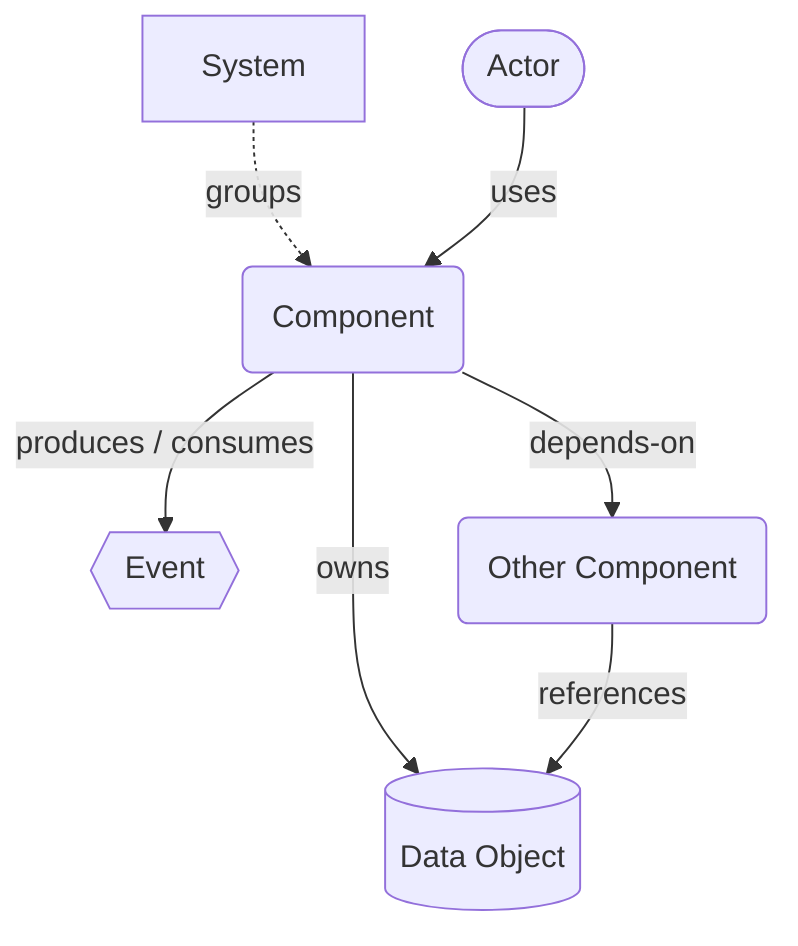
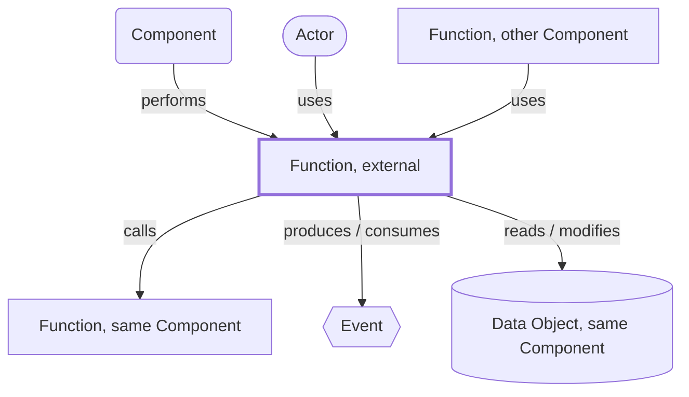
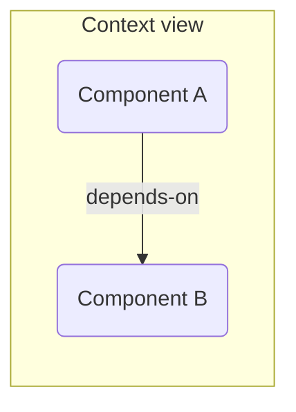
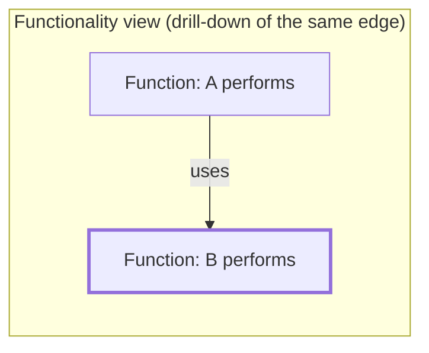
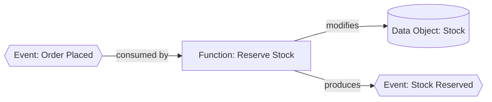
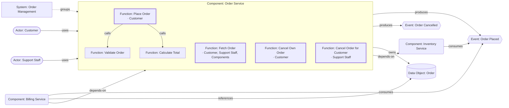
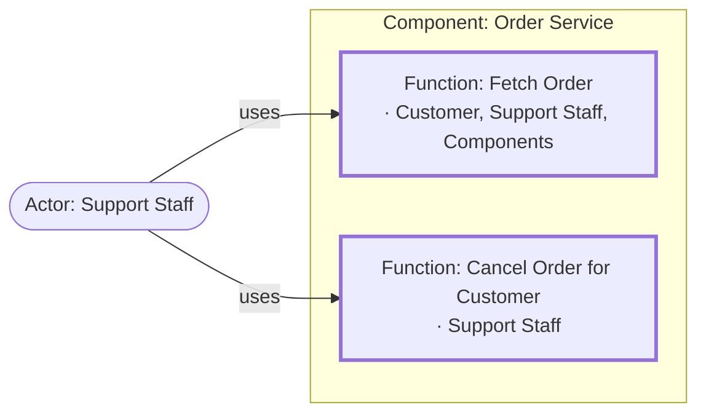
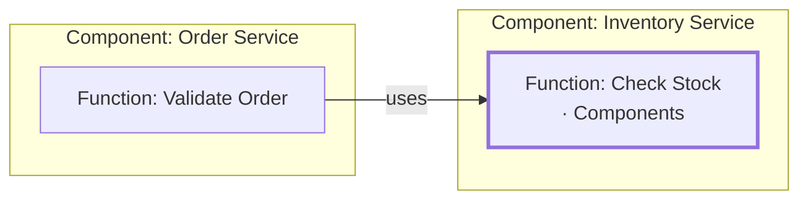

# Contour

## A Lightweight Framework for Modeling Software System Architecture

### Defining logical boundaries — functionality, data, and contracts — as a business-readable structure for propagating change into code

**Version 0.4** — working draft

**Author:** Mykhailo Kulish ([LinkedIn](https://www.linkedin.com/in/mkulish/))

---

## Abstract

Enterprise and software architects routinely need to describe how a software
system behaves, what it offers to its environment, how it talks to other
systems, and what data flows through it. Comprehensive enterprise
architecture standards provide this — but at the cost of a large,
multi-layered metamodel that is often more than a single system
description needs.

This paper proposes **Contour** — a small, opinionated modeling
framework for the **logical boundary of a software system**: what it
does, the data it shares, and the contracts it offers and depends on.
It is structured precisely enough to act as **guardrails for
propagating a described change into actual code**, rather than as
after-the-fact documentation, and it serves three audiences at once: a
**non-developer**, who describes a needed change in business language
without reading code; a **developer**, who turns that into a safe
change; and an **LLM**, which can do the same, using the model as its
specification and its boundary.

What gets modeled is a **System** — the business-level application a
stakeholder would name — delivered by one or more **Components**, each
with a single lifecycle. Contour describes a System by describing its
Components: the Component is what gets drawn, the System is what they
add up to.

The paper claims two things: that a readable Contour record is enough to
propagate a described change into an existing codebase correctly, and
enough to build a new Component from as a spec. The evidence lives in a
companion document, [`contour-experiments.md`](contour-experiments.md),
which also carries the roadmap. In short: preliminary experiments
support both claims on one small codebase. On a real undocumented
legacy subsystem they support the second only for structure: the
record was a sufficient spec for the new Component's shape, not for its
detailed behavior. A third, harder
possibility — reconstructing an existing system's real prior behavior
from its record alone — is left explicitly **optional** and untested;
nothing else here depends on it.

The framework works in two tiers. A compact **diagram** shows a system's
shape at a glance; a **structured record** underneath each element
carries the detail a diagram can't hold — behavior, schemas, contracts,
ordered steps. Six element types and eight relationship verbs, one
vocabulary partitioned across two zoom levels (Section 3), and no
separate vocabulary per level. The name says the same thing: a contour
traces an outline at low resolution and leaves the interior to something
else.

This is a personal working paper, not a finished standard. The goal is
to pressure-test whether a model this small still says enough to guide a
change into code correctly.

---

## Contents

1. [Motivation](#1-motivation)
2. [Design Principles](#2-design-principles)
3. [Core Metamodel](#3-core-metamodel)
   1. [Metamodel diagram](#31-metamodel-diagram)
   2. [Two Levels of Detail: Context View and Functionality View](#32-two-levels-of-detail-context-view-and-functionality-view)
   3. [The Structured Record](#33-the-structured-record)
   4. [Event-Driven Causal Chains](#34-event-driven-causal-chains)
   5. [Naming Conventions](#35-naming-conventions)
   6. [Requirements and Guardrails](#36-requirements-and-guardrails)
4. [Notation](#4-notation)
5. [Worked Example](#5-worked-example)
6. [Limitations and Open Questions](#6-limitations-and-open-questions)
7. [Conclusion](#7-conclusion)
8. [Appendix: Comparison to ArchiMate and C4](#appendix-comparison-to-archimate-and-c4)
9. [Changelog](#changelog)

Experiment results and the roadmap live in the companion document
[`contour-experiments.md`](contour-experiments.md).

---

## 1. Motivation

Most architecture documentation questions an architect is actually asked
boil down to a short, recurring list:

- What does this system *do*?
- What does it offer to the outside world, and to whom?
- How do other systems reach it (protocol, format, contract)?
- What events does it raise, and what does it react to?
- What data does it own or exchange?
- What does it depend on, and what depends on it?

Full enterprise frameworks answer these questions but bury them across
several layers (business, application, technology) and dozens of element
types, most of which are irrelevant when the scope is "describe this one
system and its neighbors." The result is that many architects fall back
to free-form boxes-and-arrows diagrams — expressive, but not comparable
across systems and not machine-readable.

A second, more demanding problem motivates this paper: a large amount of
software, particularly legacy software, exists with little or no
documentation of any kind. LLMs are increasingly capable of reading such
a codebase and producing *some* description of it — but a description
is only as useful as what it lets you do next. A description that lets a
human skim and nod along is not the same as a description precise
enough that a specific, described change — in business-friendly
language, not code — can be turned into the correct actual code change
without drifting outside the system's declared boundary. That is a
genuinely useful outcome on its own, for legacy modernization, incident
response, or simply making a change safely. Ordinary prose
documentation, and most diagram notations, fall short of that bar: they
describe *shape*, not enough to guide *change* correctly.

Contour aims at the middle ground on both problems at once: a notation
small enough to use consistently without a tool-enforced palette, but
structured enough — down to the level of individual Function behavior,
Data Object schemas, and the contracts external Functions are offered
through — to be captured as data
(e.g., YAML/JSON) and acted on to propagate a change correctly.

A note on words: capitalized terms (System, Component, Function, …) are
Contour elements. Lowercase "system" is the ordinary word.

---

## 2. Design Principles

1. **Two boundaries: business and lifecycle.** A *System* is the
   business-level application a stakeholder would name — one capability,
   however it happens to be built. A *Component* is a lifecycle boundary
   inside it: one thing built, versioned, released, and retired as a
   whole. A System of one Component is normal; a System of several is
   common. Neither boundary is a size limit — a Component can be a small
   service or a large monolith, so long as it shares one lifecycle. Each
   diagram centres on one Component: everything else is either something
   it contains or something in its environment. The one-page constraint
   governs the diagram, not the real size of what it depicts or the
   record beneath it.

2. **A small, fixed vocabulary.** Six element types, on the diagram,
   and no more — a fixed vocabulary is easier to apply consistently than
   an extensible one. The record tier may still name things that are never
   drawn. Where a concept can be *derived* rather than declared, it is:
   a Function has no separate "service" or "interface" counterpart; it is
   externally accessible exactly when it names one of its Component's
   contracts, and private otherwise.

3. **Logical relations, not communication mechanisms.** Contour records
   *that* one thing invokes, reaches, or reacts to another — never how
   the invocation physically travels. Two Functions in one Component share
   the same `calls` relation whether that is a method call, an in-process
   bus, or an internal queue; a Function reaching another Component shares
   the same `uses` relation whether it is REST, gRPC, or a file drop. An
   Event marks a genuine crossing *between* Components — a logical fact, not
   a transport choice. Mechanism detail belongs in a contract's `binding`
   (Section 3.3) or a Function's `behavior`.

4. **Data has a home.** Every Data Object is owned by exactly one Component.
   Only Functions of that Component may read or modify it directly; others
   reach it through an external Function or an Event, never by a direct data
   link. Ownership is asserted once and never implied, which is what
   keeps data lineage legible.

5. **Two levels of detail, not two layers.** Contour has no
   business/application/technology strata to switch between — business
   capability mapping and infrastructure topology stay out of scope. It
   has instead two *zoom levels of the same thing*: a Context view
   (Component-to-Component) and a Functionality view (Function-to-Function),
   the way a map has a country view and a street view of one territory.
   The coarser level always summarizes the finer one — a `depends-on`
   edge stands for a `uses` edge to an external Function underneath it — so detail is
   drilled into when needed, never duplicated. A System is a *grouping*
   drawn around Components in the Context view, not a third zoom level:
   it changes what the boundary encloses, not how deep the diagram goes.

6. **The diagram summarizes; the record holds the truth.** Each element
   has a shape on the diagram and a structured record underneath it. The
   diagram is what gets read first and stays deliberately small; the
   record is where completeness lives — descriptions, schemas, a
   Function's behavior and its ordered steps. When the two disagree, the
   record is authoritative.

7. **Written for three audiences at once.** A non-developer must be able
   to read the diagram unaided and describe a needed change in business
   language; a developer must be able to turn that into a safe change; an
   LLM must find the record unambiguous enough to do the same. This is
   why names are plain language and Functions are named for the work they
   do rather than their implementation — and why one model serves all
   three rather than three artifacts drifting apart.

8. **A guardrail, not a retrospective.** A record is not only written
   after the fact to describe what exists. It bounds what may be built or
   changed: the behavior, schemas and contracts are the boundary a Component
   is expected to stay inside of, whether it is being built for the first
   time or receiving a described change. What an element must achieve is
   named as a *Requirement*; where its implementation must stop, as a
   *Guardrail* (Section 3.6).

---

## 3. Core Metamodel

Contour defines **six element types**:

| # | Element | Meaning |
|---|---------|---------|
| 1 | **System** | The business-level application a stakeholder would name — "Order Management", "Payments". A System groups the Components that together deliver one business capability. It performs no work of its own: everything a System does, one of its Components does. A System may contain a single Component, and often contains several |
| 2 | **Component** | One lifecycle: whatever is built, versioned, released, and retired as a whole, usually by one owning team. The consequence is that it deploys as one artifact — a single service, or a monolith, however large. Anything with more than one lifecycle is modeled as more than one Component, tied together by `depends-on`. This is the unit most modeling happens at |
| 3 | **Function** | A capability the Component performs — internal or external. It becomes externally accessible the moment it names one of its Component's contracts (Section 3.3); a Function that names none is private. A Function can consume and react to an Event, produce an Event, call another Function in the same Component, or use another Component's external Function. It is the minimal unit of Component behavior — but not smaller than an actual piece of business-related work: `Calculate Total` is a Function; `Parse Input` is an implementation step inside one, and belongs in that Function's `steps`/`behavior` record (Section 3.3), not on the diagram |
| 4 | **Event** | A notification to the environment that a Component's state has changed — "Payment Completed", "Order Placed". An Event reports something that has already happened, which is why Event names are written in the past tense (Section 3.5) |
| 5 | **Data Object** | A named piece of information the Component owns |
| 6 | **Actor** | A person, external system, or organization that participates from outside. An Actor is a *role with distinct access*, not a job title: two job titles that reach a Component the same way are one Actor, and the difference between them belongs in the Actor's `description` |

and **eight relationship types** (three of which pair an inverse verb — `produces`/`consumes`, `reads`/`modifies`, `owns`/`references`):

| Relationship | Between | Meaning |
|---|---|---|
| **groups** | System → Component | This Component is one of the deployables delivering the System's capability. A Component belongs to exactly one System |
| **performs** | Component → Function | The component carries out this function |
| **uses** | Actor → Component, or Actor / Function → Function | A caller — an Actor or a Function of *another* Component — reaches an external Function through that Function's Component contract for the caller (Section 3.3): the Actor's own contract, or the `Components` contract for a Function. At Component level, Actor → Component is a Context-view summary: the Actor reaches every Function that lists it. A Function never `uses` a Function of its own Component; inside a Component the relation is `calls` |
| **calls** | Function → Function | One Function invokes another *within the same Component*, with no contract in between. Order is not part of this edge — see the note below |
| **produces / consumes** | Component → Event, or Function → Event | At Component level, a Context-view summary: the component raises or reacts to this event. At Function level, the precise cause: which specific Function produces it, or reacts to it — see Section 3.4 |
| **reads / modifies** | Function → Data Object | A Function's actual read or write access to a Data Object owned by its *own* Component — principle 4 at Function-level precision. A Function in another Component can only reach that data through an Event it consumes or an external Function it uses |
| **owns / references** | Component → Data Object | `owns`: this Component is the Data Object's single home. `references`: a Context-view summary that this Component obtains the Data Object *from its owner* — through one of the owner's external Functions or an Event it produces. It is never direct access; the Functionality-view chain underneath it is a `uses` edge to an external Function that `reads` it, or a `consumes` edge on an Event that carries it. A `references` edge that rests on a `uses` edge implies a `depends-on` edge to the owner |
| **depends-on** | Component → Component | A directed dependency, drawn at Context-view resolution, summarizing one or more `uses` edges from its Functions to the other Component's external Functions — see Section 3.2. Consuming another Component's Event does *not* create a `depends-on` edge: the Event is the coupling, and it is drawn as such |

That's the entire metamodel. Everything on a Contour diagram is one of
these six boxes connected by one of these eight relations.

**Why `calls` is separate from `uses`:** `uses` always crosses into a
Component through a contract — with a binding and a shape. `calls` is a
same-Component invocation with no contract in between. Keeping them
distinct means a reader can tell, from the relation alone, whether they're
looking at a governed boundary crossing or a plain internal invocation.
Like every relation, `calls` is logical (principle 3): it covers a direct
method call, an in-process bus, an internal queue, or a scheduled
hand-off, and the mechanism, if it matters, goes in the calling Function's
`behavior`.

**Ordering is not part of the `calls` edge itself.** If `Place Order`
calls `Validate Order` before `Calculate Total`, the `calls` edges on
the diagram don't show that sequence; the relationship stays a plain,
unordered edge, the same way `modifies` stays a plain edge rather than a
state transition (Section 3.4). Sequence lives in the calling Function's
`steps` list (Section 3.3); the diagram's edges are a derived summary of
that list, not the authoritative source of order.

### 3.1 Metamodel diagram

Context-view relations (Component-level):


```mermaid
graph TD
    Y[System] -.->|groups| Sys(Component)
    A([Actor]) -->|uses| Sys
    Sys -->|produces / consumes| E{{Event}}
    Sys -->|owns| D[(Data Object)]
    Other(Other Component) -->|references| D
    Sys -->|depends-on| Other
```

Functionality-view relations (Function-level), which the Context-view
relations above summarize (principle 5):


```mermaid
graph TD
    Sys(Component) -->|performs| F[Function, external]:::ext
    A([Actor]) -->|uses| F
    F2[Function, other Component] -->|uses| F
    F -->|calls| F3[Function, same Component]
    F -->|produces / consumes| E{{Event}}
    F -->|reads / modifies| D[(Data Object, same Component)]
    classDef ext stroke-width:3px
```

`produces`/`consumes` and `uses` appear at both levels — a
Component-level edge summarizing the Function-level ones beneath it; the
other six belong to one view each. The heavy border marks an external
Function — one that lists at least one contract (Section 4).

### 3.2 Two Levels of Detail: Context View and Functionality View

Contour can be drawn at two resolutions of the same model, chosen per
diagram rather than fixed for the whole framework:

- **Context view** — boxes are Components; the primitive relation is
  `depends-on` (Component → Component). This is the fast, whiteboard-friendly
  view: "what does this landscape look like." It is complete and valid
  on its own — you don't have to model Functions to draw it.
- **Functionality view** — boxes are Functions; the primitive relation
  is `uses` (Function → external Function of another Component). This is
  the precise, drill-down view: "*why*, specifically, does Component A
  depend on Component B?" Answer: because one of A's Functions `uses` one
  of B's external Functions, through B's contract for other Components.


```mermaid
graph LR
    subgraph "Context view"
        SA(Component A) -->|depends-on| SB(Component B)
    end
```


```mermaid
graph LR
    subgraph "Functionality view (drill-down of the same edge)"
        FA[Function: A performs] -->|uses| FB[Function: B performs]:::ext
    end
    classDef ext stroke-width:3px
```

The two views describe the same territory at different resolutions. Once
the Functionality view exists, every Context-level `depends-on` edge
should be *explainable* by a `uses` chain underneath it — "soft
consistency," expected but not enforced (Section 6).

**The default one-page diagram combines the two.** In practice, and in
every diagram in this paper, a Component diagram draws the focal
Component *opened* — its Functions, external ones marked, the Data
Objects it owns, the Events it produces — and every neighbouring
Component *closed*, as a Context-view box with only its `depends-on`,
`consumes` and `references` edges. That is the Context view of the
landscape and the Functionality view of one Component on one page; the
Functionality view of a neighbour is a separate drill-down.

### 3.3 The Structured Record

The diagram answers "what exists and how does it connect." It
deliberately does not answer "what would I need to know to build this,
or to change it correctly." That second question is answered by a
structured record attached to each element — built from a small, shared
set of possible fields, rather than each of the six inventing its own
shape:

- **`description`** — required. A plain-language sentence or two, same
  register as the name (Section 3.5) — what this element is, for a
  reader who isn't going to open the schema.
- **`schema`** — the structured shape of data: a Data Object's fields,
  an Event's payload. It can be given inline, or as a link to an
  existing schema artifact (an AsyncAPI file, a JSON Schema, an Avro
  definition) rather than a re-authored duplicate — for legacy systems
  in particular (Section 1), the schema usually already exists
  somewhere; Contour can point at it instead of restating it. System,
  Component, Actor, and Function have no `schema`.

A Function deliberately has no `schema`: a private Function's data shape
is already determined by its relations — the Data Objects it
`reads`/`modifies` and any external Function it `uses` elsewhere — and
a separate schema would restate those and drift from them. What an
external Function promises outside callers is not derivable from
anything else in the model, so it carries a `contract` instead: who may
call it, and the operation they call (see *Contracts and external
Functions* below).

Any element may also carry `requirements` and `guardrails` (Section
3.6); because they apply everywhere, the table lists them once rather
than per element. Beyond that, a Function carries `behavior` and
`steps` — the one place `description` alone leaves room to guess — and
an external Function carries a `contract`:

| Element | Property | Description |
|---|---|---|
| **any element** | `requirements` | Optional list of Requirement names this element must satisfy (Section 3.6) |
| | `guardrails` | Optional list of Guardrail names this element must stay inside (Section 3.6) |
| **Function** | `description` | Plain-language summary of what the Function does |
| | `behavior` | Prose account of business rules and side effects, precise enough that its logic isn't left for an LLM to invent |
| | `steps` | Ordered list of the Function's own `consumes` (first step only)/`calls`/`uses`/`reads`/`modifies`/`produces` edges — the authoritative sequence the diagram's edges summarize |
| | `contract` | External Functions only: `callers`, the Component contract keys it is reached through (Actors, or `Components`), and `operation`, its description in each style's own format — see below. Its presence is what makes the Function external |
| **Data Object** | `description` | Plain-language summary of what this data represents |
| | `schema` | Fields and nested types, in the core type notation (below) |
| **Event** | `description` | Plain-language summary of what happened |
| | `schema` | Payload shape |
| **System** | `description` | Plain-language statement of the business capability this System delivers |
| **Component** | `description` | Plain-language purpose of the Component |
| | `contract` | The access the Component offers, keyed by who it is for — an Actor, or `Components` — each with a `description` and a `binding` (see below) |
| **Actor** | `description` | Plain-language role, and the job titles or systems that play it |

A sketch of what this looks like as data (illustrative, not the final
syntax — the serialization used in the experiments is described in
`contour-experiments.md`):

```yaml
Function: Place Order
  description: Accepts a new order request, validates it, and creates it.
  behavior: >
    Validates the order via Validate Order, which checks each item
    against current stock. Rejects the order if validation fails. On
    success, persists an Order and emits Order Placed.
  steps:
    - calls: Validate Order
    - calls: Calculate Total
    - modifies: Order
    - produces: Order Placed

Function: Validate Order
  description: Checks that every item on the order is in stock.
  steps:
    - uses: Check Stock

DataObject: Order
  description: A customer's order, from placement through fulfillment.
  schema:
    id: uuid
    customerId: string
    items: LineItem[1..]
    total: decimal
    status: enum(pending, confirmed, shipped, cancelled)
    LineItem: { productId: string, quantity: integer, unitPrice: decimal }
```

`steps` is an ordered list, and each entry is one of the relationship
verbs Section 3 already defines — `consumes`, `calls`, `uses`, `reads`,
`modifies`, `produces` — so it adds no new relationship type. A `uses`
step never names the contract it goes through: the caller determines it
(see *Contracts and external Functions* below).

`consumes` is special: it may appear only as the **first** step, and at
most once. It marks the Function as *subscribed* to that Event — the
Event's arrival is what starts it, and the steps after it are how the
Function processes it (Section 3.4). A Function therefore has one
declared way of being started: by an Event, through its first step; by
an outside caller, through a contract; or, with neither, only by
another Function of its own Component through `calls`. A Function that
must react to two Events is two Functions, which may share a private
one through `calls`.

What `steps` changes
is which side is authoritative: the diagram's edges for those verbs are a
**derived, unordered summary** of the Function's `steps` list — the same
rollup as principle 5 (Context summarizes Functionality), applied one
level further down (record summarizes into diagram).

`steps` is deliberately a straight line, not a control-flow language: it
can't express "these two run in parallel" or "only call Calculate Total
if validation passed." That is out of scope for now, and worth
revisiting only if the experiments show plain sequence isn't enough
(Section 6).

#### Core type notation

Every `schema` in a record — a Data Object's fields, an Event's payload —
uses one small notation, so that a shape means the same thing wherever
it appears and whatever technology later carries it:

| Notation | Meaning |
|---|---|
| `string`, `integer`, `decimal`, `boolean`, `uuid`, `date-time` | Primitive types |
| `enum(a, b, c)` | One of a fixed set of values |
| `T[]`, `T[1..]` | A list; `[1..]` requires at least one entry |
| `T?` | Optional; every field without `?` is required |
| `Order` | A reference to a Data Object |
| `Order.LineItem` | A type nested in a Data Object's schema — defined once, in its owner (principle 4) |

How each type is represented on the wire — whether a `decimal` is a JSON
number or a string, what a `uuid` becomes in protobuf — is not part of
the notation; it is defined by the binding (below). The same binding
defines how an operation (below) refers to a Data Object, so that the
shape of what an operation sends or returns still has one home.

#### Contracts and external Functions

A **contract** is the access a Component offers to one kind of caller,
declared on the Component's record and **keyed by who it is for**:
either an Actor, or the reserved key `Components`, which stands for any
Function of another Component. A contract is not separately named —
the key *is* its meaning, and because it must be an existing Actor or
`Components`, a renamed or misspelled audience fails a check rather
than silently breaking the link. It follows that a Component has at
most one contract per Actor, and at most one for other Components.

Each contract carries:

- **`description`** — what this access is for, in plain language.
- **`binding`** — the contract's whole technical side, in one block.
  Contour defines a single key in it, **`style`** (OpenAPI, gRPC,
  AsyncAPI, RMI, …), which names the *binding* that interprets every
  other key in the block — base address, authentication, error
  envelope, versioning, and so on (see *Bindings* below).
- **`requirements`** / **`guardrails`** — optional, as on any element;
  here they apply to every Function reached through the contract (e.g.
  a Customer contract's "own orders only").

Contracts are record-tier, like Requirements and Guardrails: Contour has
no separate element for them and never draws them, and the vocabulary
stays at six elements.

A Function becomes external by declaring a **`contract`** of its own,
with two parts:

- **`callers`** — the keys of its Component's contracts it is reached
  through: Actors, or `Components`. There is no limit on how many.
- **`operation`** — the operation those callers invoke, given **once per
  style** among those contracts' bindings, each in *that style's own
  format*: for OpenAPI, the path and method with their Operation Object;
  for gRPC, the `rpc` definition and its messages. Contour defines the
  slot — one entry per style, keyed by the style's name — and leaves the
  format of each entry to that style's binding. An existing spec's
  operation can therefore be pasted in as it is, rather than restated in
  a Contour-specific notation.

One invariant holds whatever the number of callers: **a Function has one
operation shape and one `behavior`, whichever contract it is reached
through.** Listing several callers asserts the operation has the same
shape and the same business rules for every one of them. When the shape
or the rules differ — a customer may cancel only before shipment,
support staff at any stage but with a reason — that is two business
decisions, and so two Functions, by the rule in Section 3.6 that a
business decision belongs to the Function that owns it. Logic they
genuinely share goes in a private Function both `call`. When the callers
span two styles, the Function carries two `operation` entries, and
keeping them describing the same shape is a check its bindings must
make.

**Which contract a `uses` goes through is never declared; it follows
from the caller.** An Actor reaches a Function through the contract keyed
by that Actor; a Function of another Component reaches it through
`Components`. The target must list that key among its `callers`. The
same rule lets an Actor be drawn once, as a single `uses` edge to the
Component (Section 3.2): the Actor reaches every Function that lists it.
Drawing Function-level edges from an Actor is only needed to show
narrower reach.

```yaml
Component: Order Service
  contract:
    Customer:
      description: Customers placing, tracking and cancelling their own orders.
      binding: { style: OpenAPI, base: /v1/orders, auth: customer token }
      guardrails: [Own Orders Only]
    Components:
      description: Other Components reading orders.
      binding: { style: gRPC, service: orders.v1.OrderService, auth: mTLS service identity }

Function: Fetch Order
  description: Returns a single order.
  contract:
    callers: [Customer, Components]
    operation:
      OpenAPI: …   # an OpenAPI path, method and Operation Object
      gRPC: …      # an rpc definition and its messages
  steps:
    - reads: Order
```

The keys after `style` in each `binding`, and the content of each
`operation` entry, belong to the style's binding, not to Contour;
Section 5 shows both filled in.

#### Bindings

Contour defines *where* integration detail goes and what it means;
**how a style carries it is defined outside this paper**, by one
binding per style, maintained with the implementation. Keeping that
detail out of the core is what lets the record stay readable to a
non-developer (principle 7) while still being precise enough to
generate from. A binding must define:

1. **Binding keys** — which keys the `binding` block accepts besides
   `style`, and their allowed values (including how authentication is
   structured).
2. **Operation format** — what a Function's `operation` entry for the
   style contains, and how it combines with the binding keys into a full
   address.
3. **Data Object references** — how an operation refers to a Data Object
   or a nested type, and how each core type is represented in the style.
4. **Defaults** — what applies when a binding key is omitted.
5. **Artifact** — which spec the binding assembles from the record, or
   checks it against.
6. **Checks** — the style-specific consistency checks, including, for a
   Function whose callers span several styles, that its operations
   describe the same shape.

**The record is the authority; a contract spec is an output.** An
OpenAPI, AsyncAPI or protobuf file for a contract is assembled from the
record — the Component's binding keys, its Functions' operations, the
Data Objects they refer to — or checked against it, the same way code
is. Unlike a Data Object's schema, a contract spec is never linked as
the source of truth: one spec file spans many Functions, so linking it
would give every Function's shape two homes that can disagree. An
existing spec from a legacy system is an *import source* for the record
— its operations are pasted into the Functions that perform them — not a
reference from it. Drift between record and spec is then the same
problem as drift between record and code, and is checked the same way
(Section 3.6).

Because contracts are structured, their consistency is mechanically
checkable rather than a matter of judgement. The core checks are
style-neutral; each binding adds its own:

1. Every contract key is an existing Actor or `Components`, and every
   name in a Function's `contract.callers` is a key on its own
   Component.
2. A Function's `contract.operation` has exactly one entry per
   `binding.style` among its callers' contracts.
3. No two Functions resolve to the same operation for the same caller.
4. Every `uses` targets a Function whose `contract.callers` includes the
   caller's key — the calling Actor, or `Components` for a calling
   Function.
5. A `consumes` step appears only first and at most once, names an Event
   produced by another Component, and appears only in a Function that
   has no `contract` — a Function is started by an Event or by a
   caller, not both.

### 3.4 Event-Driven Causal Chains

Section 3.2 showed `depends-on` as a Context-view summary of a
Function-level `uses` edge to an external Function. The same rollup applies to
Events (principle 5): a Component-level `produces`/`consumes` edge is a
summary; the precise cause is a specific Function consuming an Event,
doing work that touches a Data Object, and possibly producing another
Event in turn. Because an Event marks a crossing *between* Components
(principle 3), the consuming Function is always in a different Component
from the producing one. The worked example (Section 5) has `Reserve
Stock`, on Inventory Service, consuming an Event produced by Order
Service. Its record opens with the subscription:

```yaml
Function: Reserve Stock
  description: Reserves stock for every item of a newly placed order.
  steps:
    - consumes: Order Placed
    - modifies: Stock
    - produces: Stock Reserved
```

As a shape:

```
Event --consumed by--> Function --modifies--> Data Object
                            |
                            +--produces--> Event
```

The shape of this chain follows from what an Event is (Section 3): the
`modifies` edge is the state change, and the `produces` edge is the
notification that it happened. A Function that produces an Event
without having changed anything is usually a sign the Event is really
reporting an activity rather than an outcome — worth re-checking
against the past-tense test in Section 3.5.

For readability, a causal chain reads left to right, event first — the
passive form of the relation (`consumed by` instead of `consumes`; same
edge, same direction, just the natural order for narrating "this
happens, which triggers that"):


```mermaid
graph LR
    OrderPlaced{{Event: Order Placed}} -->|consumed by| ReserveStock[Function: Reserve Stock]
    ReserveStock -->|modifies| Stock[(Data Object: Stock)]
    ReserveStock -->|produces| StockReserved{{Event: Stock Reserved}}
```

`modifies` is deliberately a plain edge, not a state machine: it says
*that* `Reserve Stock` changes `Stock`, not which field or which
state transition. A Data Object's structured record (Section 3.3) may
optionally describe states and transitions — the worked `Order` schema
already sketches a `status` enum — but the core metamodel stays at the
"this Function touches this Data Object" level, consistent with a small
diagram vocabulary (principle 2) and precision in the record (principle
6) rather than in the relationship itself.

### 3.5 Naming Conventions

Because the diagram tier is meant to be legible to a wide audience — not
only engineers — Contour treats naming as part of the metamodel, not a
stylistic afterthought:

- **Plain language, for a wide audience.** Names describe things the way
  any project stakeholder would recognize them, not the way a codebase
  would. "Reserve Stock" reads as work being done; `InventoryUpdateHandler`
  or `calcTotalV2` reads as code. Class names, method names, and other
  implementation detail belong in the element's `description` or
  `behavior` (Section 3.3), never in the name shown on the diagram.
- **Functions are named for the work, not the mechanism.** A Function
  name states what actually gets done — an action plus the thing it
  acts on ("Reserve Stock", "Validate Order", "Calculate Total") — not
  the technical means used to do it, the class it happens to map to, or
  the protocol it runs over. Protocol and transport belong to a
  contract's `binding`, and an operation or method name
  (`GetOrder`) to the Function's `contract.operation` — never in the Function's
  name. Principle 7 applied to naming.
- **A Function split by audience says whose action it is.** When one
  piece of work becomes two Functions because its rules differ per
  contract (Section 3.3), each name states who acts: "Cancel Own Order",
  "Cancel Order for Customer" — not "Cancel Order" twice, and not the
  caller in brackets. A Function reached through several contracts with
  the same rules keeps one plain name.
- **Actors are named for the role, not the job title.** Because a
  contract is keyed by its Actor, an Actor names a role with distinct
  access — "Support Staff", not "Support Agent" and "Back-Office Admin"
  when both reach the Component the same way — and never a mechanism
  ("Mobile App", "REST Client").
- **Events are named in the past tense.** An Event reports a state
  change that has already happened, so its name says so: "Order
  Placed", "Payment Completed", "Stock Reserved" — not "Place Order"
  (that's the Function doing the work) or "Order Placement" (which
  names a process, not an outcome). The tense is the tell: if a name
  reads as an instruction or an activity in progress, it is describing
  a Function, not an Event.

### 3.6 Requirements and Guardrails

Two kinds of statement don't belong inside any single element's
`description` or `behavior`: what an element must *achieve*, and where
its implementation must *stop*. Contour names both, as record-tier
concepts rather than diagram elements:

- A **Requirement** states something an element must address — a
  business rule, a technical or operational target, a regulatory
  obligation. It is a positive obligation: the element is not correct
  unless it satisfies this.
- A **Guardrail** states a boundary the implementation must stay
  inside — where responsibility ends, what must not be reimplemented,
  reached for, or bypassed. It doesn't say what to achieve; it directs
  *how* the achieving may be done.

The distinction is worth holding onto, because the two fail differently.
A missed Requirement means the element doesn't do its job. A crossed
Guardrail means the element does its job the wrong way — often by
absorbing responsibility that belongs somewhere else, which is exactly
the drift a model is supposed to prevent.

Both are named, defined once, and *referenced* by the elements they
apply to — the same way a `schema` field can point at an external spec
instead of restating it inline. Neither is ever drawn, so principle 2's
count of six elements and eight relations is untouched. Either may be
referenced from **any** element, and from a Component's contracts: a
contract can carry a boundary about what must never be returned through
it, a Data Object one about where it may be
copied to, just as readily as a Function can carry one about
responsibility it must not absorb.

```yaml
Requirement: Minimum Order Value
  description: >
    An order must total at least $1.00 before it can be placed; smaller
    amounts are rejected to avoid processing-fee losses.

Guardrail: Payment Logic Stays in Billing
  description: >
    Order Service must not compute, authorize, or settle payments. It
    uses Billing Service's external Functions and treats the result
    as opaque.

Function: Place Order
  description: Accepts a new order request, validates it, and creates it.
  requirements: [Minimum Order Value]
  guardrails: [Payment Logic Stays in Billing]
```

`Place Order`, not `Calculate Total`, is where the Minimum Order Value
requirement belongs: `Calculate Total` should only produce a fact — the
order's total — not decide anything about it. Rejecting an order
because that fact falls below a threshold is a business decision, and
that decision belongs to whichever Function owns it. `Place Order`
calls `Calculate Total` (per its `steps` list in Section 3.3) to get
the total, then is the one responsible for satisfying the Requirement
against it.

Neither field replaces `behavior`: that says what the Function does, a
Requirement what must be true of it, a Guardrail what it must not
become.

**Both are enforced, not declarative.** Unlike the soft consistency
between the two views (Section 3.2), these references are meant to be
checked rather than asserted: after propagating a change into a
Component, or building one from its record, verify for every element
that each Requirement it references is satisfied and each Guardrail it
references is respected — by a test asserting the rule directly, or by
grading the result against the description. A Requirement or Guardrail
that fails that check isn't a documentation gap; it's a failed test, the
same as a structural or contractual mismatch would be.

---

## 4. Notation

Contour uses six simple shapes so a diagram can be drawn by hand and still
be recognizable. The element and relationship set is normative; the
shapes are the recommended rendering, and a tool may substitute its own
so long as the six stay distinguishable:

- **System** — dashed boundary drawn around the Components it groups,
  labeled at the edge. A grouping, not a box that performs work — which
  is why its border is dashed and the Components inside keep their own
  solid ones
- **Component** — rounded rectangle, bold border
- **Function** — plain rectangle, nested inside the Component box. An
  external Function — one that lists a contract — has a heavy border,
  sits on the Component's edge, and carries its contract keys after its
  name (`Fetch Order · Customer, Components`); a private one has a
  normal border and sits fully inside. Contracts themselves are never
  drawn
- **Event** — hexagon
- **Data Object** — cylinder (borrowed shorthand for "a store of data,"
  used purely as a pictogram — not implying a database)
- **Actor** — stick figure when drawn by hand; a stadium (capsule)
  shape in tools that have no stick figure, placed outside the
  Component boundary

Relationships are drawn as directed arrows, labeled with the relationship
verb (`performs`, `uses`, `produces`, `owns`, `depends-on`, etc.) so
the diagram is readable without a legend. An Actor is normally drawn
with one `uses` edge to the Component: since the Actor's contract is
keyed by the Actor, the edge needs no further label, and the Functions
it reaches are the ones carrying the Actor's name. Drawing a Function
inside its Component's boundary may stand in for the `performs` edge.

Every diagram in this paper follows these shapes, so Sections 3.1 and 5
double as a notation reference.

---

## 5. Worked Example

A small **Order Service** in an e-commerce context, drawn as the default
one-page diagram of Section 3.2 — Order Service opened, its neighbours
closed:


```mermaid
graph LR
    Customer([Actor: Customer])
    Staff([Actor: Support Staff])
    OrderMgmt[System: Order Management] -.->|groups| OrderSvc

    subgraph OrderSvc [Component: Order Service]
        PlaceOrder["Function: Place Order<br/>· Customer"]:::ext
        FetchOrder["Function: Fetch Order<br/>· Customer, Support Staff, Components"]:::ext
        CancelOwn["Function: Cancel Own Order<br/>· Customer"]:::ext
        CancelFor["Function: Cancel Order for Customer<br/>· Support Staff"]:::ext
        ValidateOrder[Function: Validate Order]
        CalcTotal[Function: Calculate Total]
    end

    Customer -->|uses| OrderSvc
    Staff -->|uses| OrderSvc
    PlaceOrder -->|calls| ValidateOrder
    PlaceOrder -->|calls| CalcTotal
    OrderSvc -->|produces| OrderPlaced{{Event: Order Placed}}
    OrderSvc -->|produces| OrderCancelled{{Event: Order Cancelled}}
    OrderSvc -->|owns| OrderData[(Data Object: Order)]
    Billing(Component: Billing Service) -->|consumes| OrderPlaced
    Inventory(Component: Inventory Service) -->|consumes| OrderPlaced
    Billing -->|references| OrderData
    Billing -->|depends-on| OrderSvc
    OrderSvc -->|depends-on| Inventory

    classDef ext stroke-width:3px
```

Order Service offers three contracts: the **Customer**'s access
(OpenAPI), the **Support Staff**'s (OpenAPI), and other **Components'**
(gRPC). Each Actor's edge to the Component means that Actor's contract,
and through it every Function whose label carries the Actor's name.
`Validate Order` and `Calculate Total` list no one, so they stay
private — `Place Order` reaches them with `calls`, inside the Component,
no contract in between.

`Fetch Order` behaves the same for every caller, so it lists all three.
Cancellation is split, because the rules differ: a customer may cancel
only before shipment, support staff at any stage but with a reason. The
two Functions are named for whose action they are (Section 3.5).

Order Service owns the `Order` Data Object and announces placement via
`Order Placed`, which both Billing and Inventory consume. Billing
`references` the Order data through `Fetch Order` rather than reading it
directly (principle 4) — as a Component it goes through the `Components`
contract, and that access is why Billing also `depends-on` Order
Service. Inventory consumes the Event but draws no `depends-on` edge:
the Event is the coupling.

Deployment nodes, infrastructure, and organizational elements are absent
by design (principle 5).

**The records behind the diagram.** The keys after `style` in each
`binding`, and the content of each `operation`, are illustrative — what
an OpenAPI or gRPC binding might define (Section 3.3). Each `operation`
is written as it would appear in that style's own spec, so an existing
spec's operation can be pasted in unchanged:

```yaml
Actor: Customer
  description: A person buying from the shop.

Actor: Support Staff
  description: Customer-service and back-office staff handling order issues.

Component: Order Service
  description: Owns the order lifecycle from placement to cancellation.
  contract:
    Customer:
      description: Customers placing, tracking and cancelling their own orders via web and mobile.
      binding: { style: OpenAPI, base: /v1/orders, auth: customer token, errors: RFC 7807 }
      guardrails: [Own Orders Only]
    Support Staff:
      description: Staff viewing and cancelling orders on a customer's behalf.
      binding: { style: OpenAPI, base: /ops/v1/orders, auth: staff SSO, errors: RFC 7807 }
    Components:
      description: Other Components reading orders.
      binding: { style: gRPC, service: orders.v1.OrderService, auth: mTLS service identity }

Function: Place Order
  description: Accepts a new order request, validates it, and creates it.
  contract:
    callers: [Customer]
    operation:
      OpenAPI:
        /:
          post:
            operationId: placeOrder
            requestBody:
              required: true
              content:
                application/json:
                  schema:
                    type: object
                    required: [items]
                    properties:
                      items:
                        type: array
                        minItems: 1
                        items: { $ref: '#/components/schemas/Order.LineItem' }
            responses:
              '201':
                description: The order was accepted and is pending.
                content:
                  application/json:
                    schema: { $ref: '#/components/schemas/Order' }
              '409':
                description: Out of stock — at least one item can't be supplied.
                content:
                  application/problem+json:
                    schema: { $ref: '#/components/schemas/Problem' }
  behavior: >
    Validates stock via Validate Order and rejects the order if any item
    is short. On success, computes the total, persists an Order with
    status pending, and emits Order Placed. The customer is taken from
    the caller's identity, never from the request.
  steps:
    - calls: Validate Order
    - calls: Calculate Total
    - modifies: Order
    - produces: Order Placed

Function: Fetch Order
  description: Returns a single order.
  contract:
    callers: [Customer, Support Staff, Components]
    operation:
      OpenAPI:
        /{id}:
          get:
            operationId: fetchOrder
            parameters:
              - { name: id, in: path, required: true, schema: { type: string, format: uuid } }
            responses:
              '200':
                description: The order as stored.
                content:
                  application/json:
                    schema: { $ref: '#/components/schemas/Order' }
              '404':
                description: No such order, or not visible to this caller.
                content:
                  application/problem+json:
                    schema: { $ref: '#/components/schemas/Problem' }
      gRPC: |
        rpc GetOrder(GetOrderRequest) returns (Order);
        message GetOrderRequest { string id = 1; }
  behavior: Returns the order as stored.
  steps:
    - reads: Order

Function: Cancel Own Order
  description: Lets a customer cancel an order that hasn't shipped.
  contract:
    callers: [Customer]
    operation:
      OpenAPI:
        /{id}/cancel:
          post:
            operationId: cancelOwnOrder
            parameters:
              - { name: id, in: path, required: true, schema: { type: string, format: uuid } }
            responses:
              '200':
                description: The order is now cancelled.
                content:
                  application/json:
                    schema: { $ref: '#/components/schemas/Order' }
              '404':
                description: No such order among the customer's own.
                content:
                  application/problem+json:
                    schema: { $ref: '#/components/schemas/Problem' }
              '409':
                description: Already shipped, or already cancelled.
                content:
                  application/problem+json:
                    schema: { $ref: '#/components/schemas/Problem' }
  behavior: >
    Allowed only while status is pending or confirmed. Sets status to
    cancelled and emits Order Cancelled.
  steps:
    - reads: Order
    - modifies: Order
    - produces: Order Cancelled

Function: Cancel Order for Customer
  description: Lets support staff cancel any order, with a reason.
  contract:
    callers: [Support Staff]
    operation:
      OpenAPI:
        /{id}/cancel:
          post:
            operationId: cancelOrderForCustomer
            parameters:
              - { name: id, in: path, required: true, schema: { type: string, format: uuid } }
            requestBody:
              required: true
              content:
                application/json:
                  schema:
                    type: object
                    required: [reason]
                    properties:
                      reason: { type: string, minLength: 1, maxLength: 500 }
            responses:
              '200':
                description: The order is now cancelled.
                content:
                  application/json:
                    schema: { $ref: '#/components/schemas/Order' }
              '404':
                description: No such order.
                content:
                  application/problem+json:
                    schema: { $ref: '#/components/schemas/Problem' }
              '409':
                description: Already cancelled.
                content:
                  application/problem+json:
                    schema: { $ref: '#/components/schemas/Problem' }
  behavior: >
    Allowed at any status except cancelled. The reason is stored on the
    Order. Sets status to cancelled and emits Order Cancelled.
  steps:
    - reads: Order
    - modifies: Order
    - produces: Order Cancelled

Function: Validate Order
  description: Checks that every item on the order is in stock.
  steps:
    - uses: Check Stock

Function: Calculate Total
  description: Computes the order total from its line items.
  behavior: Sum of quantity × unit price per line item; no discounts or tax.

DataObject: Order
  description: A customer's order, from placement through fulfillment.
  schema:
    id: uuid
    customerId: string
    items: LineItem[1..]
    total: decimal
    status: enum(pending, confirmed, shipped, cancelled)
    cancellationReason: string?
    LineItem: { productId: string, quantity: integer, unitPrice: decimal }

Event: Order Placed
  description: A customer's order was accepted and persisted.
  schema: { orderId: uuid, customerId: string, total: decimal }

Event: Order Cancelled
  description: An order was cancelled, by its customer or by support staff.
  schema:
    orderId: uuid
    reason: string?

Guardrail: Own Orders Only
  description: >
    Through the Customer contract, a caller can read or change only orders
    whose customerId matches their own identity. Other orders are reported
    as Not Found, so their existence isn't revealed.
```

The operations refer to data the way their own spec would —
`#/components/schemas/Order` in OpenAPI, the `Order` message in gRPC —
and in both cases the reference resolves to the `Order` Data Object:
the bindings place Data Objects and their nested types in the assembled
spec, so the shape of an order still has one home (principle 4).
`Problem` comes from the Customer and Support Staff bindings' `errors:
RFC 7807` key, not from any Function. `Fetch Order` carries two
operations because its callers span two styles; that both describe the
same lookup is a check the bindings make. The two cancel Functions share
`/{id}/cancel` without colliding, because they sit on different
contracts with different bases (check 3 in Section 3.3).

**Drilling into an Actor edge:** `Support Staff → Order Service`
summarizes Function-level edges that are derived from the record, not
drawn by hand:


```mermaid
graph LR
    Staff([Actor: Support Staff])
    subgraph OrderSvc [Component: Order Service]
        FetchOrder["Function: Fetch Order<br/>· Customer, Support Staff, Components"]:::ext
        CancelFor["Function: Cancel Order for Customer<br/>· Support Staff"]:::ext
    end
    Staff -->|uses| FetchOrder
    Staff -->|uses| CancelFor
    classDef ext stroke-width:3px
```

**Drilling into the dependency:** the `depends-on` edge to Inventory is
a Context-view summary. If we needed to know *why*, the Functionality
view underneath it might look like this:


```mermaid
graph LR
    subgraph OrderSvc [Component: Order Service]
        ValidateOrder[Function: Validate Order]
    end
    subgraph Inventory [Component: Inventory Service]
        CheckStock["Function: Check Stock<br/>· Components"]:::ext
    end
    ValidateOrder -->|uses| CheckStock
    classDef ext stroke-width:3px
```

```yaml
Function: Check Stock          # on Inventory Service, whose Components contract is gRPC
  description: Reports whether requested quantities are available.
  contract:
    callers: [Components]
    operation:
      gRPC: |
        rpc CheckStock(CheckStockRequest) returns (CheckStockResponse);
        message CheckStockRequest  { repeated LineItem items = 1; }
        message CheckStockResponse { bool available = 1; repeated LineItem short_items = 2; }
  steps:
    - reads: Stock
```

`Validate Order` — one specific Function inside Order Service — is what
actually drives the dependency, not the Component as a whole. It names
no contract: as a Function of another Component, it can only go through
Inventory's `Components` contract, which `Check Stock` lists. That
precision is optional: the diagram above stands on its own without it.
`Check Stock` reports short stock in its response, not as an error: an
order that can't be filled is a successful answer to "is it
available?", not a failure of the operation.

**Drilling into the event:** the same optional precision applies to
`Order Placed`. At Context level, Order Service `produces` it and
Inventory `consumes` it — that's the whole story on the diagram above.
The Functionality-view chain underneath, on Inventory's side, is the one
Section 3.4 showed: `Reserve Stock` is the specific Function reacting to
`Order Placed`, and `Stock Reserved` is a second Event the one-page
diagram never had to show.

---

## 6. Limitations and Open Questions

Where a limitation has been observed in practice, the bullet points to
the evidence in [`contour-experiments.md`](contour-experiments.md)
("Experiments" below), which also carries the roadmap for closing it.

- **No layering** means Contour cannot, by itself, connect a system model
  to business capability *mapping* or strategy — the portfolio-level
  discipline of tracing systems to an enterprise capability model. It
  would need to compose with a separate business-layer model for that.
  (This is distinct from the Function-level sense of "a capability the
  Component performs" in Section 3, which Contour does express.)
- **No deployment/infrastructure view** — physical or cloud topology is
  intentionally out of scope. Contour models the lifecycle boundary a
  Component draws, not the infrastructure the resulting artifact runs on.
- **Neither vocabulary has settled, and the relationship list less so.**
  Both lists have changed as the precision bar rose — v0.4 removed an
  element and a relation by folding Interface into Function and
  Component; whether eight relationship types are sufficient for complex, multi-directional
  data-flow scenarios is untested.
- **`steps` covers the straight line only.** Branching and parallelism
  ("these two run at once," "only call Calculate Total if validation
  passed") are outside the metamodel, as are Data Object state
  transitions (Section 3.4). Experiment 3 is the first evidence that
  real systems need conditional steps: three of its six behavioral
  defects were branch structure the list could not hold (Experiments
  §3). Whether to extend `steps`, or to require such branches as named
  Requirements with their conditions spelled out, is now a live
  question.
- **One Function, one shape and one set of rules.** A Function reached
  through several contracts must offer the same operation shape and the
  same behavior through each (Section 3.3). A capability whose shape or rules differ per audience
  becomes several Functions, which a business reader may find redundant
  on the diagram, and naming them well takes effort. The rule is also
  easy to break silently: a modeler can list several contracts and hide
  per-audience rules in `behavior` prose ("if the caller is staff…").
  Nothing structural prevents that; a `behavior` that mentions a caller
  type or a contract is a review signal that the Function should be
  split.
- **One contract per caller, per Component.** Because a contract is
  keyed by its Actor, an Actor reaches a Component in exactly one way.
  Two Actors with identical access must be modeled as one role, and one
  Actor that needs two styles on the same Component — a REST API and a
  gRPC feed for the same partner, say — must be split into two Actors.
  The same holds for other Components: a Component migrating its
  `Components` contract from one style to another cannot model both
  styles at once. That is a transitional state, and falls under the
  current-versus-target limitation below.
- **The record is only as precise as its bindings.** Contour defines the
  slots and what a binding must provide (Section 3.3), not any binding
  itself. Whether a record generates a correct spec therefore depends on
  bindings that exist outside this paper and are not yet written. Some
  styles sit uneasily in the model: RMI's operation is a method
  signature, which brings the record close to code.
- **Operations are written in each style's own format.** That lets an
  existing spec's operations be pasted into a record unchanged, but it
  also means a Function's operation is only as readable as its style:
  an OpenAPI fragment is precise for a developer or an LLM and opaque to
  a non-developer, who has to rely on the Function's `description` and
  `behavior`. And when a Function's callers span two styles, its two
  operations restate one shape twice; Contour leaves it to the bindings
  to check they agree, so that check is only as strong as the bindings
  that implement it.
- **Events are outside the contract model.** A Component's Events still
  carry their own `schema` and name no contract, so how a Component
  publishes them (transport, envelope) has no structured home yet, and
  a Component that publishes the same Event to two audiences (an
  internal bus and partner webhooks, say) can't say so.
- **Soft consistency between the two views is unenforced.** Nothing in
  the model requires a Context-view `depends-on` edge to actually be
  explainable by a `uses` chain in the Functionality view, or vice
  versa — the two can drift apart silently unless a modeler or tooling
  checks them against each other. Whether that check should become
  mandatory is worth revisiting now that a serialization exists to
  enforce it (Experiments §1).
- **Requirement and Guardrail compliance grading is only partly tested.**
  Section 3.6 prescribes checking both, but *how* — a hard test
  assertion versus an LLM grading the resulting code against a
  `description` — gives very different reliability guarantees, and only
  the first has been tried. The experiments also showed the limit of
  direct assertion: a test derived from a Requirement is only as
  precise as the Requirement's text (Experiments §2, §3). Guardrails may
  be the harder of the two:
  a Requirement can often be asserted directly ("rejects orders under
  $1.00"), while a boundary ("doesn't reimplement payment logic") is a
  statement about what the code *doesn't* do, which is much harder to
  test for than to describe.
- **Full reconstruction of an existing system is optional, and
  unproven.** Taking a system that already exists and regenerating code
  that matches its real prior behavior, using the record alone with no
  reference to the original source, is a further possibility the model
  happens to support, not something this paper claims works: no such
  round-trip has been attempted. Until it is, "enough detail to match
  prior behavior" is a guess: a Function's `behavior` field, in
  particular, could easily be under-specified for anything beyond
  toy-sized logic, or could balloon into effectively re-writing the
  source in prose. Experiment 3 gives the first real data points, and
  they point toward under-specification: on that evidence, a
  record-only rebuild of that subsystem would have shipped several real
  defects (Experiments §3, §4). Answering that isn't a precondition for
  the change-propagation or build-from-spec claims the rest of the
  paper depends on.
- **No failure policy on a `uses` edge.** A `uses` relation says that a
  Function depends on another Component's external Function. It does
  not say what the using Function does when that call fails outright —
  as distinct from a declared failure response, which the target's
  `contract.operation` now names. Experiment
  3 needed that decision for every integration client and had to infer
  it (Experiments §3). Whether it belongs in a Requirement or Guardrail
  on the using Function, or in the edge's own record, is open.
- **No distinction between a current and a target record.** A record can
  describe a Component as it is or as it is meant to become, and legacy
  extraction needs both. Experiment 3's record described a target
  Component that did not yet exist as its own lifecycle, and the
  decomposition status of its dependencies had to be carried outside
  the metamodel (Experiments §3).
- **Existing consumers aren't a first-class constraint.** An Event or
  external Function whose `schema` or `contract.operation` is already
  bound to live consumers constrains
  the Component's own choices, such as identifier type. Nothing in the
  record marks that constraint, so in Experiment 3 it surfaced only when
  a real consumer schema was checked (Experiments §3).
- **The two primary claims rest on three preliminary experiments, each a
  single run.** Two propagated changes and two independent builds on
  one small codebase, plus one build from a record of a real legacy
  subsystem — the latter checked against the record and, statically,
  against the legacy source, but never run against the legacy system's
  behavior. On the small codebase, what this leaves open is precision.
  On the legacy subsystem, it also leaves open whether a record can
  carry detailed behavior at all (Experiments §4).

---

## 7. Conclusion

Contour is an attempt to answer a narrow but demanding question: can a
software system's *logical boundary* — its functionality, the data it
shares, and the contracts it offers and depends on — be described
precisely enough, and readably enough for a non-developer, that a
specific described change can be propagated into existing code
correctly, or a new Component built correctly from the record as a spec?
The framework keeps its diagram small on purpose (six elements, two
zoom levels, one page per diagram) and pushes the completeness that
guiding a change correctly demands into a structured record underneath
each element. Three preliminary experiments (documented in
[`contour-experiments.md`](contour-experiments.md)), one of them on a
real legacy subsystem, say the split holds for structure and boundary.
They say it holds for behavior only on small codebases. On real legacy
logic, the record fixed the Component's shape reliably. Its prose did
not carry conditional and time-dependent behavior precisely enough to
build from without reading the source directly, and in one case it
summarized that behavior wrongly. The other open decisions — what
happens when a dependency fails, compatibility with consumers that
already exist, and whether a record describes the current or the target
system — look closable with conventions. How much branching behavior a
record should carry is the harder question.
Whether "enough detail to guide a change" and "small enough to stay
usable" continue to coexist as the Component grows is what the next
experiments (the roadmap in `contour-experiments.md`) are meant to find
out; the harder, optional question of regenerating an existing system
from its record alone comes after.

---

## Appendix: Comparison to ArchiMate and C4

Contour is a deliberate subset-and-simplification, not a derivative of
either:

| Aspect | ArchiMate | C4 | Contour |
|---|---|---|---|
| Element count | 50+ across 3 layers | ~8 (across diagram types) | 6, single layer |
| Notation | Standardized shapes & colors (Open Group spec) | Boxes + arrows, informal | Generic geometric shapes, no reserved iconography |
| Scope | Whole enterprise (business, application, technology, motivation) | One software system's structure | One Component and its immediate environment |
| Zoom levels | Layers (business/application/technology) | Separate diagram types (Context, Container, Component, Code, Dynamic) | Two views of one model (Context, Functionality) — Section 3.2 |
| Relationships | 10+ formal types with precise semantics | Informal, unlabeled by convention | 8 relationship types, one vocabulary partitioned across both views |
| Service concept | A dedicated element (Business/Application Service, separate from Process/Function) | Not modeled explicitly | No separate type — a Function that names a contract |
| Interface concept | A dedicated element (Application Interface) | Not modeled explicitly | No element — a record-tier contract on the Component, keyed by the Actor it serves, with the technology in its `binding` |
| Sequence/ordering | Not a core concern | Dynamic diagram (separate, numbered arrows) | `steps` list on a Function's record (Section 3.3) |
| Tooling | Formal metamodel, exchange format, certified tools | Informal; Structurizr DSL as one implementation | Tool-agnostic (plain diagrams or simple YAML) |

A few points worth stating plainly rather than leaving to the table:

- The **Context / Functionality** split (Section 3.2) echoes C4's own
  resolution of the same problem — a Context diagram and a Component
  diagram of the same system, with no requirement to draw both — but
  Contour keeps one fixed element vocabulary across both resolutions
  rather than C4's separate diagram types, each with its own
  conventions.
- The `steps` list on a Function (Section 3.3) has a direct precedent in
  C4's supplementary Dynamic diagram, which numbers ordered interactions
  between components for a use case. C4 explicitly treats Code as its
  lowest, optional level and recommends *not* hand-maintaining it, since
  low-level structure churns too fast to document by hand. `steps`
  pushes into that territory on purpose — not because Contour disagrees
  that this detail churns fast, but because guiding a change correctly
  (Section 1) needs exactly this precision to exist as data. That's a
  real, knowingly-accepted maintenance cost, not an oversight.
- No ArchiMate or C4 shapes, colors, or relationship names are reused;
  the similarity is only at the level of the general idea (component +
  contract + relation modeling, viewed at more than one zoom level),
  which is common ground shared by many architecture notations and not
  something any single framework owns. One term does overlap: ArchiMate
  has a Motivation-layer element called Requirement. Contour's
  Requirement is a different thing in a different place — a record-tier
  annotation on an element, never a modeled element with a shape of its
  own, and with no motivation layer for it to live in. The word is a
  common noun in this field rather than a coined one, but the overlap is
  worth naming rather than glossing over. The same holds for
  **contract**: ArchiMate's business layer has a Contract element, a
  specialization of Business Object for a formal agreement. Contour's
  contract is a field on a Component's record in the everyday sense of
  "API contract" — the access offered to one kind of caller, and its
  technical binding — and maps to nothing in ArchiMate's business
  layer. **Binding**, in turn, follows WSDL's and AsyncAPI's use of the
  word for a protocol-specific mapping of an abstract contract.
- **"Component" means something finer-grained in C4.** C4's deployable
  unit is a *Container*; its Component sits one level below that, inside
  a Container. Contour's Component is the lifecycle unit — in practice
  the deployable — so it maps to C4's Container, not C4's Component. The
  naming instead follows the lay reading — a System is made of
  Components — which Backstage's software catalog arrived at
  independently: there too, `Component` is one deployable service and
  `System` is a group of Components forming a product. Prior art is
  genuinely split on this word; Contour sides with the reading a
  non-technical stakeholder would expect (principle 7). The mapping,
  stated plainly: Contour Component ≈ C4 Container ≈ Backstage Component.

A third, non-diagram comparison worth naming given Contour's
record tier (Section 3.3): interface-description formats
like **OpenAPI**, **AsyncAPI** and protobuf already solve "precise
enough to regenerate a client or server" — but only for the contract
layer, in isolation, without the surrounding Component/Function/Data
Object context or the Context-view landscape. Contour's structured
record is closer in spirit to that kind of precision, applied across
all six elements rather than contracts alone, and paired with the
lighter-weight diagram those formats don't attempt to provide. Since
v0.4 the relationship is directional: a contract's spec in one of those
formats is generated from the record by its binding, or checked against
it, never the other way round (Section 3.3).

---

## Changelog

- **v0.4** — Removed the Interface element and the `exposes` relation:
  six elements, eight relations. Externality is still derived, now from
  a Function declaring a **contract** against its Component's contracts
  — record-tier, never drawn, and keyed by who they serve: an Actor, or
  the reserved key `Components` for other Components' Functions, so a
  Component has at most one contract per caller. Each Component contract
  has a `description` and a `binding` block whose one core key, `style`,
  names the binding that interprets the rest. A Function's `contract`
  holds `callers` (those keys) and `operation`, given once per style in
  that style's own format — an OpenAPI path and Operation Object, a gRPC
  `rpc` definition — so existing specs can be pasted in; the format is
  defined by the style's binding, not by Contour. A Function keeps one
  operation shape and one behavior across its callers; differing rules
  per caller mean separate Functions. `schema` now belongs to Data
  Objects and Events only. Section 3.3 gained the core type notation
  for those schemas (primitives, `enum`, `T[]`, `T[1..]`, `T?`,
  references, nested types), the contract model, a
  *Bindings* subsection listing what a binding — maintained outside the
  paper — must define, and five style-neutral consistency checks. A
  contract's spec (OpenAPI, AsyncAPI, protobuf) is now assembled from
  the record, never linked as its authority; Data Object and Event
  schemas may still link existing specs. `uses` now targets an external
  Function or, from an Actor, a Component; the contract it goes through
  is never declared but follows from the caller. `consumes` is now
  allowed as a Function's first step, marking it as subscribed to that
  Event; a Function is started by an Event or by a caller, not both
  (check 5), and 3.4's `Reserve Stock` now shows its record. Actor
  redefined as a role with distinct access. `uses` now appears at both
  levels (3.1). Naming (3.5) gained rules for Functions split by
  audience and for Actors as roles. Notation (4): Interface lollipop
  removed; external Functions have a heavy border and carry their
  callers; an Actor is drawn with one unlabeled `uses` edge to the
  Component; containment may stand in for `performs`. Section 5
  rewritten around three contracts, a Function reached through all three
  and in two styles, a cancellation split by caller, and full records
  with OpenAPI and gRPC operations. Section 6: replaced "same function,
  differently-shaped interfaces" with "one Function, one shape and one
  set of rules"; added one-contract-per-caller, binding-precision,
  style-native-operations and Events-outside-contracts limitations;
  updated failure-policy and existing-consumers wording. Appendix:
  element and relation counts, an Interface-concept row, the ArchiMate
  Contract overlap, the origin of "binding", and the direction between
  record and contract specs. Events are unchanged in this version.
- **v0.3** — Restructured into two documents. This paper now holds the
  concept only: motivation, design principles, metamodel, notation,
  worked example, limitations, and conclusion. Experiment results
  (formerly Section 8) and next steps (formerly Section 7) moved,
  unchanged in substance, to the new companion
  `contour-experiments.md`, which carries the evidence per claim and
  the roadmap and can grow without a new release of the paper. Section
  6's bullets keep their claims but point at the companion for the
  evidence; the abstract and conclusion reference it; the former
  Section 9 (Conclusion) is now Section 7.
- **v0.24** — Added Experiment 3 to Section 8: a build from spec of a new
  Component from the record of a real, undocumented legacy subsystem,
  including its second, source-verified pass (six behavioral defects the
  first build missed), with a statement of the experiment's limits
  (multi-source input, static rather than behavioral comparison with
  the legacy system, single build). Section 8.1 gained its results: a
  Requirement-derived test that caught a deviation (qualified by the
  second pass), structure that carried over from the record, and
  principles used as decision rules. Section 8.2 gained its challenges:
  schema and identifier types, an existing consumer's contract, a
  mechanism mis-guessed by a derived document, failure policy, an unmet
  Requirement, current versus target, the limit of record-derived tests,
  places where the record was wrong rather than silent, conditional
  control flow, and prose paraphrase of control flow. Section 8.3
  rewritten across all three experiments, splitting the build-from-spec
  result into structure (held) and detailed behavior (did not, on the
  legacy subsystem). Section 6 gained three limitations (failure policy
  on `uses`, current vs. target records, existing consumers); its
  `steps`, compliance-grading, reconstruction, and evidence-base bullets
  were updated. Section 7 items 2 and 6 updated, item 7 added. Abstract
  and Section 9 updated.
- **v0.23** — Consistency pass. Sections 7 and 9 updated to reflect the
  Section 8 results; build-from-spec claim given its own test item and
  mapped to Experiment 1. Defined the default one-page diagram (focal
  Component opened, neighbours closed) in Section 3.2 and labeled the
  worked example accordingly. `references` redefined as a Context-view
  summary of obtaining data via the owner's Interface or Event, with its
  drill-down and its implied `depends-on`; stated that consuming an Event
  creates no `depends-on`. `uses` added to the `steps` vocabulary;
  `Validate Order` (not `Calculate Total`) now uses the Inventory Stock
  API throughout. Component defined by lifecycle everywhere, with
  deployability as the consequence. Section 8's Requirement and
  Guardrails introduced before use. Fixed cross-references (principle 1 →
  2 in 3.4; principle 7 → Section 3 in Section 6; System "drawn view" →
  composed landscape in Section 7). Removed restatements of: the optional
  reconstruction disclaimer, the three-audience formula, `calls`
  mechanism-agnosticism, ordering/branching scope, derived public/private
  visibility, multi-Function Interfaces, Context-view completeness, soft
  consistency, defined-once-referenced R&G, and the Section 8 net read.
  Removed edit-history phrasing ("now exists", "same as before", …).
  Event example "Order Created" → "Order Placed"; Interface operation
  "Create Order" → "Place Order". Section 4 states shapes are recommended,
  the element set normative. Added this Changelog (listed in Contents but
  missing in v0.22).
