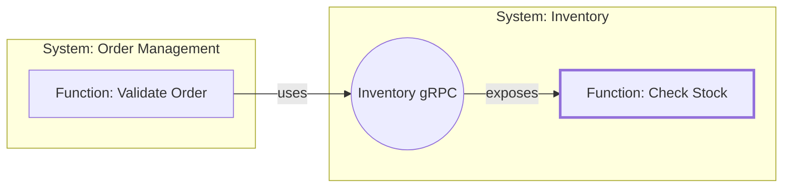
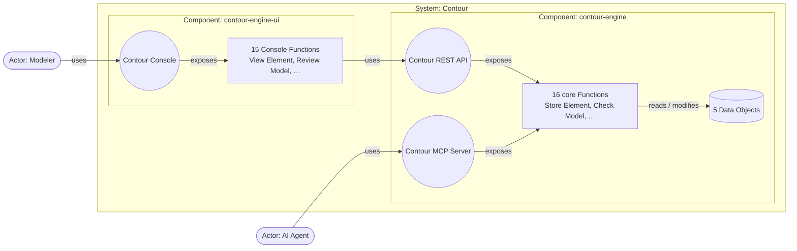

# Contour — Worked Examples

Companion to [`contour.md`](../contour.md) (v0.5). The paper's Section 5
shows one System on one page; this document walks through the model
files behind it, the second System it talks to, and a larger System
split into two Components — and shows, with the checker's real output,
how each model looks when started from either end. It grows with new
examples without a new release of the paper.

| Model file | System | What it shows |
|---|---|---|
| [`order-management.yaml`](order-management.yaml) | Order Management | Three Actors, one per Interface — one of them another System; a neighbour System this one depends on |
| [`billing.yaml`](billing.yaml) | Billing | The same dependency seen from the other side; an Event-triggered Function |
| [`contour-engine.yaml`](../engine/contour-engine.yaml) | Contour | Two Components, an Interface serving `System`, the redesign rule for split `calls` |

Every finding quoted below is the output of
[`contour-check.py`](../skills/contour-check.py) on these files, or on a copy
with the stated parts removed:

```
python3 skills/contour-check.py example/order-management.yaml   # from the repository root
```

---

## 1. Order Management

The one-page diagram is in the paper (Section 5). Here are the records
that carry its points.

### An Actor and the Interface designed for it

The Customer's `uses` is the business statement; the Customer API
exposes exactly that list, and says nothing about which Component it
sits on:

```yaml
Actor: Customer
  description: A person buying from the shop.
  uses: [Place Order, Fetch Order, Cancel Own Order]
  requirements: [Web And Mobile]
  guardrails: [Own Orders Only]

Interface: Customer API
  description: Customers placing, tracking and cancelling their own orders via web and mobile.
  serves: Customer
  binding: { style: OpenAPI, base: /v1/orders, auth: customer token, errors: RFC 7807 }
  rationale: [Customer needs, Web And Mobile]
  exposes:
    Place Order:
      operation: POST /
      request:
        items: "Order.Line Item { productId, quantity }[1..]"
      responses:
        Placed:            { code: 201, body: "Order { id, items, total, status }" }
        Out Of Stock:      { code: 409, body: { shortItems: "{ productId: string, missing: integer }[1..]" } }
        Below Minimum:     422
        Stock Unavailable: 503
    Cancel Own Order:
      operation: POST /{id}/cancel
      request: { id: uuid }
      responses:
        Cancelled:         { code: 200, body: "Order { id, status }" }
        Already Shipped:   409
        Already Cancelled: 409
        Not Found:         404
    # Fetch Order: as in the paper, Section 3.3
```

`Place Order` never mentions a customer id: it works with the caller's
identity, which the Customer API's `auth` establishes. `Own Orders
Only` sits on the Customer — the Actor — so it governs everything that
Actor reaches, whichever Interface carries it. The Operations API
exposes `Cancel Order for Customer` as `POST /{id}/cancel` too, without
colliding, because the two Interfaces have different bases. The
cancellation is two Functions, not one, because the rules differ: a
customer may cancel only before shipment, support staff at any stage
but with a reason.

### The allocation, written once

The Component is where the System's work and data are placed; every
Interface sits on `order-service` because that is who performs
everything it exposes:

```yaml
Component: order-service
  description: Owns the order lifecycle from placement to cancellation.
  performs: [Place Order, Validate Order, Calculate Total, Fetch Order,
             Cancel Own Order, Cancel Order for Customer]
  owns: [Order]
  produces: [Order Placed, Order Cancelled]
  rationale: [All Or Nothing, "principle 4: data has a home"]
```

The Functions carry no paths, codes or payloads; the Interfaces carry
no business rules. `All Or Nothing` sits on the System, so every
alternative of every Function leaves the order untouched unless it
says otherwise.

### The dependency on Inventory, drawn in full

The one-page diagram's `uses · Inventory gRPC` edge, as a drill-down
(caller → Interface → Function):



Inventory is in this model only half-open, as its `Neighbour` block
(paper, Section 3.7): `Check Stock` with its outcomes, and
`Inventory gRPC` serving Order Management — the System this model
describes is Inventory's Actor.

### The Event, drilled into

At Context level, Order Management `produces` `Order Placed`; Billing
and Inventory consume it. The Functionality-view chain underneath lives
in each consumer's own model: on Billing's side it is `Create Invoice`
(Section 2 below); on Inventory's, the `Reserve Stock` chain of the
paper's Section 3.4. An Event creates no `depends-on` and no Actor
relation: the Event is the coupling.

### Started from either end

**Top-down start** — Actors, their `uses`, Functions, Data Objects,
Events, Requirements and Guardrails; no Components, no Interfaces:

```
GAP [A0] No Components yet: the model says what the System does, not how it is split.
      top-down:  allocate Functions and Data Objects once Requirements say what must change or scale apart
      bottom-up: record the deployables found in the code as Components
GAP [N2] Actor Customer uses 3 Functions but no Interface serves it
      top-down:  add an Interface for this Actor, its binding chosen by the Actor's channel Requirement
      bottom-up: find the entry point this Actor uses in the code
GAP [N2] Actor Support Staff uses 2 Functions but no Interface serves it
      top-down:  add an Interface for this Actor, its binding chosen by the Actor's channel Requirement
      bottom-up: find the entry point this Actor uses in the code
GAP [N2] Actor Billing uses 1 Function but no Interface serves it
      top-down:  add an Interface for this Actor, its binding chosen by the Actor's channel Requirement
      bottom-up: find the entry point this Actor uses in the code
0 contradiction(s), 4 gap(s)
```

**Bottom-up start** — Components and Interfaces as found in code; no
Actor `uses`, no `rationale`:

```
GAP [N1] Actor Customer has Interfaces but no `uses`
      top-down:  state the Functions this Actor uses
      bottom-up: take them from what its Interfaces expose: Cancel Own Order, Fetch Order, Place Order
GAP [N1] Actor Support Staff has Interfaces but no `uses`
      top-down:  state the Functions this Actor uses
      bottom-up: take them from what its Interfaces expose: Cancel Order for Customer, Fetch Order
GAP [N1] Actor Billing has Interfaces but no `uses`
      top-down:  state the Functions this Actor uses
      bottom-up: take them from what its Interfaces expose: Fetch Order
GAP [W1] Component order-service has no rationale
      top-down:  it should not exist yet — derive it from a need, Requirement or Guardrail
      bottom-up: state the Requirement or Guardrail that explains why the code has it
GAP [W1] Interface Customer API has no rationale
      top-down:  it should not exist yet — derive it from a need, Requirement or Guardrail
      bottom-up: state the Requirement or Guardrail that explains why the code has it
GAP [W1] Interface Operations API has no rationale
      top-down:  it should not exist yet — derive it from a need, Requirement or Guardrail
      bottom-up: state the Requirement or Guardrail that explains why the code has it
GAP [W1] Interface Order gRPC has no rationale
      top-down:  it should not exist yet — derive it from a need, Requirement or Guardrail
      bottom-up: state the Requirement or Guardrail that explains why the code has it
0 contradiction(s), 7 gap(s)
```

Neither start has a contradiction: each is an unfinished model, not a
wrong one, and every gap names its next step from both directions.
Planted mistakes come back as contradictions wherever the model
stands. A second owner for `Order`:

```
CONTRADICTION [A1] Data Object Order is allocated to both order-service and archive
CONTRADICTION [A3] Place Order on order-service modifies Order, owned by archive (principle 4)
CONTRADICTION [A3] Fetch Order on order-service reads Order, owned by archive (principle 4)
CONTRADICTION [A3] Cancel Own Order on order-service reads Order, owned by archive (principle 4)
CONTRADICTION [A3] Cancel Own Order on order-service modifies Order, owned by archive (principle 4)
CONTRADICTION [A3] Cancel Order for Customer on order-service reads Order, owned by archive (principle 4)
CONTRADICTION [A3] Cancel Order for Customer on order-service modifies Order, owned by archive (principle 4)
7 contradiction(s), 0 gap(s)
```

A response map missing an outcome:

```
CONTRADICTION [R3] Customer API / Place Order: responses don't cover exactly its outcomes
1 contradiction(s), 0 gap(s)
```

---

## 2. Billing — the other side of the dependency

In Order Management's model, Billing is one line — an Actor using
`Fetch Order`. Billing's own model carries its side of the same
dependency, with Order Management as *its* half-open neighbour:

```yaml
Function: Create Invoice
  description: Issues an invoice for a newly placed order.
  steps:
    - consumes: Order Placed
    - uses: Order gRPC / Fetch Order
      becomes: { Not Found: Order Missing, Unreachable: Deferred }
    - modifies: Invoice
    - produces: Invoice Issued
  result: Invoiced
  alternatives:
    Order Missing:
      when: The order no longer exists.
      effects:
        - produces: Invoice Failed
    Deferred: Order Management couldn't be reached; the Event is processed again later.

Neighbour: Order Management
  events:
    - name: Order Placed
  functions:
    - name: Fetch Order
      result: Found
      alternatives: { Not Found: No order has this id. }
  interfaces:
    - name: Order gRPC
      serves: Billing
      exposes: [Fetch Order]
```

The two models agree at the boundary: Order Management's `Order gRPC`
serves Billing and exposes `Fetch Order`; Billing's step uses exactly
that, and the checker verifies the `becomes` keys against
`Fetch Order`'s real outcomes. `Create Invoice` also shows the other
side of `Unreachable`: when Order Management can't be reached, the
business answer is to try again later, not to fail the invoice. And it
is how Billing obtains Order data without reading it — principle 4,
across Systems.

Billing's own Actor is Finance Staff, served by the Billing API
(`Fetch Invoice`, `Void Invoice`); `Create Invoice` is used by no Actor,
because only the Event starts it.

What nothing checks yet is that the two files keep agreeing: Billing's
`Neighbour` block is a hand-written copy of what `order-management.yaml`
declares. A cross-model check is the open item in the paper's
Section 6.

---

## 3. Contour — a System split into two Components

[`contour-engine.yaml`](../engine/contour-engine.yaml) models the Contour engine
itself: 31 Functions, two Components and three Interfaces.



The Requirement *Console Released Independently* separates the browser
application from the engine. Its Functions have their own behavior —
how a record is laid out, that a diagram is shown exactly as rendered —
and each one crosses to the engine with a visible step:

```yaml
Function: View Element                         # performed by contour-engine-ui
  description: >-
    Shows one element of any type in detail — its structured record, the requirements and guardrails
    it references, its relationships — together with its element-scoped diagram.
  steps:
    - uses: Contour REST API / Retrieve Element
      becomes: { Not Found: Not Found, Unreachable: Engine Unavailable }
    - uses: Contour REST API / Render Element Diagram
      becomes: { Not Found: Not Found, Unreachable: Engine Unavailable }
  result: Shown
  alternatives:
    Not Found: The element no longer exists.
    Engine Unavailable: The engine couldn't be reached; nothing is shown or changed.
```

The Contour REST API serves `System` — this System's own Components —
and exposes exactly the 15 core Functions the Console Functions' steps
use; anything else it exposed would be a gap. The engine also
implements v0.5 itself: `Validate Element` rejects a write only for a
contradiction, never for a gap, and `Check Model` returns both lists —
to the AI Agent through the MCP Server, and to the Modeler through the
Console's `Review Model`.

### Where the REST API comes from

Top-down, the Console Functions start by simply `call`ing the core
Functions. Allocate them to two Components before any Interface
exists, and every one of those calls now crosses a boundary — the
redesign rule fires once per call (output shortened):

```
CONTRADICTION [A3] List Components on contour-engine-ui calls Search Specifications on contour-engine: `calls` stays within a Component; redesign — allocate both to one Component, or expose Search Specifications on an Interface serving System and make the step `uses`
CONTRADICTION [A3] Find Specifications on contour-engine-ui calls Search Specifications on contour-engine: `calls` stays within a Component; redesign — allocate both to one Component, or expose Search Specifications on an Interface serving System and make the step `uses`
… 14 more of the same, one per crossing call …
GAP [N2] Actor Modeler uses 15 Functions but no Interface serves it
      top-down:  add an Interface for this Actor, its binding chosen by the Actor's channel Requirement
      bottom-up: find the entry point this Actor uses in the code
GAP [N2] Actor AI Agent uses 15 Functions but no Interface serves it
      top-down:  add an Interface for this Actor, its binding chosen by the Actor's channel Requirement
      bottom-up: find the entry point this Actor uses in the code
16 contradiction(s), 2 gap(s)
```

The fix is the redesign each line names: expose the callee on an
Interface serving `System` and make the step `uses`, deciding what
`Unreachable` becomes. Done for all sixteen, that Interface is the
Contour REST API.
